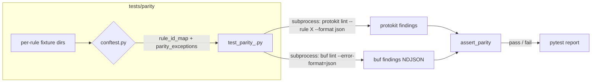
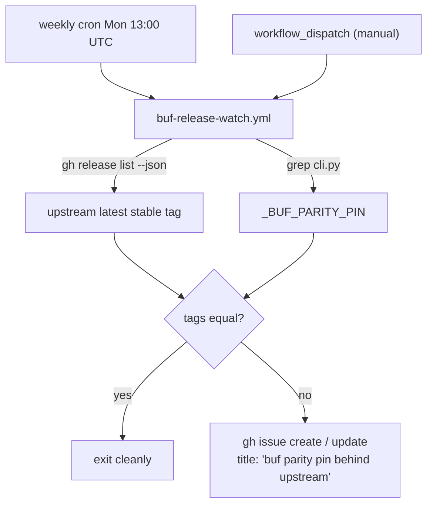

# feat: D6a Unit 8 — buf-parity test infrastructure + advisory CI job + release watcher

## Overview

Land the buf-parity test harness for D6a's 16 buf-equivalent rules (plus the
D2 canary `naming/snake-case-fields`, which has functional but not
nominal buf parity). The harness:

1. Installs and pins a specific `buf` binary version in a dedicated CI job.
2. Runs each protokit rule's fixture through both `protokit lint` and
   `buf lint` and asserts equivalent findings (with documented
   per-rule divergences for `file/syntax-specified`).
3. Surfaces parity divergence as an **advisory** CI signal (visible
   but non-blocking — per J2 of the parent plan).
4. Adds a scheduled release-watcher workflow that opens a tracking
   issue when buf ships a newer version than the pin, decoupling
   pin bumps from PR throughput per R13.

U8 sits between the rule packs (U3–U6, all shipped) and the CLI
wiring (U9, which needs `_BUF_PARITY_PIN` to surface in `--version`).
This plan lands U8 as **three sequenced commits** (Phase A: local
harness; Phase B: CI parity job; Phase C: release watcher + drift
guard) so each phase is independently reviewable and safely
revertible.

## Problem Frame

D6a's `recommended` profile now fires 17 rules (D2 canary + 16 net
new buf-BASIC parity rules from U3–U6). Each rule's
`LintRuleSpec.source_spec` carries a machine-readable parity claim
(`buf:<RULE_ID>`). At present, those claims are **untested** — they
rest on careful authorship and ce:review discipline. R10/R11/R13
turn the claims into a CI-enforced contract: if buf and protokit
emit different findings on the same fixture for the same rule, the
parity job reports it.

The brainstorm's `audit-wire-format-before-claiming-sibling-parity`
learning warns that parity claims survive plan review through
implementation without CI enforcement — U8 closes that gap.

The job is **advisory**, not blocking. Buf may ship behavior changes
between protokit releases; we want the signal in the PR's checks
panel without coupling buf's release cadence to our merge throughput.
The release-watcher workflow fills the surveillance gap so a
behind-upstream pin doesn't rot silently.

## Requirements Trace

Carried forward from the D6a parent plan (`docs/plans/2026-05-12-001-feat-protokit-lint-d6a-rule-library-plan.md`).

- **R10** — `tests/parity/` directory + `@pytest.mark.parity` marker
  registered in `pyproject.toml`; default `pytest tests/` skips the
  marker. (See origin: parent plan Unit 8 Files list.)
- **R11** — Dedicated CI parity job installing pinned buf binary;
  runs `pytest tests/parity/ -m parity`. **Advisory (non-blocking)**
  per J2.
- **R13** — Buf version pin policy:
  - Pin to a single buf version (this plan: **v1.69.0**, the latest
    non-pre-release tag at 2026-05-13 — release date 2026-04-29).
  - Surface the pin in `protokit lint --version` (CLI surfacing is
    Unit 9's responsibility; U8 only ships the `_BUF_PARITY_PIN`
    constant).
  - Companion scheduled "buf release watcher" workflow opens an
    issue when upstream has a newer stable release.

R12 (R6 has no parity test; no buf analogue) is moot for D6a — R6 is
deferred to D6b per J1.

## Scope Boundaries

**In scope (U8):**
- `tests/parity/` directory + `__init__.py` + `conftest.py`.
- `@pytest.mark.parity` marker registration in `pyproject.toml`.
- Per-rule fixtures: 1 happy-path + 1 sad-path `.proto` + 1 `buf.yaml`
  per buf-equivalent rule (16 rules; canary uses an explicit mapping
  override).
- Per-family parity test modules: `test_parity_naming.py`,
  `test_parity_enum.py`, `test_parity_imports.py`,
  `test_parity_package.py`, `test_parity_file.py`.
- Parity assertion helper + rule-id mapping derived from
  `LintRuleSpec.source_spec` + curated overrides for the canary and
  for documented divergences.
- `_LINT_PATHS` ratchet entry for `tests/parity`.
- New CI top-level `parity` job in `.github/workflows/ci.yml`:
  buf binary download, SHA-256 checksum verification, pytest
  invocation. Advisory (not in required-checks).
- New scheduled workflow `.github/workflows/buf-release-watch.yml`
  (weekly cron + `workflow_dispatch`).
- `_BUF_PARITY_PIN` constant in `src/protokit/schema/lint/cli.py`
  (kept in sync with CI YAML via the drift-check test in Phase C).
- Drift-check test (`tests/test_buf_parity_pin_drift.py`) asserting
  the constant and the CI YAML pin reference the same string.

### Deferred to Separate Tasks

- **Unit 9** — Wire `_BUF_PARITY_PIN` into `protokit lint --version`
  output and add the R9a/R9c/R9d CLI surface. U8 ships the constant
  only.
- **Unit 10** — README + CHANGELOG documentation of the parity job
  and pin-bump cadence. U8 ships the workflow; user-facing prose
  lands with the rest of the D6a delivery doc updates.
- **D6b** — Parity tests for R6 (option-aware differentiator) and
  for cross-language `PACKAGE_SAME_*` family rules.

## Context & Research

### Relevant Code and Patterns

- **Parent plan Unit 8**: `docs/plans/2026-05-12-001-feat-protokit-lint-d6a-rule-library-plan.md:662–720`
  — authoritative specification of U8 goals; this plan deepens
  individual decisions without superseding the parent.
- **Buf-parity divergence learning**: `docs/solutions/best-practices/buf-parity-divergence-documentation-discipline-2026-05-13.md`
  — four-site documentation protocol for `file/syntax-specified` and
  any future divergence; informs the per-rule divergence allowlist
  in `conftest.py`.
- **Sibling-parity audit discipline**: `docs/solutions/best-practices/audit-wire-format-before-claiming-sibling-parity-2026-05-03.md`
  — the motivation for U8's existence.
- **Pytest marker pattern**: `pyproject.toml [tool.pytest.ini_options] markers`
  lines 84–86 already registers `slow`. The new `parity:` marker
  appends here, mirroring exactly.
- **Existing CI pattern**: `.github/workflows/ci.yml:43–104` —
  `test` job installs system protoc via `sudo apt-get install
  protobuf-compiler`. The new `parity` job mirrors the shape but
  installs buf from a GitHub Releases tarball (apt does not ship
  buf).
- **Static-analysis ratchet**: `tests/test_static_analysis.py:31–42`
  — `_LINT_PATHS` tuple. New entry `"tests/parity"` lands in
  Phase A.
- **Source-spec extraction**: every rule's `@lint_rule(...)`
  decorator carries `source_spec="buf:<RULE_ID>"` (or `aip.dev/...`
  for the canary). The conftest reads `fn._lint_spec.source_spec`
  to build the mapping at fixture-collection time, so the mapping
  stays in lockstep with the rule registry without manual sync.
- **LintRuleSpec model**: `src/protokit/schema/lint/model.py:758–856`.
  Field `source_spec: str = ""` is the canonical parity-claim
  attachment point.
- **Rule pack inventory** (current, U6 ship state):
  - `naming` (8 buf-equiv + 1 canary):
    `naming/pascal-case-messages` → `buf:MESSAGE_PASCAL_CASE`,
    `naming/pascal-case-enums` → `buf:ENUM_PASCAL_CASE`,
    `naming/upper-snake-case-enum-values` → `buf:ENUM_VALUE_UPPER_SNAKE_CASE`,
    `naming/snake-case-oneofs` → `buf:ONEOF_LOWER_SNAKE_CASE`,
    `naming/pascal-case-services` → `buf:SERVICE_PASCAL_CASE`,
    `naming/pascal-case-rpcs` → `buf:RPC_PASCAL_CASE`,
    `naming/snake-case-files` → `buf:FILE_LOWER_SNAKE_CASE`,
    `naming/snake-case-packages` → `buf:PACKAGE_LOWER_SNAKE_CASE`,
    `naming/snake-case-fields` → `aip.dev/122` (canary, functional
    parity with `FIELD_LOWER_SNAKE_CASE` via override).
  - `enum` (2): `enum/no-allow-alias` → `buf:ENUM_NO_ALLOW_ALIAS`,
    `enum/first-value-zero` → `buf:ENUM_FIRST_VALUE_ZERO`.
  - `imports` (3): `imports/no-public` → `buf:IMPORT_NO_PUBLIC`,
    `imports/no-weak` → `buf:IMPORT_NO_WEAK`,
    `imports/unused` → `buf:IMPORT_USED`.
  - `package` (2): `package/defined` → `buf:PACKAGE_DEFINED`,
    `package/directory-match` → `buf:PACKAGE_DIRECTORY_MATCH`.
  - `file` (1): `file/syntax-specified` → `buf:SYNTAX_SPECIFIED`
    (with **documented divergence** on explicit `proto2`; see
    Divergence Handling below).

### Institutional Learnings

- `audit-wire-format-before-claiming-sibling-parity-2026-05-03` — U8
  exists to honor this learning's CI-enforcement implication for
  every `source_spec="buf:..."` claim landed since D6a U3.
- `buf-parity-divergence-documentation-discipline-2026-05-13` — U8's
  per-rule divergence allowlist (`_PARITY_EXCEPTIONS` in conftest)
  is the machine-readable counterpart to the four-site prose
  discipline. Updating the allowlist for a future divergent rule
  becomes the fifth site, but the rule-author work remains the
  four prose sites; only the parity infra accumulates the allowlist
  entry.
- `pytest-static-analysis-gate-ratchet-2026-05-02` — `tests/parity`
  is a new root-level test directory; the `_LINT_PATHS` entry
  lands in Phase A alongside the directory creation.
- `fail-closed-ci-matrix-coverage-meta-test-2026-05-12` — U8's parity
  tests are unconditionally on (no `skipif` predicate); the
  companion coverage meta-test is NOT needed. The drift-check test
  (Phase C) is the analogue invariant: it asserts the constant ↔
  YAML pin agreement at every default `pytest tests/` run.
- `stale-forward-looking-text-cli-help-agent-discoverability-2026-05-12`
  — U8 introduces no end-user-facing forward-looking text; the
  Unit 10 sweep will still inspect the new YAML and conftest for
  any "will be implemented in U9" residuals.
- `click-parameter-source-detection-cli-config-precedence-2026-05-11`
  — not applicable to U8 (no Click flag here); Unit 9 picks this
  up when wiring `--version`.
- `keyboardinterrupt-baseexception-bypass-rule-pack-load-2026-05-07`
  — applies at the conftest subprocess call site: wrap
  `subprocess.run` in triple-arm guard so Ctrl-C during a long buf
  invocation surfaces cleanly without swallowing.

### External References

- `https://github.com/bufbuild/buf/releases/tag/v1.69.0` — pinned
  buf release (published 2026-04-29). Asset format
  `buf-Linux-x86_64.tar.gz` + combined `sha256.txt` checksum file.
- `https://buf.build/docs/lint/usage` — `buf lint --error-format=json`
  documentation (NDJSON output: one annotation per line; fields
  `path`, `start_line`, `start_column`, `end_line`, `end_column`,
  `type`, `message` — `type` carries the buf rule ID).
- `https://buf.build/docs/configuration/v2/buf-yaml` — v2 config
  format (since buf v1.32.0). Per-fixture `buf.yaml` uses
  `version: v2` + `modules: [{ path: . }]` + `lint: use: [<RULE_ID>]`.
- `https://cli.github.com/manual/gh_release_list` — `gh release list
  --json tagName,isLatest,isPrerelease,publishedAt` shape used in
  the release watcher.

## Key Technical Decisions

### KTD-1: Pin buf at v1.69.0 (latest stable as of 2026-05-13)

v1.69.0 is the latest non-pre-release tag, published 2026-04-29 — 14
days old at U8 ship date; well past the typical post-release
patch-cycle window. Pinning to v1.69.0 lets the parity job exercise
the most recent BASIC ruleset against protokit's claims.

### KTD-2: Per-rule fixture isolation via explicit `buf.yaml use:` list

Each per-rule fixture directory has its own `buf.yaml` that enables
**only the rule under test** by ID — never a category. This sidesteps
the BASIC/MINIMAL/STANDARD partition surprises (e.g.,
`FILE_LOWER_SNAKE_CASE` lives in STANDARD, not BASIC; per agent
research) and keeps each test's "expected buf finding" deterministic.
The protokit invocation is `protokit lint --rule <rule_id>` (existing
D3 flag) so both tools see exactly one rule's findings.

### KTD-3: Source-spec is the single source of truth for rule-id mapping

The mapping `protokit_rule_id → buf_rule_id` is **derived at conftest
collection time** by walking every rule in `BUILTIN_PACKS`, reading
`fn._lint_spec.source_spec`, and extracting the value after `buf:`.
A curated `_CANARY_PARITY_OVERRIDE` dict adds the one rule whose
source_spec is non-buf (the canary `naming/snake-case-fields` →
`FIELD_LOWER_SNAKE_CASE`). Adding a new buf-parity rule in a future
delivery requires zero conftest changes — the source_spec is the
contract.

**Canary parity is functional, not nominal.** The canary's
`source_spec="https://google.aip.dev/122"` is the correct provenance
(aip.dev defines the original spec); the override exists because the
rule's behavior — lower_snake_case enforcement on field names with
synthetic map-entry fields excluded — matches buf's
`FIELD_LOWER_SNAKE_CASE`. The `_CANARY_PARITY_OVERRIDE` entry carries
an inline comment naming this as **functional-only equivalence**
and flagging that any future change to the canary's
`_SNAKE_CASE_RE` regex requires re-validating buf parity against
v1.69.0's behavior (feasibility review F3). Fixtures for the canary
use unambiguous violations (e.g., `int32 MyField = 1;` —
clearly-mixed-case) to avoid boundary cases where the canary and
buf could diverge on edge segments.

### KTD-4: Divergence allowlist via `_PARITY_EXCEPTIONS` map

The `file/syntax-specified` rule diverges from buf on the
explicit-proto2 branch (see the divergence-discipline learning).
The conftest carries a `_PARITY_EXCEPTIONS: Mapping[str, set[str]]`
keyed by `(rule_id, fixture_name)` listing intentional divergences.
The parity assertion asks: "does the divergence (protokit fired, buf
did not, or vice versa) appear in `_PARITY_EXCEPTIONS`?" If yes,
the test passes for the asserted divergence shape. If no, the test
fails — surfacing an unintended drift.

Each `_PARITY_EXCEPTIONS` entry has an adjacent inline comment
naming the relevant rule docstring + four-site documentation;
contributors who delete the entry hit a failed test pointing them
at the documented divergence.

### KTD-5: Subprocess invocation with hard 30s timeout + triple-arm guard

Both `buf lint` and `protokit lint` are invoked via
`subprocess.run(..., timeout=30, check=False, capture_output=True,
text=True)`. The 30s cap prevents a hung subprocess from deadlocking
the parity job. The invocation is wrapped in the standard triple-arm
guard (`SystemExit` + `KeyboardInterrupt` + `Exception`) per the
KeyboardInterrupt-bypass learning.

### KTD-6: Buf binary discovery prefers `$BUF_BINARY` env var then `shutil.which("buf")`

Local developers can point at a custom buf path via `BUF_BINARY=...
pytest tests/parity -m parity`. CI sets `$BUF_BINARY` explicitly
to the downloaded binary path after install. If neither resolves,
fixture collection fails fast with a clear message
("`BUF_BINARY` not set and `buf` not on PATH — install buf or set
the env var to run parity tests").

### KTD-7: Tarball install path + SHA-256 verification (combined sha256.txt)

**Critical:** `sha256sum -c -` reads `<HASH>  <FILENAME>` lines from stdin and re-hashes the file at `<FILENAME>` relative to the CWD. The filename in `sha256.txt` is `buf-Linux-x86_64.tar.gz`, so the downloaded asset **must** be saved under that exact name. (Feasibility review F1/F8 caught this; saving as `buf.tar.gz` makes the verification step fail with "no such file or directory".)

CI install steps (canonical filename throughout):
1. `curl -fsSL -o buf-Linux-x86_64.tar.gz https://github.com/bufbuild/buf/releases/download/v1.69.0/buf-Linux-x86_64.tar.gz`
2. `curl -fsSL -o sha256.txt https://github.com/bufbuild/buf/releases/download/v1.69.0/sha256.txt`
3. `grep " buf-Linux-x86_64.tar.gz$" sha256.txt | sha256sum -c -` — fails the job if the checksum doesn't match. **Non-optional.** The single space in the grep pattern is sufficient because the actual sha256.txt format uses two spaces between hash and filename; grep treats the space as a literal anywhere in the line.
4. `tar -xzf buf-Linux-x86_64.tar.gz` (extracts `buf/bin/buf`).
5. `sudo mv buf/bin/buf /usr/local/bin/buf` + `sudo chmod +x /usr/local/bin/buf`.
6. Export `BUF_BINARY=/usr/local/bin/buf` for the pytest step.

The SHA-256 file format on buf releases is a single combined
`sha256.txt` listing all assets — not per-asset `.sha256` files. The
plan filters to the binary's line before piping into `sha256sum -c -`.

`-fsSL` flags: `-f` fails on HTTP errors (404 from a non-existent tag fails the step rather than silently writing a 404 HTML body to the tarball), `-sS` quiet but surface errors, `-L` follow redirects (GitHub releases redirect through the CDN).

### KTD-8: Three-commit sequencing (Phase A → Phase B → Phase C)

| Phase | Lands | What's exercised locally? |
|-------|-------|---------------------------|
| **A** — Local harness | `tests/parity/` + conftest + fixtures + per-family test modules + `_LINT_PATHS` entry | `BUF_BINARY=$(which buf) pytest tests/parity -m parity` passes on a developer's machine with buf installed |
| **B+C** — CI parity job + release watcher + drift guard (combined commit) | New top-level `parity` job in `.github/workflows/ci.yml`; `.github/workflows/buf-release-watch.yml`; `_BUF_PARITY_PIN` constant in `cli.py`; `tests/test_buf_parity_pin_drift.py` | First PR after the commit lands shows the parity job in CI (advisory); the drift test runs in default `pytest tests/`; `workflow_dispatch` lets a maintainer test the watcher manually |

**Combined B+C rationale** (feasibility review F7): splitting Phase B
and Phase C across two commits creates a window where the CI YAML
pin and the `_BUF_PARITY_PIN` constant could drift without the
drift-check test in place to detect it. Both phases together are
still small (~50 line YAML job + ~30 line watcher YAML + ~10 line
constant addition + ~30 line drift test ≈ 120 lines of new
non-fixture content); keeping them atomic eliminates the drift
window and stays well within a reviewable diff. Phase A remains
its own commit because the ~51 fixture files are the bulky portion
that benefits from isolation.

Each phase is one commit with its own ce:review pass (per the
established per-unit /ce:work workflow). Phase A is independently
useful (developers can run parity locally) even if Phase B+C ships
later.

### KTD-9: Parity job advisory via not-in-required-checks (no `continue-on-error`)

The parity job runs on every PR but is **not** added to any
branch-protection required-checks list. Its failure surfaces as a
red X on the PR's checks panel but does not block merge. This is
strictly more informative than `continue-on-error: true` (which
would mark the whole check green even on failure) — the maintainer
sees the divergence and decides whether to address in-PR or in a
follow-up. The release watcher fills the case where the divergence
is buf-side (pin bump needed) rather than protokit-side.

**Current state:** the repo has no configured GitHub remote
(per `.github/workflows/ci.yml:14-17` header comment), so no branch
protection exists today; the advisory posture is trivially
satisfied. **Forward discipline:** when a remote is wired and
branch protection is configured, the parity job MUST NOT be added
to required-checks. To make this discipline discoverable, the
parity job's YAML header comment explicitly directs future
maintainers:
*"DO NOT add this job to required-checks; it is intentionally
advisory per D6a U8 KTD-9 / J2 of the parent plan."*
(Feasibility review F4 surfaced this risk: GitHub's branch-protection
UI defaults to listing every check that has run, so a contributor
enabling protection could include `parity` by accident.)

### KTD-10: `_BUF_PARITY_PIN` in `cli.py` (per parent plan); drift-check guards the YAML link

Parent plan picks `src/protokit/schema/lint/cli.py` as the
constant's home. Phase C adds the constant there and a
`tests/test_buf_parity_pin_drift.py` static-analysis test that:
1. Parses `_BUF_PARITY_PIN = "v1.69.0"` out of `cli.py` (regex
   match on a stable line shape).
2. Parses the buf download URL out of `.github/workflows/ci.yml`
   (regex match on the `releases/download/v<X>/` segment).
3. Asserts both extract the same version string.

The test runs in default `pytest tests/` (no buf required), so any
drift between the constant and the CI YAML fails locally and in CI
before merge.

### KTD-11: Release watcher weekly cron + workflow_dispatch + dedup'd issue

`.github/workflows/buf-release-watch.yml` runs on
`cron: '0 13 * * 1'` (Mondays 13:00 UTC) and on
`workflow_dispatch` for manual runs. Steps:
1. `gh release list -R bufbuild/buf --limit 5 --json
   tagName,isLatest,isPrerelease,publishedAt` — query upstream.
2. Filter `isLatest == true && isPrerelease == false` to pick the
   current stable tag.
3. Extract `_BUF_PARITY_PIN` from `src/protokit/schema/lint/cli.py`
   via grep.
4. Compare the two strings. If equal, exit cleanly.
5. If different, search existing issues with title equal to "buf
   parity pin behind upstream" (exact match via `gh issue list
   --search 'in:title "buf parity pin behind upstream"
   --state open --json number,title,body`).
6. If found, update the body with current pin + latest tag +
   today's date. If not, open a new issue.

Issue body shape (markdown):
- "Current pin: `<PIN>`"
- "Latest stable: `<TAG>` (released `<DATE>`)"
- "Release notes: `https://github.com/bufbuild/buf/releases/tag/<TAG>`"
- "Bump procedure: update `_BUF_PARITY_PIN` in `cli.py` and the
  `releases/download/...` URL in `.github/workflows/ci.yml`. Refresh
  fixtures if buf has added/removed/renamed any BASIC rule."

Workflow permissions: `issues: write`, `contents: read`. No
secrets required (uses the default `GITHUB_TOKEN`).

## Open Questions

### Resolved During Planning

- **Buf version pin** — v1.69.0 (latest stable 2026-04-29). KTD-1.
- **Asset format** — `buf-Linux-x86_64.tar.gz` (capital L,
  tarball not raw binary). KTD-7.
- **SHA-256 file format** — single combined `sha256.txt`, not
  per-asset `.sha256`. KTD-7.
- **Buf JSON parsing** — NDJSON; `type` field carries buf rule
  ID. (Verify on first invocation via a Phase A unit test that
  asserts the field exists; if the field is somehow absent in
  v1.69.0, fall back to parsing the `message` for the rule ID
  prefix — buf messages start with the rule name. The fallback is
  a documented Phase A defensive measure, not the primary path.)
- **buf.yaml format** — v2 (`version: v2`, `modules:`, `lint:
  use:`). KTD-2.
- **Per-rule fixture isolation** — every fixture lists its rule
  by ID, never by category. Dodges the BASIC/MINIMAL/STANDARD
  partition issue (FILE_LOWER_SNAKE_CASE is in STANDARD per agent
  research, but explicit-use sidesteps this). KTD-2.
- **Canary parity handling** — `_CANARY_PARITY_OVERRIDE` map in
  conftest maps `naming/snake-case-fields → FIELD_LOWER_SNAKE_CASE`;
  the rule keeps its `source_spec="https://google.aip.dev/122"`
  (correct provenance — aip.dev is the original spec).
- **Divergence handling** — `_PARITY_EXCEPTIONS` allowlist for
  `file/syntax-specified` explicit-proto2 branch. KTD-4.
- **CI job advisory mechanism** — not-in-required-checks. KTD-9.
- **Drift-check location** — top-level
  `tests/test_buf_parity_pin_drift.py` (runs in default pytest,
  no buf required). KTD-10.
- **Release watcher schedule** — weekly Mondays 13:00 UTC + manual
  dispatch. KTD-11.
- **Tracking-issue dedup** — exact title match on "buf parity pin
  behind upstream"; updated-in-place on subsequent runs. KTD-11.

### Deferred to Implementation

- **Exact buf JSON `type` field semantics under v1.69.0.** Phase A
  ships a **hard-precondition** sanity test (`tests/parity/test_buf_output_shape.py`
  or equivalent) that runs `buf lint --error-format=json` on a
  one-rule fixture and asserts the `type` field exists and matches
  the expected buf rule ID. If the field shape differs from the
  documented contract (e.g., buf has renamed it in v1.69.0), this
  test fails with a clear message
  ("buf v1.69.0 JSON shape changed; update conftest parser") and
  the entire parity job aborts before the per-rule tests run.
  **No message-prefix fallback path.** Feasibility review F2 found
  that buf lint messages do not start with the rule name (they
  start with the offending identifier or human-readable phrasing),
  so the parser cannot reconstruct rule IDs from messages — a
  fallback would only mask a real shape-change as a green run.
  The hard-fail precondition is the correct posture.
- **`tests/parity/` linter scope.** Adding `"tests/parity"` to
  `_LINT_PATHS` means ruff lints every `.py` file in the tree, but
  not `.proto` or `.yaml` fixtures. Confirm at implementation that
  the existing `_TYPE_CHECK_PATHS` does NOT pick up `tests/parity`
  (consistent with the `tests/schema/lint` precedent — tests linted,
  not strict-typed).
- **Fixture `.proto` content.** The plan budgets ~17 happy +
  ~17 sad + 17 `buf.yaml` files = ~51 fixture files. Each fixture is
  3–10 lines of proto3. Content is straightforward
  (e.g., `naming/pascal-case-messages/bad.proto` declares
  `message lower_case_message {}` to trigger the rule).
  The implementer composes them from the existing in-test fixtures
  in `tests/schema/lint/rules/test_naming.py` etc., which already
  encode minimal triggering shapes.

## High-Level Technical Design

> *This illustrates the intended approach and is directional guidance for review, not implementation specification. The implementing agent should treat it as context, not code to reproduce.*

### Phase A — local harness data flow



`conftest.py` produces three module-scoped fixtures:
- `rule_id_map: Mapping[str, str]` — protokit rule_id → buf rule_id (derived from `LintRuleSpec.source_spec` + `_CANARY_PARITY_OVERRIDE`).
- `parity_exceptions: Mapping[tuple[str, str], str]` — `(rule_id, fixture_name) → divergence_description` (loaded from the `_PARITY_EXCEPTIONS` constant).
- `buf_binary: Path` — resolved buf binary path (`$BUF_BINARY` → `shutil.which`).

Per-family test modules use `pytest.mark.parametrize` over the rules in their family + over `(happy, sad)` fixture pairs. Each test invokes both binaries, parses both outputs, and runs the assertion helper.

### Phase B — CI parity job structure

```yaml
# .github/workflows/ci.yml — new top-level job, advisory
parity:
  runs-on: ubuntu-latest
  steps:
    - checkout
    - setup-python 3.12
    - install protobuf-compiler  # for protokit's protoc backend
    - install protokit + dev deps
    - download buf-Linux-x86_64.tar.gz at the pinned version
    - download sha256.txt and verify the binary checksum (fail job on mismatch)
    - extract tarball + place binary at /usr/local/bin/buf
    - run pytest tests/parity -m parity with BUF_BINARY exported
```

The job is **not** listed in any branch-protection required-checks rule. Its red status surfaces as a visible-but-non-blocking signal on every PR.

### Phase C — release watcher + drift guard



Separate from the watcher, every `pytest tests/` run executes the drift-check test, which parses both `cli.py` and `ci.yml` and asserts both reference the same pinned version string. Editing one without the other fails the test.

## Implementation Units

The parent plan models U8 as a single unit. This sub-plan **decomposes U8 into three sequenced commits (Phases A/B/C)**. Each phase is independently mergeable and reviewable; the per-unit /ce:work workflow runs once per phase. The triple-commit shape mirrors how D5 U1/U2/U3 sequenced the pyproject-config work.

---

- [ ] **Phase A: Local parity harness — `tests/parity/` + conftest + fixtures + per-family tests**

**Goal:** Ship the in-repo parity harness so a developer with `buf` installed can run `BUF_BINARY=$(which buf) pytest tests/parity -m parity` and exercise every D6a buf-equivalent rule's parity claim. No CI changes in this phase.

**Requirements:** R10 (marker + directory); R11 partial (test code only — CI job lands in Phase B).

**Dependencies:** Units 3–6 (all rule packs shipped — confirmed via git log; current `BUILTIN_PACKS` = `(naming, enum, imports, package, file)`).

**Files:**
- Create: `tests/parity/__init__.py` — empty package marker.
- Create: `tests/parity/conftest.py` — buf binary discovery; rule-id mapping; `_PARITY_EXCEPTIONS`; `_CANARY_PARITY_OVERRIDE`; `run_buf_lint`, `run_protokit_lint`, `assert_parity` helpers.
- Create: `tests/parity/test_parity_naming.py` — `TestParityNaming` class; parametrized over 9 rules (8 buf-equiv + canary).
- Create: `tests/parity/test_parity_enum.py` — `TestParityEnum`; 2 rules.
- Create: `tests/parity/test_parity_imports.py` — `TestParityImports`; 3 rules.
- Create: `tests/parity/test_parity_package.py` — `TestParityPackage`; 2 rules.
- Create: `tests/parity/test_parity_file.py` — `TestParityFile`; 1 rule (with two sad-path branches per the divergence learning).
- Create: `tests/parity/fixtures/<family>/<rule-slug>/{good.proto,bad.proto,buf.yaml}` — ~51 fixture files (16 rules × 3 files + the canary's 3 + the second sad-path branch for file/syntax-specified).
- Modify: `pyproject.toml` — register `parity:` marker alongside `slow:` in `[tool.pytest.ini_options].markers`.
- Modify: `tests/test_static_analysis.py` — add `"tests/parity"` to `_LINT_PATHS`.

**Approach:**
- `conftest.py` defines module-scoped fixtures: `buf_binary` (resolved path; fails collection with a clear message if absent), `rule_id_map` (derived from `BUILTIN_PACKS`; overrides for canary), `parity_exceptions`.
- Each per-family test module declares a `TestParity<Family>` class with `pytestmark = pytest.mark.parity` and methods parametrized over the family's rules. Two methods per rule: `test_happy_path_clean` (both tools emit zero findings on `good.proto`) and `test_sad_path_parity` (both tools emit exactly one finding on `bad.proto`, with matching rule_id and file location — except where `_PARITY_EXCEPTIONS` documents a divergence).
- The `assert_parity(protokit_findings, buf_findings, rule_id_map, exceptions, fixture_name)` helper:
  1. Filters both finding sets to just the rule under test (by rule_id on protokit side; by mapped buf rule_id on buf side).
  2. Compares cardinality, then per-finding `(file_path, line)` tuples.
  3. For mismatches, consults `parity_exceptions[(rule_id, fixture_name)]`. If a matching entry exists, the assertion passes with the documented divergence shape; otherwise fails with a diagnostic showing both finding sets.
- `subprocess.run(..., timeout=30, check=False)` for both tool invocations; on `subprocess.TimeoutExpired`, surface "<tool> invocation exceeded 30s on <fixture>" as the failure message. Wrapped in the triple-arm `SystemExit + KeyboardInterrupt + Exception` guard per the institutional learning.
- Sanity test in `tests/parity/test_parity_file.py` (or a tiny `test_buf_output_shape.py`): assert `buf lint --error-format=json` produces NDJSON with a `type` field on at least one fixture — pins the parsing contract.

**Patterns to follow:**
- `tests/schema/lint/test_perf_smoke.py` for marker registration and class-based parametrize layout.
- `tests/schema/lint/rules/test_<pack>.py` for the in-test proto-source fixtures (each provides minimal triggering shapes that can be transplanted into `bad.proto` files).
- `_safe_for_stderr` and the stderr-forge learning for any subprocess output surfaced in test failure messages.

**Test scenarios:**
- *Happy path:* `TestParityNaming::test_sad_path_parity[pascal-case-messages]` — `bad.proto` declares `message lower_case_message {}`; protokit emits one `naming/pascal-case-messages` finding on line N; buf emits one `MESSAGE_PASCAL_CASE` finding on line N; assertion passes.
- *Happy path:* `TestParityEnum::test_happy_path_clean[no-allow-alias]` — `good.proto` declares a clean enum with `allow_alias = false`; both tools emit zero findings; assertion passes.
- *Happy path (canary parity):* `TestParityNaming::test_sad_path_parity[snake-case-fields]` — uses `_CANARY_PARITY_OVERRIDE` to map to `FIELD_LOWER_SNAKE_CASE`. Fixture uses an unambiguous violation like `int32 MyField = 1;` (clear mixed-case, no boundary semantics) per KTD-3 / feasibility F3. Both tools fire.
- *Documented-divergence:* `TestParityFile::test_sad_path_parity[syntax-specified][explicit-proto2]` — protokit fires on `syntax = "proto2";`; buf does not; `_PARITY_EXCEPTIONS` has `("file/syntax-specified", "explicit-proto2"): "protokit stricter; descriptor-level limitation"` → assertion passes.
- *Documented-parity:* `TestParityFile::test_sad_path_parity[syntax-specified][no-syntax]` — neither file declares syntax; both tools fire (parity holds); assertion passes.
- *Edge case:* `buf_binary` fixture fails collection cleanly when `$BUF_BINARY` is unset and `buf` is not on PATH (developer message: "install buf or set BUF_BINARY").
- *Edge case:* default `pytest tests/` (no `-m parity`) skips the entire `tests/parity/` tree (verified by counting collected items before/after the marker filter — Phase A's commit message claims this; the existing `slow:` marker pattern is the reference).
- *Edge case (subprocess timeout):* a hung tool invocation surfaces `subprocess.TimeoutExpired` as a clear failure within 30s rather than deadlocking pytest.
- *Edge case (rule_id_map drift):* if a rule's `source_spec` changes form (e.g., `buf:X` → `X` without prefix), the map-builder raises a clear `ValueError("unexpected source_spec shape: ...")` rather than silently producing an empty map.
- *Edge case (parity_exceptions invariant):* the `_PARITY_EXCEPTIONS` entries are validated at collection time to reference only known rule_ids — drift in either direction fails fast.
- *Integration:* the full `tests/parity/` directory passes ruff lint per the new `_LINT_PATHS` entry.

**Verification:**
- `BUF_BINARY=$(which buf) pytest tests/parity -m parity -v` passes locally (with buf v1.69.0 installed) — every rule's two test methods (happy + sad) green.
- `pytest tests/` (default) collects zero items from `tests/parity/` (marker-gated; verified via `pytest --collect-only -q tests/parity | head`).
- `ruff check tests/parity` passes.
- The existing 1486-test suite count grows by approximately `(17 rules × 2 methods) + sanity + divergence-branch + collection invariants ≈ 40 tests`. New count target: ~1526.
- Static-analysis ratchet (`tests/test_static_analysis.py`) passes — `tests/parity` is on the linted-paths list.

---

- [ ] **Phase B+C (combined commit): CI parity job + release watcher + `_BUF_PARITY_PIN` constant + drift-check test**

**Goal:** Land the CI-side of U8 as one atomic commit: an advisory parity job, a scheduled release watcher, the `_BUF_PARITY_PIN` constant in `cli.py`, and the drift-check test that locks the constant and the CI YAML pin together. Combining (vs. splitting B/C) eliminates the brief window where the YAML pin and constant could drift without enforcement (feasibility review F7).

**Requirements:** R11 (advisory framing per J2), R13 (pin policy + release watcher + `--version` infrastructure; Unit 9 ships the user-visible `--version` change).

**Dependencies:** Phase A landed (the parity job runs the tests Phase A creates).

**Files:**
- Modify: `.github/workflows/ci.yml` — append a new top-level job named `parity` after the existing `test` job.
- Create: `.github/workflows/buf-release-watch.yml` — scheduled release watcher (~50 lines of YAML + bash).
- Modify: `src/protokit/schema/lint/cli.py` — add `_BUF_PARITY_PIN: str = "v1.69.0"` near the existing module-level constants (e.g., right after `_LINT_HUMAN_SUMMARIZATION_THRESHOLD` from D5 U5). Include an inline comment cross-referencing `.github/workflows/ci.yml` and the drift-check test.
- Create: `tests/test_buf_parity_pin_drift.py` — top-level test (not in `tests/parity/`; runs in default `pytest tests/`).

**Approach:**

- **Parity job (in `.github/workflows/ci.yml`):**
  - YAML header comment directs future maintainers: *"DO NOT add this job to required-checks; it is intentionally advisory per D6a U8 KTD-9 / J2 of the parent plan."* (per KTD-9 + feasibility F4).
  - YAML header also cross-references `_BUF_PARITY_PIN` in `cli.py`: bumping the URL in YAML without bumping the constant fails the drift-check test locally and in the default `test` job before the parity job runs.
  - Runs on `ubuntu-latest` only; no matrix axes — parity is rule-output equivalence, not interpreter coverage. `python-version: "3.12"`.
  - Steps:
    1. `actions/checkout@v4`.
    2. `actions/setup-python@v5` with `python-version: "3.12"`.
    3. Install `protobuf-compiler` via apt (mirrors existing pattern at `.github/workflows/ci.yml:57–59`).
    4. `pip install -e ".[compiler,dev]"`.
    5. Download buf assets — **use the canonical filename throughout** (feasibility F1/F8):
       ```
       curl -fsSL -o buf-Linux-x86_64.tar.gz \
         https://github.com/bufbuild/buf/releases/download/v1.69.0/buf-Linux-x86_64.tar.gz
       curl -fsSL -o sha256.txt \
         https://github.com/bufbuild/buf/releases/download/v1.69.0/sha256.txt
       grep " buf-Linux-x86_64.tar.gz$" sha256.txt | sha256sum -c -
       ```
       The downloaded tarball MUST be on disk as `buf-Linux-x86_64.tar.gz` (the name `sha256sum -c -` will look up). `-f` flag fails on HTTP errors (404 from a stale tag fails the step rather than writing an HTML body).
    6. Extract + place: `tar -xzf buf-Linux-x86_64.tar.gz && sudo mv buf/bin/buf /usr/local/bin/buf && sudo chmod +x /usr/local/bin/buf`.
    7. `buf --version` (sanity / fail-fast on a corrupted install).
    8. `BUF_BINARY=/usr/local/bin/buf pytest tests/parity -m parity -v`.
  - **Supply-chain hardening is non-optional.** Skipping/commenting the checksum step is a P1 review block.

- **Release watcher workflow shape (`.github/workflows/buf-release-watch.yml`):**
  - `on: { schedule: [{cron: '0 13 * * 1'}], workflow_dispatch: {} }`.
  - `permissions: { issues: write, contents: read }`.
  - Single job `check-buf-release` on `ubuntu-latest`.
  - Steps:
    1. Checkout (we need to read `cli.py`).
    2. `gh release list -R bufbuild/buf --limit 5 --json tagName,isLatest,isPrerelease,publishedAt` piped to `jq` to select `.[] | select(.isLatest == true and .isPrerelease == false) | .tagName`.
    3. Grep `_BUF_PARITY_PIN` out of `src/protokit/schema/lint/cli.py`.
    4. If equal → exit cleanly.
    5. If different:
       - Search existing open issues with title-scoped search via `gh issue list --state open --search 'in:title "buf parity pin behind upstream"' --json number,title`, then **post-filter results in jq for exact title equality** (feasibility review F5: GitHub's `in:title` qualifier is full-text/case-insensitive, not strict-equality, so an issue titled `"buf parity pin behind upstream (manual override)"` would match; the post-filter rejects partial matches before the update-vs-create decision).
       - If found → `gh issue comment <num> --body <text>` (refresh the latest-tag-seen). Optionally `gh issue edit <num> --body <text>` to update the body in place — preference: edit (one body, always current) over comment (history of stale comments accumulates).
       - If not found → `gh issue create --title 'buf parity pin behind upstream' --body <text>` with the body shape in KTD-11.
- **`_BUF_PARITY_PIN` constant placement** — top of `cli.py` near other module-level constants. Type annotation `: str = "v1.69.0"`. Inline comment: `# Pinned buf version for the parity CI job and tests/parity/. Update in lockstep with .github/workflows/ci.yml and the fixture corpus. Drift between this and ci.yml is caught by tests/test_buf_parity_pin_drift.py.`
- **Drift-check test shape:**
  - Read `cli.py` as text; regex `^_BUF_PARITY_PIN\s*:\s*str\s*=\s*"(v[^"]+)"` to extract the constant.
  - Read `.github/workflows/ci.yml` as text; regex `releases/download/(v[^/]+)/buf-Linux-x86_64.tar.gz` to extract the CI version.
  - Assert both match; on failure, the error message names both files and both values.
  - Two assertions, no buf required, runs in default `pytest tests/`. Fast (single-digit-millisecond).
- The watcher script is bash-only — no Python interpreter needed in the workflow runner (uses `gh`, `jq`, `grep`, `sed`). Keep ~50 lines of YAML + ~30 lines of inlined shell.

**Patterns to follow:**
- Existing protoc install step pattern at `.github/workflows/ci.yml:57–59`.
- Existing pip-install patterns at `.github/workflows/ci.yml:62–67`.
- Existing job structure (jobs map, top-level `runs-on`, `steps:` list).
- The `_LINT_HUMAN_SUMMARIZATION_THRESHOLD` constant in `cli.py` (D5 U5) for module-level-constant placement + inline-comment style.
- Drift-check pattern: simple regex over text, no AST parsing required (regex is brittle but the line shapes are stable; if a future contributor reformats either file in a way that breaks the regex, the test fails loudly with `"could not extract version from <file>"`).

**Test scenarios:**

*Parity job:*
- *Happy path:* On a clean PR with no rule changes, the parity job passes — every parity test green.
- *Sad path (parity drift):* A faulty rule change locally that breaks parity (e.g., a false-positive on a fixture) makes the job fail visibly, but the PR remains mergeable (the maintainer decides whether to fix-in-PR).
- *Sad path (corrupted/tampered binary):* The SHA-256 verification step fails the job before pytest runs — never silently runs an unverified binary.
- *Sad path (stale tag URL):* If the curl URL points at a non-existent tag, `-f` makes curl exit non-zero with a clean error rather than writing a 404 HTML body to `buf-Linux-x86_64.tar.gz`.
- *Edge case (network outage):* If curl to the GitHub release bucket fails, the job fails fast with the curl error; the release watcher path is unaffected.
- *Edge case (apt protobuf-compiler version):* the apt-shipped protoc on `ubuntu-latest` is 3.21+ — sufficient for proto3 fixtures used by U8 (no editions content).

*Drift-check test:*
- *Happy path:* `tests/test_buf_parity_pin_drift.py` — `cli.py` has `_BUF_PARITY_PIN: str = "v1.69.0"`; `ci.yml` has `releases/download/v1.69.0/...`; test passes.
- *Sad path (drift on constant):* Set `_BUF_PARITY_PIN: str = "v1.70.0"` locally; test fails with a diagnostic naming both files and both values.
- *Sad path (drift on YAML):* Set `releases/download/v1.70.0/...` locally; test fails with the analogous diagnostic.
- *Edge case (formatting drift):* If either file is reformatted in a way that breaks the regex (e.g., a multi-line string, line break inside the constant), the test fails with `"could not extract version from <file>"` rather than silently passing.

*Release watcher (manual workflow_dispatch):*
- Manually dispatch the watcher with the constant temporarily set to `v1.68.4` (one minor behind upstream); confirm an issue titled exactly "buf parity pin behind upstream" is opened with the expected body.
- Re-dispatch; confirm the existing issue body is updated in place (no duplicate issue) and the post-filter exact-title-equality check (per KTD-11 + feasibility F5) is exercised.
- Reset the constant to `v1.69.0`; re-dispatch; confirm no new issue is opened and the existing one stays open until a human closes it after merging the pin bump.
- *Edge case (pre-release filtering):* Upstream ships a `v1.70.0-rc.1`; the watcher's `jq` filter `isPrerelease == false` skips it.
- *Edge case (`gh` rate-limit):* The default `GITHUB_TOKEN` does not hit rate limits on a weekly cadence + 5-release sample. If it does, the workflow fails the run — manual `workflow_dispatch` retry is the recovery path. No circuit-breaker complexity.

**Verification:**
- A test PR triggers the parity job; the job shows in the PR's checks panel; pass/fail status visible.
- `gh pr checks <PR>` lists `parity` as a separate check entry (when a remote exists; the repo has no remote today — the discipline lands as YAML and discovers value when CI is wired).
- The parity job is **NOT** in any branch-protection required-checks rule (trivially satisfied today — no remote, no protection).
- `tests/test_buf_parity_pin_drift.py` runs in default `pytest tests/` and passes after this commit lands.
- Manual `workflow_dispatch` of `buf-release-watch.yml` against the current state (pin equal to upstream) exits cleanly with no issue opened.
- The `_BUF_PARITY_PIN` constant is reachable for Unit 9 to import (`from protokit.schema.lint.cli import _BUF_PARITY_PIN`) when wiring `protokit lint --version`.
- Static-analysis ratchet still green (the new constant is one line; the new test file is one file).

---

## System-Wide Impact

- **Interaction graph:**
  - `LintEngine` and rule packs unchanged. U8 adds a new external observer (the parity test harness) that runs both `protokit lint` and `buf lint` as subprocesses and compares outputs. Neither tool is aware of the other.
  - `cli.py` gains one new module-level constant (`_BUF_PARITY_PIN`); Unit 9 reads it, the release watcher greps it, the drift test reads it. No runtime behavior change in D6a U8 itself.
- **Error propagation:** Subprocess failures (timeout, missing binary, malformed output) surface as pytest test failures with diagnostic context (tool name, fixture, stderr). The triple-arm `SystemExit + KeyboardInterrupt + Exception` guard around `subprocess.run` ensures Ctrl-C during a hung buf invocation does not corrupt pytest's session state.
- **State lifecycle risks:** None. Parity tests are stateless; each fixture is read-only; subprocess invocations create no persistent state. The release watcher writes to GitHub Issues (an external system) but is idempotent via the dedup'd-title pattern.
- **API surface parity:** The parity tests themselves are NOT a Public Surface — they're CI infrastructure. The `_BUF_PARITY_PIN` constant is private (underscore prefix). Unit 9's `protokit lint --version` output IS a Public Surface and gains a row in the DRAFT table in Unit 10. U8 does not add Public Surface rows.
- **Integration coverage:** Phase A tests cross two subprocess boundaries (buf binary + protokit CLI). Phase B exercises the same in CI. Phase C's drift-check is purely textual (no subprocess), so it's pure-function CI surface — exactly the integration-coverage discipline the brainstorm calls for, where unit-test mocks would miss the buf↔protokit divergence the entire harness exists to detect.
- **Unchanged invariants:**
  - **D1 cold-import contract** — `tests/parity/` does not import `protokit.schema.lint.rules.*` eagerly; rule introspection happens inside the conftest fixtures (lazy, post-collection). `tests/parity/__init__.py` is empty.
  - **D2 engine walker order** — Phase A invokes the existing CLI as a subprocess; no change to engine internals.
  - **D3 CLI exit-code ladder** — parity tests assert on CLI output (JSON findings), not on exit codes; the existing `no-rules` / `findings-present` / `clean` ladder remains untouched.
  - **D4 formatter contract** — uses the existing `--format json` output without modification.
  - **D5 cross-formatter render parity** — no new formatters; no new `LintRuntimeWarning.category` values.
  - **`BUILTIN_PACKS` tuple membership** — unchanged (U10 amends the KD-9 docstring; U8 does not touch the tuple).

## Risks & Dependencies

| Risk | Mitigation |
|------|------------|
| Buf JSON output shape differs from documented contract in v1.69.0 (`type` field missing / renamed) | Phase A includes a **hard-precondition** sanity test (`test_buf_output_shape.py`) asserting the field exists and matches the expected rule ID. If absent, the parity job aborts before per-rule tests with a clear message ("buf v1.69.0 JSON shape changed; update conftest parser"). No fallback — feasibility F2 found that buf lint messages do not start with the rule name, so message-prefix parsing cannot reconstruct rule IDs reliably. |
| `FILE_LOWER_SNAKE_CASE` and similar rules are not in buf BASIC under v1.69.0 (in STANDARD per agent research) | Each fixture's `buf.yaml` uses explicit rule IDs (never category names) per KTD-2. The BASIC/STANDARD partition is moot for our use case. |
| Buf release bucket unavailable in CI (rate-limit, outage) | Parity job is advisory (KTD-9); a failed buf download fails the parity job visibly but does not block the PR. Release-watcher tolerates rate limits via the dedup'd-issue pattern (no spam on repeated failures). |
| GitHub Releases asset URL pattern changes (capital-L / lowercase / new arch slug) | Drift-check test (Phase C) catches asset-URL drift between `cli.py` constant and `ci.yml` curl URL, but not against upstream. Watcher does NOT verify the asset URL pattern — only the tag. Acceptable: an asset rename ships as a separate "bump asset URL" task once the watcher's "behind upstream" issue is filed. |
| SHA-256 file format changes (per-asset vs combined) | The plan pins the combined `sha256.txt` shape from v1.69.0. If buf migrates to per-asset `.sha256` files in a future release, the bump PR updates the verification step alongside the URL. The drift-check does not enforce SHA-format consistency — it's a one-time review concern per bump. |
| Subprocess hangs deadlock parity job | `timeout=30` on every `subprocess.run`; `TimeoutExpired` surfaces as a test failure. CI job timeout (GitHub Actions default 6h) is the outermost bound; the 30s subprocess cap is the inner-loop control. |
| Per-rule `buf.yaml` files diverge from the `_PARITY_EXCEPTIONS` allowlist over time | Each `_PARITY_EXCEPTIONS` entry has an inline comment naming the rule docstring; the four-site divergence-discipline documentation makes drift conspicuous to anyone touching the rule. No structural enforcement at the harness level — relying on the prose discipline + ce:review for now (the `parity_note` structured field is deferred until a second divergence per the U6 learning). |
| Release watcher false-positives (pre-releases interpreted as newer) | `jq` filter `isLatest == true and isPrerelease == false` is explicit. Tested via manual `workflow_dispatch` against a known state. |
| `_BUF_PARITY_PIN` constant in `cli.py` becomes a load-bearing module-level state for non-CLI consumers | The constant is private (underscore prefix). Drift-check + release watcher are the only legitimate consumers besides Unit 9's `--version`. If a third consumer needs it, refactor to a dedicated module (`_parity.py`) at that time. |
| Phase A leaves `tests/parity/` under `_LINT_PATHS` but without typing coverage in `_TYPE_CHECK_PATHS` | Consistent with the `tests/schema/lint` precedent — tests are linted but not strict-typed. No mitigation needed; called out for review awareness. |

## Documentation / Operational Notes

- **No README / CHANGELOG additions in U8.** Unit 10 owns the user-facing prose for the parity job + `--version` surfacing + pin-bump cadence.
- **Inline documentation:**
  - `tests/parity/conftest.py` module docstring explains the harness goals, the source-spec → buf-rule-id derivation, the `_CANARY_PARITY_OVERRIDE`, and the `_PARITY_EXCEPTIONS` allowlist convention.
  - `.github/workflows/ci.yml` `parity` job has a comment header explaining the pin, the advisory posture, and the cross-reference to `_BUF_PARITY_PIN`.
  - `.github/workflows/buf-release-watch.yml` has a header comment naming the cadence, the dedup'd-title pattern, and the workflow_dispatch escape hatch.
  - `src/protokit/schema/lint/cli.py` inline comment on `_BUF_PARITY_PIN` cross-references both the CI YAML and the drift-check test.
- **Memory update (post-U8 ship):** Update `~/.claude/.../memory/project_state.md` reflecting U8 SHIPPED. Then proceed to U9 (CLI wiring) per the parent plan's sequencing.

## Sources & References

- **Origin document:** `docs/plans/2026-05-12-001-feat-protokit-lint-d6a-rule-library-plan.md` (Unit 8 section, lines 662–720).
- **Upstream brainstorm:** `docs/brainstorms/2026-05-12-protokit-lint-delivery-6a-rule-library-requirements.md` (R10, R11, R12 carve-out, R13).
- **Recent learnings:**
  - `docs/solutions/best-practices/buf-parity-divergence-documentation-discipline-2026-05-13.md`
  - `docs/solutions/best-practices/audit-wire-format-before-claiming-sibling-parity-2026-05-03.md`
  - `docs/solutions/best-practices/pytest-static-analysis-gate-ratchet-2026-05-02.md`
  - `docs/solutions/best-practices/stale-forward-looking-text-cli-help-agent-discoverability-2026-05-12.md`
- **External references:**
  - `https://github.com/bufbuild/buf/releases/tag/v1.69.0` — pinned buf release.
  - `https://buf.build/docs/lint/usage` — `buf lint --error-format=json` NDJSON contract.
  - `https://buf.build/docs/configuration/v2/buf-yaml` — v2 config format used by per-rule fixtures.
  - `https://cli.github.com/manual/gh_release_list` — release-watcher input shape.
- **Related code:**
  - `src/protokit/schema/lint/rules/{naming,enum,imports,package,file}.py` — rule definitions whose `source_spec` is the parity-claim contract.
  - `src/protokit/schema/lint/model.py:758–856` — `LintRuleSpec` definition.
  - `tests/test_static_analysis.py:31–42` — `_LINT_PATHS` ratchet.
  - `pyproject.toml:79–86` — pytest markers registration.
  - `.github/workflows/ci.yml` — CI workflow this phase extends.
