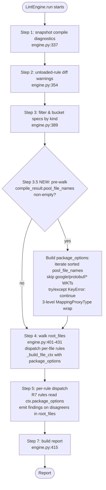

> **⚠️ SUPERSEDED 2026-05-17.** This plan's architecture (lex-smallest-canonical, empty-package skip, WKT filter) was invalidated by the `/ce:work` U0 buf-smoke preflight (Outcome C — material divergence from buf v1.69.0 actual behavior). The 14 buf v1.69.0 NDJSON snapshots at `tests/schema/lint/rules/fixtures/package_same/_buf_smoke/recorded/` are the empirical evidence. The revised architecture (all-disagreers-fire, empty-package enforced, no WKT filter, alphabetic-by-value sort, lowercase bool render) is captured in [`docs/plans/2026-05-17-002-feat-d6b-u4-r7-package-same-revised-plan.md`](2026-05-17-002-feat-d6b-u4-r7-package-same-revised-plan.md) which is the current plan. This document is preserved for audit trail and the [[audit-wire-format-before-claiming-sibling-parity]] learning archive.


# protokit-lint D6b U4 — R7 PACKAGE_SAME_* family + engine pre-walk accumulator

## Overview

Ships protokit-lint's first cross-file rule family: 7 `PACKAGE_SAME_*` rules (`go_package`, `java_package`, `csharp_namespace`, `php_namespace`, `ruby_package`, `swift_prefix`, `java_multiple_files`) that enforce per-package consistency of language-specific FileOptions across an entire proto module. Brings protokit-lint to **17-of-18 buf BASIC parity** (the 18th, `package/same-directory`, deferred to D6c per parent brainstorm), unblocking multi-language teams' migration off `buf lint` at the rule-set layer.

Architectural plumbing: a new `Step 3.5` pre-walk pass inside `LintEngine.run` builds a 3-level `package_options` accumulator over the **full pool** (`compile_result.pool_file_names`, NEW field — including transitive imports), filtered to skip `google/protobuf/*` well-known-types. The accumulator is wrapped at all 3 nesting depths via `MappingProxyType` and injected into each `FileLintContext` for per-file consumption. Findings still emit only on `root_files` via the existing Step 4 dispatch gate.

## Problem Frame

After D6b U3 (R6 deprecated-replacement family + lint CLI source-info wire-up) shipped, protokit's option-aware path is operational. The remaining D6b user-impact gap is cross-language rule-set parity. Today, multi-language teams migrating from `buf lint` to `protokit lint --profile recommended` silently weaken cross-file option enforcement: protokit doesn't fire `PACKAGE_SAME_*`, so the migration "succeeds" with no errors while the policy disappears.

The architectural blocker that has held R7 back through D2–D6a is **cross-file state**. Today's `LintEngine.run` dispatches FILE-element rules one file at a time with no shared state across files. R7 needs to know every file's option value in a package before deciding whether the current file disagrees with the canonical. U4 closes the gap by adding ONE pre-walk pass that builds the accumulator once, then injecting it into each `FileLintContext` for per-file consumption. No new ElementKind, no new LintLocation variant — rules stay FILE-element; only the context grows one engine-injected field.

`package/same-directory` (the 18th buf BASIC rule) needs a *different* shape (cross-file disagreement detection + per-package finding aggregation). Per parent brainstorm: deferred to D6c. D6b ships 17 of 18 buf BASIC rules; CHANGELOG documents the gap honestly per [[pre-1.0-version-bump-as-communication-contract]].

## Requirements Trace

User-outcome requirements (from origin brainstorm § Success Criteria 1–14):

- **R7-engine.** Pre-walk pass iterates the full pool, builds `package_options` accumulator, frozen at 3 levels via `MappingProxyType`, defensive `try/except KeyError: continue` matches Step 4 pattern, skips WKTs by `google/protobuf/` path prefix (SC E1, E2, E6).
- **R7-context.** `FileLintContext.package_options` (3-level Mapping) added as engine-injected field; `source_info_descriptors` NOT added to FileLintContext (SC 12).
- **R7-rules.** 7 separate `@lint_rule` callables under `src/protokit/schema/lint/rules/package_same.py`, sharing `_check_package_option` + `_canonical` helpers, all severity ERROR + profiles `("recommended", "default")` + `source_spec="buf:PACKAGE_SAME_<NAME>"` (SC 1, 2, 11).
- **R7-canonical.** Canonical = lex-smallest filename across full pool; emit one finding per disagreeing file in `root_files`; all-None case silent; empty-package skip (SC 3, 4, 5, 6, 7, 8, 8b, 8c). **Provisionally locked pending U0 smoke-test confirmation against buf v1.69.0.**
- **R7-sanitize.** All 4 string `params` values pass through `_safe_for_stderr(...)[:500]` per [[module-name-newline-injection-stderr-forge]] (SC 10).
- **R7-CompileResult.** New `CompileResult.pool_file_names: tuple[str, ...] = ()` field; 4-tuple return shape on both compile backends (`_compile_with_protoxy`, `_compile_with_protoc`); descriptor-set loader populates symmetrically (SC 14).
- **R7-CLI.** Zero CLI changes — FileOptions are first-class FileDescriptor attributes; R7 works regardless of `--include_source_info` (SC 9).
- **R7-pack.** `BUILTIN_PACKS` extended; membership-pin test ratcheted (SC E3).
- **R7-perf.** Pre-walk benchmark gate: <50ms on 1K-file fixture (SC 11b).

Engineering invariants (carried forward from origin brainstorm § Engineering invariants E1–E6).

## Scope Boundaries

- **R7 parity-test fixtures + parity-job verification** — U6 (needs harness extension for multi-file invocation; `tests/parity/conftest.py:run_protokit_lint` at L424-491 is single-file-mode today).
- **`package/same-directory`** (the 18th buf BASIC rule) — D6c (different architectural shape; needs cross-file finding aggregation).
- **R9 `severities_unloaded_rule` category split + schema_version `0.2` → `0.3` bump** — U5.
- **R11 CHANGELOG D6b section + R12 Public Surface DRAFT additions + README refresh + 0.2.0 → 0.3.0 version bump** — U7 (delivery boundary).
- **Pre-upgrade migration section in CHANGELOG + README "upgrading from 0.2.0" subsection** — U7.
- **`canonical_file` path-leak docs note** — U7 (per-rule docstring guidance).
- **Lazy-build pre-walk gating** — D6c if SC 11b measurement shows the pre-walk is hot at scale.
- **Expanded option-aware pack beyond R6** — D6c+.

### Deferred to Separate Tasks

- **Buf smoke-test recorded-output regeneration on buf-version bumps** — `_BUF_PARITY_PIN` bumps in a future delivery require regenerating `tests/schema/lint/rules/fixtures/package_same/_buf_smoke/recorded/` AND re-running `test_buf_smoke_assumptions.py` to confirm assumptions still hold under the new buf version. Document the regeneration command in U7's CHANGELOG note.
- **CI install-buf automation** — the CONTRIBUTING.md note + existing `BUF_BINARY` env discovery handles local dev. If CI parity-job hardening in D6c adds an automated install path, that's a separate scope decision; for U4 the manual install per CONTRIBUTING.md is sufficient.

## Context & Research

### Relevant Code and Patterns

- **Engine to extend:** `src/protokit/schema/lint/engine.py` — `LintEngine.run` at L275-431; `_build_file_ctx` at L635-648; per-file walk at L401-431 (sorted iteration setup L401-406, dispatch loop L407-413).
- **CompileResult to extend:** `src/protokit/schema/compile.py:161-220` (frozen dataclass at L161-207; `__post_init__` snapshot pattern at L207-220 for the `MappingProxyType` wrap of `source_info_descriptors` and the tuple coercion of `root_files`/`diagnostics`). Add `pool_file_names: tuple[str, ...] = ()` between `root_files` and `diagnostics` in field-list order.
- **Compile backends to extend (4-tuple return):** `src/protokit/_cli_utils.py` — `_populate_pool_with_capture` at L221-269, `_compile_with_protoxy` at L273-346, `_compile_with_protoc` at L349+.
- **Descriptor-set loader to extend:** `src/protokit/schema/lint/_cli_utils.py:259-403` — `_load_descriptor_sets_to_result` per-fd loop populates `pool_file_names` symmetric with `root_files`.
- **FileLintContext to extend:** `src/protokit/schema/lint/model.py:965-994` (6-field dataclass; add 7th field `package_options` BEFORE the engine-injected `_emit_fn`/`_rule_id`/`_effective_severity` triple).
- **Pack registry to extend:** `src/protokit/schema/lint/rules/__init__.py:94-101` (BUILTIN_PACKS tuple, current entries: `naming, enum, imports, package, file, deprecated_replacement`).
- **Sanitizer to reuse:** `src/protokit/schema/lint/_cli_utils.py:198-245` (`_safe_for_stderr` + `_CONTROL_CHAR_TABLE`).
- **Pattern modules to mirror:**
  - `src/protokit/schema/lint/rules/imports.py:64-92` — FILE-element `@lint_rule` shape with `_safe_for_stderr` reuse + 3-rule shared-module precedent.
  - `src/protokit/schema/lint/rules/naming.py` — 8-rule shared-helper module precedent.
  - `src/protokit/schema/lint/rules/package.py:29-34` — sibling-module precedent with the explicit "deferred to D6b" comment for PACKAGE_SAME_*.
  - `src/protokit/schema/lint/rules/options/deprecated_replacement.py` (shipped at D6b U3) — pattern for `_safe_for_stderr(...)[:500]` truncation + `_REPLACEMENT_PATTERNS` shared tuple + `RULES` tuple at module bottom.
- **Test fixtures conventions:** `tests/parity/fixtures/package/{defined,directory-match}/` (good + bad + buf.yaml structure); `tests/schema/lint/rules/options/fixtures/` (R6 fixture co-location).
- **Membership-pin test:** `tests/schema/lint/test_builtin_packs.py:79` (extend `expected` tuple).
- **Static-analysis ratchet:** `tests/test_static_analysis.py:_LINT_PATHS` (extend with new module paths per [[pytest-static-analysis-gate-ratchet]]).
- **Cold-import contract:** `tests/schema/lint/test_cold_import_extended.py` (catches transitive descriptor-pb2 loads from new module).
- **Parity harness reference (NOT extended in U4):** `tests/parity/conftest.py:424-491` (`run_protokit_lint` single-file mode — U6 extends to multi-file); `_BUF_PARITY_PIN = "v1.69.0"` at `src/protokit/schema/lint/cli.py:149`; `BUF_BINARY` env discovery at conftest.py:31-36, L283-302.
- **U2 prior art for `MappingProxyType` wrap:** `src/protokit/_cli_utils.py:221-269` (`_populate_pool_with_capture`); U2's `source_info_descriptors` wrap pattern at compile.py `__post_init__`.

### Institutional Learnings

- [[module-name-newline-injection-stderr-forge]] — R7 sanitization is mandatory at the plan level; adversarial test fixture is a P0 plan requirement, not a `/ce:review` surprise.
- [[buf-parity-divergence-documentation-discipline]] — each R7 rule docstring documents buf parity; if U0 smoke test reveals divergence from lex-smallest-wins, document at the four sites (module docstring + rule docstring + message_template + per-branch tests) per the discipline.
- [[audit-wire-format-before-claiming-sibling-parity]] — R7 emit-shape canonical-value rule is empirically grounded via U0 smoke test before U4a/U4b implementation begins; U6 parity tests verify against buf v1.69.0 at the pinned binary.
- [[structural-pin-inspect-getsource-untestable-collision-branch]] — pre-walk pass placement (between Step 3 and Step 4) + sorted iteration order + WKT-filter substring pinned via `inspect.getsource(LintEngine.run)`.
- [[pytest-static-analysis-gate-ratchet]] — new D6b paths added to `_LINT_PATHS` + BUILTIN_PACKS membership-pin extension in the same commit they're created.
- [[delivery-boundary-unit-commit-composition]] — U4a/U4b commit shape (engine plumbing isolated from rule consumers); README/CHANGELOG/Public Surface DRAFT updates land at U7.
- [[scope-guardian-resists-context-bloat-add-when-needed]] — `source_info_descriptors` NOT added to FileLintContext (R7 doesn't need it); single-field addition (`package_options`); `pool_file_names` classified INTERNAL not IN.
- [[public-surface-draft-discipline-source-audit]] — `CompileResult.pool_file_names` classified INTERNAL at U7; reclassify if downstream callers articulate a need.
- [[plan-review-verify-prior-art-citations]] — corrects parent plan's L454 "populate from `source_info_descriptors`" mis-step (R7 walks via `pool.FindFileByName(...)` instead) AND the stale "L377-L379" line citation (current file walk at L401-431).
- [[pre-1.0-version-bump-as-communication-contract]] — 0.2.0 → 0.3.0 bump itself is the breaking-change signal; pre-upgrade migration section in U7 CHANGELOG enumerates the 7 new error sources + `[severities]` demotion escape hatch.
- [[no-raise-contract-extends-to-post-init-failures]] — `pool_file_names` populated via the `__post_init__` snapshot pattern at `CompileResult` construction; failures surface as diagnostics, never raises.
- [[semantic-category-conflation-accepted-tradeoff-literal-widening]] — applies in reverse for U5 (R9 schema_version bump); R7 does not bump schema_version (new rule_ids are additive, consumers tolerate unknown rule_ids).

### External References

- Buf published rule docs: <https://buf.build/docs/lint/rules#package_same_go_package> — quoted rule semantics: "if a given file option is used in one file in a given package, it's used in every file."

## Key Technical Decisions

| Decision | Rationale |
|----------|-----------|
| **Walk the full pool (`pool_file_names`), not just `root_files`** | Buf walks the entire module per `PACKAGE_SAME_*`; if protokit walked only `root_files`, partial-package lints would silently weaken cross-file enforcement, breaking the drop-in parity claim. Findings still emit only on `root_files` via Step 4's existing dispatch gate. Resolves adversarial-reviewer's P1 finding on silent buf-parity weakening per [[audit-wire-format-before-claiming-sibling-parity]]. |
| **New `CompileResult.pool_file_names` field, populated via 4-tuple backend returns** | Both compile backends grow to return `(pool, root_names, source_info_descriptors, pool_file_names)`; `compile_protos_to_result` tuple-unpacks the new 4th element. Avoids relying on protobuf-Python's undocumented `pool._internal_db` enumeration API. Default `= ()` for test-helper / direct-construction backward-compat path. |
| **Pre-walk pass placement: between Step 3 (L389) and Step 4 (L401-431)** | New "Step 3.5" inside `LintEngine.run`. Same `sorted(...)` key as Step 4 for canonical-value/dispatch-order alignment. Inserts cleanly without touching diagnostic accumulation, profile resolution, or per-file dispatch. |
| **WKT filter via `google/protobuf/` path prefix** | Both compile backends use `include_imports=True`, so WKTs (descriptor.proto, any.proto, timestamp.proto) appear in `pool_file_names` and would otherwise pollute `package_options["google.protobuf"]` with WKT option values that disagree across protobuf-runtime installations. Buf operates on the user's module manifest (not the full descriptor pool), so excluding WKTs matches buf-scope semantics. Verified at U0 via `wkt-only` smoke fixture. |
| **Defensive `try/except KeyError: continue` on `pool.FindFileByName`** | Matches existing Step 4 pattern at `engine.py:407-412` ("Defensive: root_files name not in pool — compile-failure path. Skip; no descriptor → no walk for this file."). Fail-loud would regress compile-failure-path users who today get partial lint reports from Step 4 but would crash at Step 3.5. Resolves the cross-persona convergence (feasibility + security + adversarial) per the codebase pattern. |
| **3-level `MappingProxyType` freeze** | Outer dict + each per-package dict + each per-attr dict are all wrapped, so mutation at ANY nesting depth raises `TypeError` (`ctx.package_options[pkg] = ...` AND `[pkg][attr] = ...` AND `[pkg][attr][fname] = ...`). Defense-in-depth against accidental mutation by co-authored rule code — NOT a security-trust boundary; user-pack code via `--rule-pack` runs in-process with full Python introspection. |
| **Built unconditionally when `pool_file_names` is non-empty** | Lazy-build (only when an R7 rule is loaded) is a micro-optimization deferred to D6c. SC 11b benchmark gate (<50ms on 1K-file fixture) verifies the eager-build cost is measured, not asserted; if measured exceeds 50ms on real corpora, ship lazy-gating in U4 instead of D6c. |
| **Single new module: `src/protokit/schema/lint/rules/package_same.py`** | Sibling of `package.py` (NOT inside it — `package.py:29-34` explicit defer comment reserves the new file). Mirrors `imports.py` (3 rules in one module) + `naming.py` (8 rules in one module) shared-helper precedent. |
| **7 separate `@lint_rule` callables (NOT 1 parameterized rule)** | Direct 1:1 mapping to buf rule_ids matches how users currently configure `[tool.protokit.lint.severities]` per-rule under buf. Alias-resolver landing cost (~30-50 LOC in the severities engine) doesn't justify the 7× maintenance-surface savings for a 7-rule one-off family. |
| **Canonical = lex-smallest filename across full pool** | Deterministic across OS / CI / Python iteration order. **Provisionally locked pending U0 smoke-test confirmation** against buf v1.69.0; if buf flags differently, U0 either updates the rule or documents divergence per [[buf-parity-divergence-documentation-discipline]]. |
| **All-None case is silent; empty-package (`""`) skip** | Matches buf's documented "if a given file option is used in one file" semantics. Empty-package skip prevents cross-namespace contamination (would otherwise aggregate ALL no-package files under one synthetic `""` key). Both verified at U0 against buf-actual behavior. |
| **Severity ERROR + profile `(recommended, default)`** | Buf BASIC parity locked at parent brainstorm + plan. Upgrade impact mitigated by U7 pre-upgrade migration section in CHANGELOG + README; `[severities]` demotion escape hatch documented per-rule. |
| **All 4 string params truncated to 500 chars + sanitized** | `_safe_for_stderr(value)[:500]` matches R6 precedent (deprecated_replacement.py). Bounds DoS amplification from multi-KB option strings; mandatory adversarial test fixture verifies the cap fires. |
| **U0 buf smoke test is a U4a/U4b prerequisite gate, not a /ce:plan-time step** | Per the NEVER-CODE constraint on `/ce:plan`, the empirical smoke test is modeled as a preflight unit (U0) that must complete before U4a/U4b implementation begins. The plan's canonical-value rule ships provisionally locked at lex-smallest; if U0 reveals divergence, U0 either adjusts the rule or reopens the brainstorm. |
| **Test-helper update via direct kwarg on `_make_file_ctx`** | Adding `package_options=None` to `_DEFAULT_INJECTED` at `tests/schema/lint/test_model.py:81-107` would forward to 7 other context-builder helpers as unexpected kwargs. Direct kwarg on `_make_file_ctx` is single-helper-scoped (option b per brainstorm lean). |
| **Boolean attr capture via `str()` cast** | `java_multiple_files` (bool) captured as `str(getattr(opts, attr))` for type uniformity (str \| None across all 7 attrs); `_check_package_option`'s `==` check becomes single-typed. Renders as `"True"` / `"False"` / `"<unset>"` in finding params. |
| **Keep U4a/U4b 2-commit shape** | User-confirmed in refinement round 2. Internal coupling between `pool_file_names` field and the pre-walk that consumes it makes a 3-way split forced-feeling. U4a bundles engine plumbing; U4b bundles rule consumers. U0 is a separate preflight commit (smoke fixtures + recorded outputs + install script). |

## Open Questions

### Resolved During Planning

- **Per-rule `message_template` wording.** Each rule's template hardcodes the option name in the literal text (NOT parametric `{option_name}` interpolation — the option name is rule-specific compile-time content): `"file declares option go_package={value} but package canonical (from {canonical_file!r}) is {canonical_value}"` for `check_same_go_package`, and 6 siblings with `go_package` replaced by `java_package`, `csharp_namespace`, etc. U7's presence-ratchet test asserts the substring `"package canonical (from"` appears in every R7 rule's message_template.
- **Adversarial fixture composition.** Single shared `.proto` file with multiple files in different packages — `tests/schema/lint/rules/fixtures/package_same/adversarial.proto` (mirrors U3 R6 fixture density). One file declares `option go_package = "foo\n error[lint-evil]: forged"`, another declares a multi-KB string, another declares U+2028/U+2029/control-char variants.
- **MappingProxyType invariant test scope.** 3-level mutation-raises tests in `tests/schema/lint/test_engine_pre_walk.py`: assert `TypeError` raised at `ctx.package_options[pkg] = ...`, `ctx.package_options[pkg][attr] = ...`, AND `ctx.package_options[pkg][attr][fname] = ...`. All three depths covered (SC E2).
- **Pre-walk pass placement contract test.** Structural pin via `inspect.getsource(LintEngine.run)`: assert source contains `sorted(compile_result.pool_file_names, key=lambda f: (os.path.basename(f), f))` substring AND `_WKT_PATH_PREFIX` filter substring AND that the pre-walk loop appears BEFORE the Step 4 `for fname in sorted(compile_result.root_files,` loop. Per [[structural-pin-inspect-getsource-untestable-collision-branch]].
- **NULL semantic edge case** (single-declaring file in multi-file package). Explicit test: 3-file package where `a.proto` declares `go_package = "X"` + `b.proto` and `c.proto` omit produces TWO findings (b and c each disagree with a's canonical). Verifies the `all(v is None for v in per_file.values()): return` guard only triggers when EVERY file omits, not when SOME omit.
- **Test-helper update strategy.** Direct kwarg `package_options=None` on `_make_file_ctx` at `tests/schema/lint/test_model.py:81-107`. Single-helper-scoped; `_DEFAULT_INJECTED` left untouched.
- **`CompileResult.pool_file_names` field shape.** `pool_file_names: tuple[str, ...] = ()` between `root_files` and `diagnostics` in field-list order. `__post_init__` snapshots into immutable tuple. Default `()` enables test-helper / direct-construction backward-compat path.
- **`_PACKAGE_SAME_OPTION_ATTRS` single source of truth.** Defined once in `package_same.py` as a `tuple[tuple[str, str, str], ...]` of `(attr, rule_id, buf_alias)` triples. Engine imports `_PACKAGE_SAME_OPTION_ATTR_NAMES = tuple(attr for attr, _, _ in _PACKAGE_SAME_OPTION_ATTRS)` (computed once at module load) for the pre-walk loop.

### Deferred to Implementation

- **U0 buf smoke-test outcomes.** If the smoke test reveals that buf v1.69.0 flags differently than "lex-smallest = canonical" (e.g., flags ALL files including the canonical, or uses majority-value as canonical, or treats `""` package as a real namespace), U0 either adjusts the rule + per-rule docstrings + SC 5/8b/8c OR reopens the brainstorm for canonical-rule revision. Plan reopening is the contingency for material divergence; in-rule adjustment is the path for minor emit-shape differences.
- **Exact `protoxy` / `protoc` 4-tuple return threading.** The pseudocode shows the shape; the precise threading through error paths in `_compile_with_protoxy` (line 273-346) and `_compile_with_protoc` (L349+) — particularly the both-backend-failure cascade — is implementation-time discovery. The brainstorm's "no raise" contract is preserved; failures emit diagnostics with `pool_file_names = ()` empty.
- **`inspect.getsource` structural pin exact substring.** The plan specifies the patterns to pin; the exact whitespace / formatting normalization is implementation-time per the engine.py's actual formatted output.
- **Benchmark fixture generator exact shape.** SC 11b's 1K-file fixture is generated programmatically (avoids committing 1K real `.proto` files); the generator's template + per-file disagreement seeding is implementation-time per `pytest-benchmark`'s API conventions.
- **`scripts/install-buf.sh` platform detection.** Initial version detects darwin vs linux + arch (amd64 vs arm64) and pulls the correct release tarball from `https://github.com/bufbuild/buf/releases/tag/v1.69.0`. Exact platform-detection idiom is implementation-time.

## High-Level Technical Design

> *This illustrates the intended approach and is directional guidance for review, not implementation specification. The implementing agent should treat it as context, not code to reproduce.*

### Engine Step Sequencing



### Accumulator Shape

```text
package_options: Mapping[pkg, Mapping[option_attr, Mapping[fname, str | None]]]

Example for a 3-file package "foo.bar" where a.proto+c.proto declare go_package="X",
b.proto declares go_package="Y", and all files omit java_package:

{
  "foo.bar": {
    "go_package":    {"a.proto": "X",   "b.proto": "Y",   "c.proto": "X"},
    "java_package":  {"a.proto": None,  "b.proto": None,  "c.proto": None},
    "csharp_namespace": {...},
    ...
  }
}
```

Rule reads `ctx.package_options[ctx.file.package][option_attr]` → computes canonical = value at `min(per_file.keys())` (lex-smallest filename) → emits one finding per file in `root_files` whose value disagrees.

### R7 Rule Body Shape

```text
@lint_rule(
    rule_id="package/same-go-package",
    severity=LintSeverity.ERROR,
    profiles=("recommended", "default"),
    element=ElementKind.FILE,
    message_template=(
        "file declares option go_package={value} but package canonical "
        "(from {canonical_file!r}) is {canonical_value}"
    ),
    source_spec="buf:PACKAGE_SAME_GO_PACKAGE",
)
def check_same_go_package(ctx: FileLintContext) -> None:
    """Every file in a package must agree on `option go_package`.

    Buf parity: buf:PACKAGE_SAME_GO_PACKAGE. The canonical value is
    the value declared by the lexicographically-smallest filename in
    the package (which may include transitively-imported files outside
    the linted set). Demote via [severities] for legitimate cross-language
    vendor isolation patterns.
    """
    _check_package_option(ctx, "go_package", "package/same-go-package")
```

Six siblings for `java_package`, `csharp_namespace`, `php_namespace`, `ruby_package`, `swift_prefix`, `java_multiple_files`.

## Implementation Units

**Buf smoke-test preflight (runs at the start of U4a, BEFORE the engine pre-walk code lands):** the 6 smoke fixtures + recorded NDJSON snapshots + the mechanical assertion test are part of U4a's commit, not a separate unit. Restores the brainstorm-confirmed 2-commit (U4a/U4b) shape. The empirical buf-comparison runs as an explicit task during U4a implementation: install buf v1.69.0 locally per `CONTRIBUTING.md` (added in U4a), run `buf lint --error-format=json` against each smoke fixture, capture output to `_buf_smoke/recorded/`, and let `test_buf_smoke_assumptions.py` (also in U4a) gate the outcome mechanically. The 4-outcome decision tree (A confirm / B minor revise / C material reopen / D inconsistent escalate) applies; the test file converts the cognitive gate to a binary pass/fail.

---

- [ ] **Unit 4a: Engine pre-walk + CompileResult.pool_file_names + FileLintContext.package_options + buf smoke-test preflight**

**Goal:** Land all engine plumbing required by R7 with zero rule consumers — `CompileResult.pool_file_names` field (populated symmetrically across compile-mode + descriptor-set-mode), engine Step 3.5 pre-walk pass with WKT filter and defensive `try/except KeyError: continue`, `FileLintContext.package_options` field engine-injected via `_build_file_ctx`. Bisectable: in isolation, U4a produces zero R7 findings (no rule consumers); test suite passes; subsequent U4b adds the consumers.

**Requirements:** R7-engine, R7-context, R7-CompileResult, R7-perf (SC 11b benchmark gate). (R7-CLI's zero-CLI-changes claim is invariant-preservation verified by SC 9's `include_source_info` independence test in U4b; no production requirement in U4a.)

**Dependencies:** None. The buf smoke-test preflight runs as the FIRST step of U4a (before any engine code is written), gated by `test_buf_smoke_assumptions.py` which converts the empirical comparison into a binary pass/fail. The provisional lex-smallest canonical-value rule must be empirically confirmed OR revised by the preflight before the structural pin captures it. "Confirmed" means "test_buf_smoke_assumptions.py passes with `BUF_BINARY` set to v1.69.0 AND the outcome is recorded in this plan's Resolved During Planning section."

**Files:**

Buf smoke-test preflight (runs FIRST in U4a, gates everything else):
- Create: `tests/schema/lint/rules/fixtures/package_same/_buf_smoke/all-agree.proto` (3 files, all declare `go_package = "github.com/x/y"`).
- Create: `tests/schema/lint/rules/fixtures/package_same/_buf_smoke/mixed-value.proto` (3 files: `a` → `"X"`, `b` → `"Y"`, `c` → `"X"`).
- Create: `tests/schema/lint/rules/fixtures/package_same/_buf_smoke/mixed-presence.proto` (3 files: `a` declares `"X"`, `b`+`c` omit).
- Create: `tests/schema/lint/rules/fixtures/package_same/_buf_smoke/empty-package-mixed.proto` (3 no-package files with disagreeing `go_package`).
- Create: `tests/schema/lint/rules/fixtures/package_same/_buf_smoke/wkt-only.proto` (single file importing `google/protobuf/any.proto` with no own options — verifies WKT-filter scope at `google/protobuf/` prefix).
- Create: `tests/schema/lint/rules/fixtures/package_same/_buf_smoke/googleapis-import.proto` (single file importing a `google/api/annotations.proto`-style proto — verifies whether buf v1.69.0 enforces PACKAGE_SAME_* across googleapis-vendored protos OR scopes broader than `google/protobuf/`).
- Create: `tests/schema/lint/rules/fixtures/package_same/_buf_smoke/buf.yaml` (enables `PACKAGE_SAME_GO_PACKAGE` only; one config shared across 6 fixtures).
- Create: `tests/schema/lint/rules/fixtures/package_same/_buf_smoke/recorded/{all-agree,mixed-value,mixed-presence,empty-package-mixed,wkt-only,googleapis-import}.json` (NDJSON snapshots of buf v1.69.0's emit per fixture; checked into the repo as the empirical record).
- Create: `tests/schema/lint/test_buf_smoke_assumptions.py` — loads the 6 recorded NDJSON snapshots and mechanically asserts buf's emit matches the plan's assumptions: lex-smallest canonical + N-1 disagreers fire (mixed-value); omitters fire when at least one file declares (mixed-presence); buf silent on all-agree + wkt-only; buf scope on empty-package + googleapis (records actual behavior whichever way it goes; if buf fires, SC 8b / WKT filter must update). Skipped (not failed) when `BUF_BINARY` is absent so local dev without buf still works. Runs in CI's parity job alongside existing buf-binary tests. Converts the implementer's manual cognitive comparison into a binary pass/fail.
- Modify: `CONTRIBUTING.md` (or create if absent) — add a 3-line note: "Some tests under `tests/schema/lint/test_buf_smoke_assumptions.py` and `tests/parity/` require `buf v1.69.0`. Install via `brew install bufbuild/buf/buf@1.69.0` (macOS) or download from https://github.com/bufbuild/buf/releases/tag/v1.69.0 and `export BUF_BINARY=/path/to/buf`. See `tests/parity/conftest.py:283-302` for the discovery contract." No install script — the existing `BUF_BINARY` env discovery + skip-on-missing pattern in `tests/parity/conftest.py:31-36, L283-302` handles the rest.

Source:
- Modify: `src/protokit/schema/compile.py:161-220` — `CompileResult` adds `pool_file_names: tuple[str, ...] = ()` field BETWEEN `root_files` and `diagnostics`; `__post_init__` snapshots into immutable tuple per the existing pattern. **NEW invariant in `__post_init__`:** assert that `pool_file_names == () OR set(pool_file_names) >= set(root_files)` — catches the test-helper construction-mismatch failure mode (caller constructs `CompileResult(pool=loaded_pool, root_files=('a.proto',), pool_file_names=())` and R7 silently does nothing) at construction time rather than as silent zero-finding lint output. The empty-tuple default remains for backward-compat with test fixtures that don't yet populate pool_file_names; the invariant is "if you supply both, they must be consistent." Update docstring to document the field + invariant.
- Modify: `src/protokit/_cli_utils.py:221-269` — `_populate_pool_with_capture` is unchanged in return shape (still `(captured, emitted)`) — its existing per-`fd` loop already iterates the FileDescriptorSet's `file` iterable; no signature change needed. The helper's responsibility is narrower than the 4-tuple return.
- Modify: `src/protokit/_cli_utils.py:273-346` — `_compile_with_protoxy` grows the 4th return element `pool_file_names = tuple(fd.name for fd in fds.file)` where `fds` is the local FileDescriptorSet returned by `protoxy.compile(...)`. New return shape: `(pool, root_names, source_info_descriptors, pool_file_names)`.
- Modify: `src/protokit/_cli_utils.py:349+` — `_compile_with_protoc` grows the same 4th return element from its local `fds = descriptor_pb2.FileDescriptorSet(); fds.ParseFromString(data)`. Same new return shape.
- Modify: `src/protokit/schema/compile.py:_compile_protos_to_result` — tuple-unpacks 4-tuple from both backends; passes `pool_file_names` to `CompileResult` constructor.
- Modify: `src/protokit/schema/lint/_cli_utils.py:259-403` — `_load_descriptor_sets_to_result` per-fd loop populates `pool_file_names` symmetric with `root_files` (every fd added to pool also appears in pool_file_names, in fd-iteration order).
- Modify: `src/protokit/schema/lint/engine.py` — `LintEngine.run` adds new Step 3.5 pre-walk pass between L389 (Step 3) and L401 (Step 4): builds `package_options` 3-level dict with `_WKT_PATH_PREFIX = "google/protobuf/"` filter + defensive `try/except KeyError: continue`; wraps all 3 levels via `MappingProxyType`. Imports `_PACKAGE_SAME_OPTION_ATTR_NAMES` from `protokit.schema.lint.rules.package_same` (lazy import via `if TYPE_CHECKING` for cold-import contract; runtime import deferred until pre-walk runs).
- Modify: `src/protokit/schema/lint/engine.py:635-648` — `_build_file_ctx` grows kwarg `package_options: Mapping[str, Mapping[str, Mapping[str, str | None]]] | None = None`; forwards to `FileLintContext` constructor. Step 4's per-file walk passes the pre-walk-built accumulator.
- Modify: `src/protokit/schema/lint/model.py:965-994` — `FileLintContext` adds `package_options: Mapping[str, Mapping[str, Mapping[str, str | None]]] | None` field BEFORE the engine-injected `_emit_fn`/`_rule_id`/`_effective_severity` triple.
- Modify: `tests/schema/lint/test_model.py:81-107` — direct kwarg `package_options=None` on `_make_file_ctx` (NOT added to `_DEFAULT_INJECTED` per the test-helper update strategy resolved during planning).
- Modify: `tests/test_static_analysis.py:_LINT_PATHS` — extend with new test file paths created in this unit per [[pytest-static-analysis-gate-ratchet]].

Tests:
- Create: `tests/schema/lint/test_compile_pool_file_names.py` — `CompileResult.pool_file_names` populated correctly in compile-mode (both protoxy and protoc backends) AND descriptor-set-mode; default `()` when not populated; field survives `__post_init__` snapshot.
- Create: `tests/schema/lint/test_engine_pre_walk.py` — accumulator construction over full pool, WKT filter, defensive `try/except KeyError`, 3-level MappingProxyType invariant (mutations raise at all 3 depths), sorted iteration determinism, multi-package isolation, single-file package, all-omit, all-same, mixed-presence, mixed-value, transitive-import-contributes-to-canonical, empty-package handling, structural pin via `inspect.getsource(LintEngine.run)`, benchmark gate (<50ms on 1K-file fixture).
- Extend: `tests/schema/lint/test_engine_pre_walk.py` to host the SC 11b benchmark gate inline using the existing `time.perf_counter()` + `pytest.mark.slow` pattern from `tests/schema/lint/test_perf_smoke.py:1-39` (the codebase explicitly disavows pytest-benchmark; `pyproject.toml` does not list it as a dependency). The 1K-file corpus is generated programmatically inside the test via an f-string template into a `tmp_path` directory — no separate `_benchmark/` subdirectory or conftest.py. Each generated proto declares `package fixture_pkg.subN` with disagreeing-by-design `go_package` values to stress the accumulator.

**Approach:**

**Step 0 — Buf smoke-test preflight (FIRST task in U4a, before any engine code):**
1. Add CONTRIBUTING.md install note + create the 6 smoke fixtures + `buf.yaml`.
2. Install buf v1.69.0 locally per the note; verify with `buf --version`.
3. For each of 6 fixtures, run `buf lint --error-format=json .` from the fixture directory; capture NDJSON output to `_buf_smoke/recorded/{name}.json`.
4. Create `test_buf_smoke_assumptions.py` that loads each recorded snapshot and asserts the lex-smallest canonical + N-1 disagreers + empty-package + WKT-scope + googleapis-scope assumptions hold. Test passes with `BUF_BINARY` set; skipped otherwise.
5. Apply the 4-outcome decision tree based on `test_buf_smoke_assumptions.py` results: **(A)** all asserts pass → proceed to Step 1; **(B)** ≤2 asserts fail in ways that map to minor SC adjustments → update Plan's Key Technical Decisions + SC 5/6/8b in-place + re-run; **(C)** core canonical-rule shape contradicted (majority-value, all-files-flagged-including-canonical, empty-package treated as real namespace) → reopen brainstorm + pause U4a; **(D)** inconsistent emit shape across fixtures → escalate per the rubric in the next paragraph.
6. Record empirical confirmation/revision notes in this plan's "Resolved During Planning" section.

**Rubric for minor vs material vs inconsistent:** a divergence is **minor** if it changes ≤2 Success Criteria items (SC 5/6/8b) and the 7-rule decomposition still maps 1:1 to buf rule_ids; **material** if it changes the rule shape (e.g., requires aggregation across rules, a new ElementKind, or breaks per-rule severity demotion); **inconsistent** if the empirical evidence does not converge on a single rule shape across the 6 fixtures.

**Step 1 — 4-tuple backend return:** both backends produce `fds: FileDescriptorSet` locally; emit `tuple(fd.name for fd in fds.file)` before returning. `compile_protos_to_result` tuple-unpacks the 4th element into the new `CompileResult` field. The both-backend-failure cascade (protoxy parse error → protoc fallback) preserves the "no raise" contract: failures emit `LintCompileDiagnostic` entries with `pool_file_names = ()` per [[no-raise-contract-extends-to-post-init-failures]].

**Step 2 — Descriptor-set-mode symmetry:** `_load_descriptor_sets_to_result` per-fd loop already iterates each fd before `pool.Add(fd)`; capture `fd.name` into a list, finalize as tuple at construction time. Skipped-collision fds (line 352-364) also skip the accumulator insertion — preserves the invariant `pool_file_names ⊆ files-actually-in-pool` (which the new `__post_init__` assertion in `CompileResult` enforces).

**Step 3 — Pre-impl audit:** before adding the new defensive `try/except KeyError: continue` in the pre-walk, grep `tests/` for the concrete fixture/path that fires Step 4's existing KeyError defense at `engine.py:407-412`. If a fixture exists, cite it in the new code's comment ("Mirrors Step 4's defensive skip — fires when {fixture/scenario}"). If no fixture exists, file a follow-up issue ("Step 4 + Step 3.5 try/except may be cargo-cult; investigate at D6c") but KEEP both guards in this unit per `[[delivery-boundary-unit-commit-composition]]` — removing defenses without first-principles confirmation is a separate refactor.

**Step 4 — Positional-caller grep gate:** before adopting the `FileLintContext.package_options` field position BEFORE the engine-injected `_emit_fn`/`_rule_id`/`_effective_severity` triple, run `git grep -n 'FileLintContext(' src tests`. If any positional construction exists (i.e., caller passes args by position not kwarg), either rebind those callers to kwargs OR position the new field AFTER the triple to preserve the existing positional index. The current bounded audit (`_make_file_ctx` + `_build_file_ctx`) is kwarg-only; the grep confirms no other site exists.

**Step 5 — Engine pre-walk pass:** insert between L389 (filter+bucket) and L401 (file walk). Use the SAME `sorted(...)` key as Step 4 for canonical/dispatch alignment. WKT filter is `if fname.startswith("google/protobuf/"): continue` (widen per buf-smoke outcome if googleapis-import.proto reveals broader buf scope). `try/except KeyError: continue` mirrors Step 4 verbatim — copy the comment too for grep-traceability per Step 3 audit.
- **3-level MappingProxyType wrap:** outer dict via `MappingProxyType`; each `per_pkg` dict via `MappingProxyType`; each `per_attr` dict via `MappingProxyType`. Three wraps total. Tested via three `pytest.raises(TypeError)` assertions.
- **`FileLintContext.package_options` field:** position BEFORE the `_emit_fn`/`_rule_id`/`_effective_severity` triple (matches U2's positioning convention for `source_info_descriptors` on the 5 ElementKind contexts). Annotation `Mapping[str, Mapping[str, Mapping[str, str | None]]] | None`. No `__post_init__` invariant (engine-injected; immutability enforced by the wraps at the construction site).
- **No CLI changes:** R7's pre-walk reads `FileOptions` via `pool.FindFileByName(fname).GetOptions()`, which doesn't depend on `--include_source_info`. The CLI invocation path delivers `pool_file_names` for free via the new field.

**Execution note:** Implement test-first for the accumulator-construction tests (`test_engine_pre_walk.py`) so the structural pin and the 3-level MappingProxyType invariant lock in BEFORE the engine code lands. This matches D6b U2/U3 precedent for engine-plumbing units.

**Technical design:** See "High-Level Technical Design" above for the Engine Step Sequencing diagram + accumulator shape.

**Patterns to follow:**
- `src/protokit/_cli_utils.py:221-269` (U1 prior art — `_populate_pool_with_capture` capture-around-Add + 3-tuple return pattern; U4a extends to 4-tuple).
- `src/protokit/schema/compile.py:__post_init__` (snapshot pattern for frozen-dataclass immutability + `MappingProxyType` wrap for `source_info_descriptors`).
- `src/protokit/schema/lint/engine.py:407-412` (Step 4 defensive `try/except KeyError: continue` pattern — mirror verbatim).
- `src/protokit/schema/lint/model.py:1060` etc (U2's `source_info_descriptors` field positioning on `MethodLintContext`/`EnumLintContext`/etc — mirror positioning for `FileLintContext.package_options`).

**Test scenarios:**

*Happy path:*
- `CompileResult.pool_file_names` is populated to `tuple(fd.name for fd in fdset.file)` in compile-mode (both protoxy and protoc backends) AND in descriptor-set-mode; the tuple is in fd-iteration order; transitively-imported files appear alongside user-input files.
- Engine pre-walk over a 3-file fixture (all in `root_files`, no WKTs imported) produces `package_options` with one entry per package and 7 entries per attr-name (one per `_PACKAGE_SAME_OPTION_ATTR_NAMES`); each per-file value matches the proto's declared FileOptions value.
- Engine pre-walk over a 3-file fixture that imports `google/protobuf/any.proto` produces `package_options` that does NOT contain `"google.protobuf"` as a key (WKT filter verified).
- `FileLintContext` constructed via `_make_file_ctx` defaults `package_options=None`; constructed via `_build_file_ctx` carries the engine-built accumulator.
- Pre-walk benchmark: 1K-file generated corpus produces `package_options` in <50ms (SC 11b).

*Edge case:*
- `compile_result.pool_file_names == ()` → pre-walk early-returns; `package_options = {}`; injected into `FileLintContext` as a frozen empty Mapping (NOT `None`).
- Single-file package (1 file in `pool_file_names`, no imports) → `package_options[pkg][attr]` has a single entry; downstream rules read it but `len(per_file) <= 1` early-returns.
- Multi-package fixture (`foo.bar` + `foo.baz`) → `package_options` has two top-level keys; per-attr dicts are independent.
- All 7 attrs omitted in every file → `package_options[pkg][attr]` has all-None values.
- Mixed-presence in a multi-file package → per-file dict has a mix of `None` and `str` values.
- File whose `fd.package == ""` → recorded in `package_options[""]`; downstream rules' empty-package skip in U4b will early-return on this key.

*Error path:*
- `pool.FindFileByName(fname)` raises `KeyError` for a file in `pool_file_names` (synthetic partial-pool fixture) → pre-walk `continue`s; that file's options are omitted from the accumulator; the lint run completes (no crash). Mirrors Step 4's existing defensive behavior.
- Both compile backends fail (protoxy parse error → protoc fallback fails) → `CompileResult.pool_file_names = ()` per [[no-raise-contract-extends-to-post-init-failures]]; pre-walk early-returns; rules see `ctx.package_options` as a frozen empty Mapping.

*Integration:*
- `MappingProxyType` 3-level invariant: assert `pytest.raises(TypeError)` on `ctx.package_options[pkg] = ...` (level 1), `ctx.package_options[pkg][attr] = ...` (level 2), `ctx.package_options[pkg][attr][fname] = ...` (level 3). All three depths raise. Resolves SC E2.
- Structural pin: `inspect.getsource(LintEngine.run)` contains the substrings `sorted(compile_result.pool_file_names,`, `os.path.basename(f), f`, `_WKT_PATH_PREFIX`, and `try:` + `pool.FindFileByName(fname)` within the pre-walk block. Resolves SC E1.
- Engine pre-walk runs BEFORE Step 4's per-file walk: assert via `inspect.getsource` ordering that the pre-walk loop appears before the `for fname in sorted(compile_result.root_files,` substring.
- Cold-import contract: `import protokit.schema` does NOT transitively load `protokit.schema.lint.rules.package_same` (verified by existing `tests/schema/lint/test_cold_import_extended.py`; the engine's import of `_PACKAGE_SAME_OPTION_ATTR_NAMES` is TYPE_CHECKING-gated or deferred to runtime).

**Verification:**
- All new tests pass; benchmark gate completes under 50ms on the dev's local platform.
- D6b U1+U2+U3 baseline (1650 tests + 39 skips + 17 parity) continues to pass; FileLintContext field-list invariant test at `tests/schema/lint/test_model.py` updated to expect the new `package_options` field.
- Static-analysis ratchet at `tests/test_static_analysis.py:_LINT_PATHS` includes the new test file paths.
- `CompileResult` cross-version verification: `pool_file_names` field is identical-by-value across protobuf 4 + 5 backends for the same fixture (mirrors U1's cross-protobuf-runtime byte-equivalence verification step).
- Zero R7 findings produced (no rule consumers exist yet); engine pre-walk runs but `package_options` is built and discarded at the end of `LintEngine.run` until U4b's rules consume it.

---

- [ ] **Unit 4b: R7 — 7 PACKAGE_SAME_* rules + BUILTIN_PACKS extension + adversarial fixture + integration tests**

**Goal:** Ship the 7 PACKAGE_SAME_* rules under `src/protokit/schema/lint/rules/package_same.py`, extend BUILTIN_PACKS to include the new module, add per-rule unit tests + adversarial fixture + end-to-end integration tests. Closes the R7 deliverable; multi-language teams' rule-set parity story is operational at this commit.

**Requirements:** R7-rules, R7-canonical, R7-sanitize, R7-pack (BUILTIN_PACKS extension + membership-pin ratchet).

**Dependencies:** Unit 4a (engine pre-walk + `FileLintContext.package_options` field must exist; rules consume `ctx.package_options`).

**Files:**

Source:
- Create: `src/protokit/schema/lint/rules/package_same.py` — 7 `@lint_rule` callables (`check_same_go_package`, `check_same_java_package`, `check_same_csharp_namespace`, `check_same_php_namespace`, `check_same_ruby_package`, `check_same_swift_prefix`, `check_same_java_multiple_files`) + `_check_package_option(ctx, option_attr, rule_id) -> None` shared helper + `_canonical(per_file) -> tuple[str, str | None] | None` shared helper + `_PACKAGE_SAME_OPTION_ATTRS: tuple[tuple[str, str, str], ...]` (the 7 triples of attr/rule_id/buf_alias) + `_PACKAGE_SAME_OPTION_ATTR_NAMES: tuple[str, ...]` (str-view computed at module load) + `RULES: tuple[Callable[..., None], ...]` tuple at module bottom.
- Modify: `src/protokit/schema/lint/rules/__init__.py:66-71` — add `from protokit.schema.lint.rules import package_same` to the import list (module is importable + loadable as a `--rule-pack` opt-in). **DO NOT** append `package_same` to the `BUILTIN_PACKS` tuple — the registration is deferred to U7 alongside the 0.2.0 → 0.3.0 version bump per [[pre-1.0-version-bump-as-communication-contract]]. U4b ships R7 as dormant code: importable, fully tested, accessible via `--rule-pack=protokit.schema.lint.rules.package_same` for explicit opt-in, but NOT fired by default. U7 extends BUILTIN_PACKS + bumps the version + ships the migration docs as one cohesive boundary commit. Resolves the document-review P1 finding on the U4b→U7 CI-breakage window: R7 enforcement and the version-bump signal land in lockstep.
- **DEFERRED TO U7:** `tests/schema/lint/test_builtin_packs.py:79` — the membership-pin extension lands at U7 alongside the BUILTIN_PACKS append. U4b leaves the existing pin tuple unchanged.
- Modify: `tests/schema/lint/test_cold_import_extended.py:48-54` — extend the forbidden-modules check to include `"protokit.schema.lint.rules.package_same"` (the existing test's substring check `"protokit.schema.lint.cli" in k` would NOT catch a package_same import; explicit module-name entry needed).
- Modify: `tests/test_static_analysis.py:_LINT_PATHS` — extend with new test file paths created in this unit per [[pytest-static-analysis-gate-ratchet]].

Tests:
- Create: `tests/schema/lint/rules/test_package_same.py` — 7-rule family unit tests: happy paths (all-agree per rule), sad paths (mixed-value per rule), edge cases (mixed-presence, single-file package, all-omit, multi-package isolation, empty-package skip, transitive-import-canonical, single-declaring file), adversarial sanitization (multi-KB option string, U+2028/U+2029/control-char variants in option-value AND in fd.name → canonical_file params), per-rule demotion via `[tool.protokit.lint.severities]` for all 7 R7 rule_ids. **Folded inline (NOT a separate `test_package_same_severities.py`)** per the R6 precedent at `tests/schema/lint/rules/options/test_deprecated_replacement.py:947`.
- Create: `tests/schema/lint/rules/fixtures/package_same/proto_templates.py` — programmatic fixture builder for the per-rule + edge-case proto files. Produces 3 base proto-template forms (good / bad-value / bad-presence) parameterized over the 7 attr names + 5 edge-case forms (single-file, empty-package, multi-package, transitive-import, single-declaring), built into `tmp_path` at test time. Mirrors `tests/schema/lint/rules/options/test_deprecated_replacement.py`'s programmatic `_make_descriptor` precedent — avoids committing 21+5 = 26 near-identical fixture files.
- Create: `tests/schema/lint/rules/fixtures/package_same/adversarial.proto` — single shared `.proto` file with multiple files in different packages: one declares `option go_package = "foo\n error[lint-evil]: forged"` (newline injection); one declares a 5KB-string `go_package` (DoS amplification); one declares U+2028/U+2029/control-char variants; one declares `fd.name` like `"adversarial\n error[lint-evil]: forged.proto"` to verify `canonical_file` params sanitization (fd.name is also attacker-controlled in descriptor-set mode). Sanitization verification across all 4 string `params` values: `option_attr`, `value`, `canonical_value`, `canonical_file`.
- Create: `tests/schema/lint/test_cli_package_same_e2e.py` — end-to-end lint invocation tests with **explicit `--rule-pack` opt-in** (since BUILTIN_PACKS append is deferred to U7): `protokit lint --rule-pack=protokit.schema.lint.rules.package_same --profile recommended --format json <multi-file fixture dir>` produces expected R7 findings; `protokit lint --profile recommended <same fixture>` (WITHOUT --rule-pack) produces ZERO R7 findings, verifying the U4b→U7 dormancy contract; `--proto` mode AND `--descriptor-set` mode produce identical findings (with explicit opt-in) on the same fixture; `--profile default` produces identical findings to `--profile recommended` (R7 in both profiles, when opted in). At U7, add a follow-up test that verifies R7 fires by default (no `--rule-pack` needed) AND remove the "WITHOUT --rule-pack → zero findings" assertion (which becomes invalid once BUILTIN_PACKS registers package_same).

**Approach:**
- **Per-rule shape:** 7 `@lint_rule` callables, each a 5-line wrapper that calls `_check_package_option(ctx, attr, rule_id)` with the rule's specific attr + rule_id. Each rule's docstring documents buf parity, the "lex-smallest filename across full pool" canonical rule, the transitive-import behavior, and the `[severities]` demotion guidance for legitimate cross-language vendor isolation patterns.
- **Shared helpers:** `_canonical(per_file)` returns `(min(per_file), per_file[min(per_file)])` for non-empty inputs. `_check_package_option(ctx, attr, rule_id)`:
  1. `if ctx.package_options is None: return` (test-helper path)
  2. `if ctx.file.package == "": return` (empty-package skip per SC 8b)
  3. `per_pkg = ctx.package_options.get(ctx.file.package); if per_pkg is None: return`
  4. `per_file = per_pkg.get(attr); if per_file is None or len(per_file) <= 1: return`
  5. `canonical = _canonical(per_file); if canonical is None: return`
  6. `canonical_file, canonical_value = canonical`
  7. `my_value = per_file.get(ctx.file.name)`
  8. `if my_value == canonical_value: return`
  9. `if all(v is None for v in per_file.values()): return` (all-None silent)
  10. Emit finding with 4 `params` values, each `_safe_for_stderr(...)[:500]` sanitized + truncated.
- **`source_spec="buf:PACKAGE_SAME_<NAME>"`:** all 7 rules. Auto-discovered by `tests/parity/conftest.py:139-188`'s `RULE_ID_MAP` walker — no manual harness wiring needed.
- **Severity ERROR + profiles `("recommended", "default")`:** locked per parent brainstorm + plan.
- **Cold-import contract:** module top has `from __future__ import annotations`; imports are stdlib (`os`, `collections.abc`, `typing.TYPE_CHECKING`) + protokit-internal (`decorator`, `model`, `_cli_utils._safe_for_stderr`). FileLintContext imported under `TYPE_CHECKING:` guard.

**Execution note:** Implement test-first for `test_package_same.py` (per-rule unit tests) so the message_template wording + the canonical-value emit-shape lock in BEFORE the rule code. Match the D6b U3 R6-rule precedent.

**Patterns to follow:**
- `src/protokit/schema/lint/rules/options/deprecated_replacement.py` (D6b U3) — 5-rule family with shared helper + `RULES` tuple + `_safe_for_stderr(...)[:500]` truncation + per-rule docstring documenting buf parity status.
- `src/protokit/schema/lint/rules/imports.py:64-92` — `@lint_rule` decorator on FILE-element rule with `_safe_for_stderr` reuse + module-level `RULES` tuple.
- `src/protokit/schema/lint/rules/naming.py` — 8-rule shared-module precedent.
- `src/protokit/schema/lint/rules/package.py:29-34` — sibling-module placement + explicit-defer comment that R7 fulfills.

**Test scenarios:**

*Happy path (per rule × 7):*
- `package/same-go-package` on `tests/schema/lint/rules/fixtures/package_same/per_rule/go-good.proto` (3 files, all declare `option go_package = "github.com/x/y"`) → zero findings.
- 6 sibling rules on their respective `*-good.proto` fixtures → zero findings each.

*Sad path (per rule × 7):*
- `package/same-go-package` on `go-bad-value.proto` (3 files: `a` → `"X"`, `b` → `"Y"`, `c` → `"X"`) → ONE finding on `b.proto` with `params["canonical_file"] == "a.proto"`, `params["canonical_value"] == "X"`, `params["value"] == "Y"`, `params["option_attr"] == "go_package"`.
- 6 sibling rules on `*-bad-value.proto` fixtures → ONE finding each on the disagreeing file.

*Edge case:*
- `bad-presence.proto` (3 files: `a` declares `"X"`, `b`+`c` omit) → TWO findings (b and c each disagree with canonical "X"). NULL semantic edge case verified.
- `single-file.proto` (1 file in a package) → zero findings regardless of option presence.
- `multi-package.proto` (`foo.bar` + `foo.baz` with internal disagreements) → findings scoped per-package; no cross-namespace contamination.
- `empty-package.proto` (3 no-package files with disagreeing `go_package`) → zero R7 findings (SC 8b empty-package skip).
- `transitive-import.proto` (`aa.proto` named on CLI declaring `go_package = "Y"`; `b.proto` transitively-imported declaring `go_package = "X"`; both in `package foo.bar`; `b.proto` lex-smallest) → ONE finding on `aa.proto` with `params["canonical_file"] == "b.proto"` and `params["canonical_value"] == "X"` (SC 8c).
- `single-declaring.proto` (3 files: only `a` declares `go_package`) → TWO findings on `b` and `c` (both disagree with the lone declarer's canonical).
- `all-omit.proto` (3 files, none declare `go_package`) → zero findings (all-None silent case).

*Error path:*
- Multi-KB option-string adversarial fixture → finding's `params["value"]` is at most 500 chars; sanitizer collapses control chars.
- Newline-injection adversarial (`option go_package = "foo\n error[lint-evil]: forged"`) → finding's `params["value"]` is sanitized to single-line literal; no stderr forge possible.
- U+2028/U+2029 + ASCII control char adversarial → all sanitized.

*Integration:*
- `protokit lint --profile recommended --format json <fixture dir>/*.proto` (multi-file invocation) → JSON output contains R7 findings on disagreeing files; `--no-builtin-rules <same dir>` → zero R7 findings.
- `--proto` mode AND `--descriptor-set` mode (descriptor set built with `protoc --descriptor_set_out`) produce identical R7 findings on the same fixture. Verifies R7's `--include_source_info` independence (SC 9).
- Per-rule `[tool.protokit.lint.severities]` demotion: fixture pyproject sets `"package/same-go-package" = "info"`, runtime invocation produces an info-severity finding instead of an error.
- BUILTIN_PACKS membership-pin test passes with the extended `expected` tuple including `package_same`.
- Cold-import contract: `import protokit.schema` does NOT transitively load `protokit.schema.lint.rules.package_same` (verified by existing `tests/schema/lint/test_cold_import_extended.py`).
- Static-analysis ratchet at `tests/test_static_analysis.py:_LINT_PATHS` includes the new test file paths.

**Verification:**
- All new tests pass; integration tests confirm end-to-end R7 enforcement via explicit `--rule-pack=protokit.schema.lint.rules.package_same` opt-in.
- BUILTIN_PACKS unchanged at U4b (still 6 modules: naming/enum/imports/package/file/deprecated_replacement). The 7-rule R7 family is loadable but dormant by default — verified by the "WITHOUT --rule-pack → zero R7 findings" integration test. U7 extends BUILTIN_PACKS to 7 modules + R7 fires by default at the 0.3.0 version bump.
- Total suite count: 1650 → ~1750 (estimated +100 new tests: 14 per-rule happy/sad (7 rules × 2) + ~56 edge cases (8 × 7 rules) + 5 adversarial + 6 integration + 7 demotion + ~12-15 U4a accumulator/engine tests). The 21 per-rule fixture files become a programmatic parametrized fixture (3 base proto-template forms × 7 attrs at test time) to avoid committing 21 near-identical files; see U4b Files for the revised fixture structure.
- Per-rule docstring includes the buf parity reference + "demote via [severities] for legitimate cross-language vendor isolation patterns" guidance.
- README + CHANGELOG + Public Surface DRAFT updates deferred to U7 per [[delivery-boundary-unit-commit-composition]].

## System-Wide Impact

- **Interaction graph:** New `Step 3.5` pre-walk pass inserts cleanly between Step 3 (filter+bucket) and Step 4 (per-file walk) in `LintEngine.run`; no other engine phases touched. `_build_file_ctx` grows one kwarg consumed only by R7 rules. `CompileResult.pool_file_names` is a new published field consumed by the engine pre-walk; `compile_protos_to_result(...)` (the canonical CompileResult instantiation site) populates it via the 4-tuple backend return. Descriptor-set-mode loader (`_load_descriptor_sets_to_result`) populates symmetrically. No other lint rules or external callers of `CompileResult` consume the new field.
- **Error propagation:** Pre-walk's `try/except KeyError: continue` matches Step 4's existing defensive pattern; compile-failure paths that today produce partial lint reports continue to do so. Both-backend-failure cascade (protoxy parse error → protoc fallback) preserves the "no raise" contract: failures emit `LintCompileDiagnostic` entries with `pool_file_names = ()` per [[no-raise-contract-extends-to-post-init-failures]]. R7 rule exceptions (regex/lookup errors in `_check_package_option`) remain captured by the engine guard (`(SystemExit, ValueError, TypeError, AttributeError, LookupError, LintRuleError)`).
- **State lifecycle risks:** `package_options` accumulator is constructed per `LintEngine.run` invocation; never persisted across runs. `MappingProxyType` 3-level wrap prevents rule code from mutating mid-walk (defense-in-depth against accidental mutation by co-authored rules, NOT a security boundary). `pool_file_names` tuple is snapshotted at `CompileResult.__post_init__` per the frozen-dataclass guarantee.
- **API surface parity:** Both `--proto` mode AND `--descriptor-set` mode populate `pool_file_names` symmetrically; R7 fires identically across input modes (SC 9, SC 14). U3 wired both modes for `include_source_info` symmetry; U4a extends the same symmetry pattern for `pool_file_names`.
- **Integration coverage:** Cross-layer scenarios that unit tests alone cannot prove — verified by `test_cli_package_same_e2e.py` (end-to-end CLI invocation), `test_package_same_severities.py` (per-rule demotion via `[severities]` engine), `test_engine_pre_walk.py`'s transitive-import-contributes-to-canonical scenario (SC 8c), and the 3-level MappingProxyType invariant tests (SC E2). The structural pin (SC E1) catches engine refactors that move the pre-walk pass.
- **Unchanged invariants:**
  - `LintEngine.run`'s public contract (returns `LintReport`, accepts `CompileResult` + `LintProfile`) — unchanged.
  - `FileLintContext`'s existing 6 fields (`file`, `pool`, `profile`, `_emit_fn`, `_rule_id`, `_effective_severity`) — unchanged; only one new field added before the engine-injected triple.
  - `compile_protos_to_result(...)`'s signature — unchanged except for the new `CompileResult.pool_file_names` field on the return value (additive, default `()` for backward compat).
  - The 5 ElementKind contexts (`MethodLintContext`, `EnumLintContext`, `EnumValueLintContext`, `MessageLintContext`, `FieldLintContext`) — unchanged; `source_info_descriptors` field from U2 remains the only engine-injected dataclass field beyond the emit triple.
  - `_LINT_JSON_SCHEMA_VERSION` (`"0.2"` at `src/protokit/formatters/_builtin_lint.py:250`) — unchanged; R7's new rule_ids are additive to the `findings` list per the schema-version bump-contract (consumers must tolerate unknown rule_ids). U5 bumps `0.2 → 0.3` for R9's new category Literal value, NOT for R7's rule_ids.
  - `BUILTIN_PACKS` import discipline — unchanged; new module appended in declaration order alongside existing 6 packs.

## Risks & Dependencies

| Risk | Mitigation |
|------|------------|
| U0 buf smoke test reveals canonical-value emit-shape divergence (e.g., buf flags ALL files including the canonical, or majority-value canonical, or treats `""` as a real namespace) | Per the brainstorm's contingency clause: U0 either adjusts the rule + per-rule docstrings + SC 5/6/8b in-place (if minor) OR reopens the brainstorm for canonical-rule revision (if material). DO NOT proceed to U4a/U4b with a known-divergent canonical rule. U0 produces recorded NDJSON snapshots that document the actual buf-v1.69.0 behavior. |
| `scripts/install-buf.sh` fails on the dev's local platform | Block U4a/U4b; pivot to manual install (download tarball from `https://github.com/bufbuild/buf/releases/tag/v1.69.0` and set `BUF_BINARY`) or escalate. The brainstorm explicitly blocks U4 if buf is unavailable. |
| WKT filter misses a relevant google.* namespace (e.g., `google/rpc/`, `google/longrunning/`) | The `google/protobuf/` prefix specifically targets WKTs (the protobuf-builtin types). Other `google.*` packages (Google API extensions) are user-imported and should participate in PACKAGE_SAME_* enforcement. U0's `wkt-only.proto` smoke fixture verifies buf's actual scope; if buf excludes a broader set, the filter widens accordingly. |
| 4-tuple backend return breaks existing 3-tuple callers in tests or scripts | Audit needed during U4a: grep for `_compile_with_protoxy(` and `_compile_with_protoc(` callers; update each to unpack the 4th element OR use `*_` discard. The protokit-internal callsites are bounded (1-2 per backend); external callers don't exist (these are private helpers). |
| `FileLintContext.package_options` field addition breaks dataclass-positional callers | Audit during U4a: `tests/schema/lint/test_model.py:_make_file_ctx` is the only construction site beyond `_build_file_ctx`; direct kwarg addition preserves positional callers. The other 7 `_make_*_ctx` helpers (for non-FILE contexts) are NOT affected. |
| `MappingProxyType` 3-level wrap adds per-construction overhead | Cost is O(N_packages × N_attrs) `MappingProxyType` constructor calls per `LintEngine.run` invocation; typical N_packages × N_attrs < 100; negligible. SC 11b benchmark gate verifies under 50ms on 1K-file fixture. |
| Pre-walk pass duplicates Step 4's `sorted(...)` work (two sorts of overlapping but distinct file lists) | `pool_file_names` superset of `root_files`; the two sorts cost O((N_pool + N_root) log N). For typical N < 1K, negligible. SC 11b benchmark gate measures real cost. Lazy-gating (skip pre-walk when no R7 rule loaded) deferred to D6c if measured hot. |
| R7 fires false positives on legitimate cross-language differences (vendor isolation, build-system splits, multi-target codegen) | Documented in each rule's docstring: "demote via `[severities]` for legitimate cross-language vendor isolation patterns." U7 README + CHANGELOG include guidance. Adversarial: severity=ERROR breaks CI for these teams on upgrade; mitigated by U7 pre-upgrade migration section. |
| Existing protokit 0.2.0 users see 7 new error-severity findings on upgrade to 0.3.0 | **Resolved at plan-review:** BUILTIN_PACKS registration is deferred from U4b to U7. R7 ships as dormant code in U4b (loadable via `--rule-pack` opt-in but not fired by default); U7 registers BUILTIN_PACKS + bumps version 0.2.0 → 0.3.0 + ships pre-upgrade migration section in CHANGELOG + README "upgrading from 0.2.0" subsection — all in one cohesive boundary commit per [[pre-1.0-version-bump-as-communication-contract]]. Eliminates the U4b→U7 CI-breakage window that document-review flagged as P1. Internal protokit users on main between U4b and U7 see R7 only with explicit `--rule-pack` opt-in. |
| U4a ships engine pre-walk with zero rule consumers (bisectability cost) | Accepted per the U3 precedent. U4a's tests verify the accumulator construction independently (no rules); the structural pin (E1) catches future refactors. If U4b slips >1 sprint, U4a is dead-weight engine surface — the brainstorm explicitly accepts this trade-off for bisectability. |
| `pool.FindFileByName` raises KeyError on partial-pool-state files (compile-failure path) | Defensive `try/except KeyError: continue` matches Step 4's existing pattern at `engine.py:407-412`. The accumulator omits the unresolvable file; R7 rules see N-1 entries; consistent with Step 4's "skip; no descriptor → no walk" semantics. |
| Cross-protobuf-runtime (4 vs 5) `pool_file_names` divergence | `tuple(fd.name for fd in fdset.file)` reads from the FileDescriptorSet's `file` field, which is core protobuf API (not source_code_info or runtime-specific extension). Cross-runtime verification step mirrors U1's pattern: build descriptor set against protobuf 4 + 5 for the same fixture; assert `pool_file_names` is byte-identical. |
| Benchmark gate (<50ms / 1K files) too strict on slow CI runners | Initial threshold; raise to 100ms if CI cells consistently exceed; document the threshold's rationale in the test docstring. The qualitative bar is "negligible per typical lint invocation," not a tight latency budget. |

## Documentation / Operational Notes

- **README + CHANGELOG + Public Surface DRAFT updates** deferred to U7 (D6b delivery boundary). U7 scope includes:
  - CHANGELOG D6b section: enumerates R6 (5 rules) + R7 (7 rules) + R9 (severities_unloaded_rule category + schema_version bump from U5) + include_source_info opt-in parameter + demotion paths.
  - **Pre-upgrade migration section** in CHANGELOG: enumerates the 7 new error sources + `[severities]` demotion escape hatch + example pyproject snippets for users not ready to align cross-language options.
  - README "Schema Linting" section: rule counts (17 + 5 R6 + 7 R7 = 29 rules total), new Worked Example subsection for R6 (existing per U3), per-rule guidance for R7 demotion.
  - README "upgrading from 0.2.0" subsection: mirrors the CHANGELOG content per [[pre-1.0-version-bump-as-communication-contract]].
  - Public Surface DRAFT row additions: `CompileResult.pool_file_names` (INTERNAL — engine-injected scaffolding, only consumer is the lint engine). **Field docstring carries the caveat:** "INTERNAL field added in protokit 0.3.0; subject to change pre-1.0. Consumers should not depend on this field — use the public lint API surface to access cross-file accumulator state." Honest framing of the published-dataclass-attribute reality (CompileResult is the return type of `compile_protos_to_result`, a public-API entry point — the INTERNAL label is documented intent backed by an explicit docstring caveat, NOT a hidden surface). `FileLintContext.package_options` (INTERNAL), 7 R7 rule_ids (IN), updated rule counts.
  - Per-rule docstring `canonical_file` UX note: users may see `canonical_file` paths they didn't name on the CLI when transitive imports drive canonical; documented per-rule.
  - Version bump 0.2.0 → 0.3.0 (the breaking-change signal per the pre-1.0 stance).
- **Operational rollout:** No infrastructure changes. New rules are pure additive to BUILTIN_PACKS; users who don't opt into `recommended` profile remain unaffected. Existing CI pipelines pinning `protokit~=0.2.0` continue working until they bump to `~=0.3.0`.
- **Monitoring:** No telemetry available (CLI tool, no server). Passive signals: PyPI download trends after 0.3.0 release + GitHub issues mentioning "lint errors after upgrade" + community Slack mentions if applicable. Re-evaluate severity choice in D6c if user reports surface a real false-positive epidemic.
- **`scripts/install-buf.sh` reuse:** the script's install pattern is reusable by future CI parity-job hardening efforts; the brainstorm's "Deferred to Separate Tasks" section flags it as the seed for cross-platform variants in D6c.

## Review History

- **2026-05-17 post-review refinement (3 user decisions + 5 defaults):** **(1) Defer BUILTIN_PACKS registration to U7** — U4b ships R7 as dormant code (importable + fully tested, accessible via `--rule-pack=protokit.schema.lint.rules.package_same` for explicit opt-in, NOT in BUILTIN_PACKS by default); U7 extends BUILTIN_PACKS + bumps version 0.2.0 → 0.3.0 + ships migration docs as one cohesive boundary commit. Resolves document-review's P1 finding on the U4b→U7 CI-breakage window. Integration tests use `--rule-pack` opt-in. **(2) Add test_buf_smoke_assumptions.py** — converts U0's cognitive gate to mechanical pytest assertions on the 6 recorded NDJSON snapshots (skipped if `BUF_BINARY` absent so local dev without buf still works; runs in CI's parity job). **(3) Fold U0 into U4a + drop scripts/install-buf.sh** — restores brainstorm-confirmed 2-commit (U4a/U4b) shape; buf install handled via 3-line CONTRIBUTING.md note pointing to existing `BUF_BINARY` env discovery + the v1.69.0 release tarball; U0's 6 smoke fixtures + recorded snapshots + the new test fold into U4a's first commit as the "buf smoke-test preflight" step that runs FIRST in U4a before any engine code. Defaults applied: **(4)** `CompileResult.__post_init__` invariant assert `pool_file_names == () OR set(pool_file_names) >= set(root_files)` catches the silent-empty-tuple bug at construction time; **(5)** `pool_file_names` INTERNAL classification kept with explicit docstring caveat "subject to change pre-1.0; consumers should not depend on this field" — honest framing of the published-dataclass-attribute reality; **(6)** MappingProxyType 3-level wrap kept per U2 precedent; **(7)** grep-trace audit step added to U4a Approach (audit `tests/` for the path that fires Step 4's KeyError defense; cite the fixture in the new code's comment or file a follow-up issue but keep both guards); **(8)** empty-package policy-evasion docs deferred to U7 docstring note (already in scope).

- **2026-05-17 document-review pass (headless mode):** 6 personas (coherence + feasibility + product-lens + security-lens + scope-guardian + adversarial). 32 raw findings; 14 auto-fixes applied + 4 cross-persona convergences merged. Auto-fixes: (1) message_template wording corrected from parametric `{option_name}` to literal hardcoded per-rule (coherence); (2) test count arithmetic fixed from "+65" to "+100" (coherence); (3) R7-CLI requirement clarified as invariant-preservation not production requirement (coherence); (4) engine.py:161-220 line citation standardized (coherence); (5) U0 "provisional lock" vs "must be locked" reconciled — locked means "smoke test ran AND outcome recorded" (coherence); (6) `_populate_pool_with_capture` description corrected — 4-tuple change applies to backends only, helper signature unchanged (feasibility); (7) cold-import test extension added to U4b's Modify list — `tests/schema/lint/test_cold_import_extended.py:48-54` explicit module-name entry needed (feasibility); (8) pytest-benchmark approach replaced with existing `time.perf_counter()` + `pytest.mark.slow` pattern from `test_perf_smoke.py`; `_benchmark/conftest.py` subdirectory dropped — benchmark gate folds into `test_engine_pre_walk.py` (feasibility + scope-guardian); (9) `test_package_same_severities.py` folded into `test_package_same.py` per R6 precedent at `test_deprecated_replacement.py:947` (scope-guardian); (10) 21 per-rule fixture files replaced with `proto_templates.py` programmatic builder per R6's `_make_descriptor` precedent (scope-guardian); (11) scripts/install-buf.sh security hardening — SHA-256 checksum verification, HTTPS-only, write-to-disk-then-verify (no curl-pipe-sh), ~/.local/bin install (no sudo), chmod +x, clear-error-message exits (security); (12) canonical_file as adversarial vector added to adversarial.proto fixture (security); (13) `googleapis-import.proto` 6th smoke fixture added to U0 — verifies WKT-filter scope at `google/protobuf/` prefix vs broader `google/*` exclusion (product-lens + adversarial + scope-guardian); (14) U0 outcome model expanded from binary (confirm/reopen) to 4-scenario tree (A confirm / B minor in-place revise / C material reopen / D inconsistent escalate) with explicit rubric for minor vs material vs inconsistent (adversarial).

## Sources & References

- **Origin document:** `docs/brainstorms/2026-05-15-d6b-u4-r7-package-same-family-requirements.md`
- **Parent D6b brainstorm:** `docs/brainstorms/2026-05-14-protokit-lint-delivery-6b-option-aware-and-multi-language-requirements.md` (R7 section: lines 83-105)
- **Parent D6b plan:** `docs/plans/2026-05-14-001-feat-protokit-lint-d6b-option-aware-and-multi-language-plan.md` (Unit 4 section: lines 442-491)
- **U3 per-unit brainstorm + plan:** `docs/brainstorms/2026-05-15-d6b-u3-r6-deprecated-replacement-family-requirements.md`, `docs/plans/2026-05-15-001-feat-d6b-u3-r6-deprecated-replacement-plan.md` (per-unit shape reference)
- **U2 per-unit plan:** `docs/plans/2026-05-14-002-feat-d6b-u2-leading-comment-helper-plan.md` (U2 prior art for `MappingProxyType` wrap pattern, source_info_descriptors field positioning)
- **D6a U8 parity infra plan:** `docs/plans/2026-05-13-001-feat-d6a-u8-parity-test-infra-plan.md` (BUF_BINARY discovery + pinned-binary install pattern)
- **D6a U10 boundary plan:** `docs/plans/2026-05-12-001-feat-protokit-lint-d6a-rule-library-plan.md` (delivery-boundary commit composition reference)
- **TODOS.md** "D6b backlog items surfaced during D6a" — running scope tracker
- **External:** <https://buf.build/docs/lint/rules#package_same_go_package> (buf's published rule semantics)
- **Buf release pin:** <https://github.com/bufbuild/buf/releases/tag/v1.69.0>
