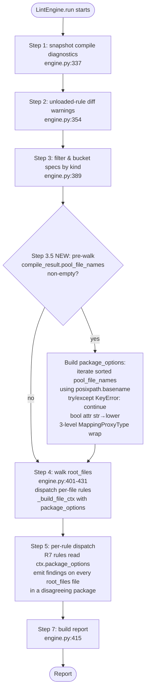

# protokit-lint D6b U4 — R7 PACKAGE_SAME_* family (REVISED)

## Overview

Ships protokit-lint's first cross-file rule family: 7 PACKAGE_SAME_* rules (`go_package`, `java_package`, `csharp_namespace`, `php_namespace`, `ruby_package`, `swift_prefix`, `java_multiple_files`) that enforce per-package consistency of language-specific FileOptions. Brings protokit-lint to 17-of-18 buf BASIC parity, unblocking multi-language teams' migration from `buf lint` at the rule-set layer.

**Architecture supersedes the 2026-05-17-001 plan after `/ce:work` U0 preflight revealed Outcome C (material divergence from the original lex-smallest-canonical design).** Empirical evidence from 14 buf v1.69.0 smoke fixtures (committed at `tests/schema/lint/rules/fixtures/package_same/_buf_smoke/recorded/`) locks the corrected architecture: all-disagreers-fire semantics, no canonical concept, no empty-package skip, no WKT filter, alphabetic-by-value sort, lowercase boolean rendering.

Engine plumbing in U4a is **structurally unchanged** from the predecessor plan (CompileResult.pool_file_names + engine Step 3.5 pre-walk + FileLintContext.package_options + 3-level MappingProxyType freeze + defensive `try/except KeyError`). What changed: drop the WKT filter, use `posixpath.basename` for cross-platform determinism, lowercase bool in the accumulator, `__post_init__` invariant via diagnostic emission (not assert).

R7-rules helper in U4b is **rewritten** per the revised architecture: drop `_canonical`, replace 4 params (`option_attr`, `value`, `canonical_value`, `canonical_file`) with 3 params (`package`, `option_attr`, `values_payload`), match buf's exact message template byte-for-byte.

BUILTIN_PACKS registration remains deferred to U7 per [[pre-1.0-version-bump-as-communication-contract]] — U4b ships R7 as dormant code accessible via `--rule-pack=protokit.schema.lint.rules.package_same` opt-in.

## Problem Frame

After D6b U3 (R6 deprecated-replacement family + lint CLI source-info wire-up) shipped, protokit's option-aware path is operational. The remaining D6b user-impact gap is cross-language rule-set parity: multi-language teams migrating from `buf lint` to `protokit lint --profile recommended` silently weaken cross-file option enforcement because protokit doesn't fire PACKAGE_SAME_*.

The architectural blocker that held R7 back through D2-D6a is **cross-file state**. U4a's engine pre-walk closes this gap with a single Step 3.5 pass that builds a per-package option-value accumulator over the full pool.

The architectural correction in this revised plan: the predecessor plan assumed buf used a "lex-smallest filename = canonical; flag every file that disagrees with canonical" emit semantics, producing N-1 findings per disagreement. Empirical evidence from 14 buf v1.69.0 smoke fixtures shows buf actually does "all disagreers fire; no canonical concept" — N findings per disagreement, no `canonical_file` concept. This is **simpler** than the original architecture but invalidates 3 Success Criteria + the `_canonical` helper + 4 of the original params + the empty-package skip + the WKT filter.

`package/same-directory` (the 18th buf BASIC rule) needs a different architectural shape (cross-file disagreement detection + per-package finding aggregation) and is deferred to D6c. D6b ships 17 of 18 buf BASIC rules.

## Requirements Trace

User-outcome requirements (from origin brainstorm § Success Criteria 1-15):

- **R7-engine.** Pre-walk pass iterates the full pool via `compile_result.pool_file_names`, builds 3-level `package_options` accumulator, frozen via 3-level MappingProxyType, defensive `try/except KeyError: continue` matches Step 4 pattern, **no WKT filter**, **`posixpath.basename` for cross-platform determinism**, **lowercase bool rendering for `java_multiple_files`** (SC E1, E2, E6).
- **R7-context.** `FileLintContext.package_options` (3-level Mapping) added as engine-injected field; `source_info_descriptors` NOT added to FileLintContext (SC 12).
- **R7-rules.** 7 separate `@lint_rule` callables under `src/protokit/schema/lint/rules/package_same.py`, sharing `_check_package_option` helper (REVISED — no `_canonical`, all-disagreers-fire semantics), all severity ERROR + profiles `("recommended", "default")` + `source_spec="buf:PACKAGE_SAME_<NAME>"` (SC 1, 2, 11).
- **R7-emit-shape (revised).** Disagreement detection: `len(set(declared)) >= 2 OR (len(distinct_declared) == 1 AND any omitter)`. Emit on every file in `root_files` participating in the disagreeing `(package, option_attr)` pair. Match buf's exact message format: `'Files in package "{package}" have {values_payload} for option "{option_attr}" and all values must be equal.'` with `values_payload = 'multiple values "X,Y"'` (when ≥2 declared, alphabetic-by-value sort) OR `'both values "X" and no value'` (mixed-presence with exactly 1 declared) (SC 3, 4, 5, 6, 7, 8, 8b, 8c, 8d).
- **R7-sanitize.** Per-value `_safe_for_stderr(v)` at accumulator build time (no length cap there); composed-payload `_safe_for_stderr(payload)[:500]` at emit time. All 3 string `params` values pass through the 500-char composed cap per [[module-name-newline-injection-stderr-forge]] (SC 10). Per-value sub-cap dropped per document-review 3-persona convergence; mirrors R6's no-per-value-cap pattern.
- **R7-CompileResult.** New `CompileResult.pool_file_names: tuple[str, ...] = ()` field; 4-tuple return on both compile backends; descriptor-set loader populates symmetrically; `__post_init__` invariant via diagnostic emission (NOT `assert`) per [[no-raise-contract-extends-to-post-init-failures]] (SC 14).
- **R7-CLI.** Zero CLI changes — FileOptions are first-class FileDescriptor attributes; R7 works regardless of `--include_source_info` (SC 9).
- **R7-pack.** Import the `package_same` module at `BUILTIN_PACKS` registration site BUT do NOT extend the tuple in U4b; BUILTIN_PACKS registration deferred to U7 alongside the 0.2.0 → 0.3.0 version bump (SC E3, SC 13).
- **R7-perf.** Pre-walk benchmark gate: <50ms on 1K-file fixture via `time.perf_counter()` + `pytest.mark.slow` (SC E7).
- **R7-smoke-gate.** `test_buf_smoke_assumptions.py` dual-mode: live buf re-invocation when `BUF_BINARY` is set + snapshot-consistency check otherwise (SC 15).

Engineering invariants (carried forward from origin brainstorm § Engineering invariants E1-E7).

## Scope Boundaries

- **R7 parity-test fixtures + parity-job verification** — U6 (needs harness extension for multi-file invocation; `tests/parity/conftest.py:run_protokit_lint` is single-file mode today).
- **`package/same-directory`** (the 18th buf BASIC rule) — D6c (different architectural shape).
- **R9 `severities_unloaded_rule` category split + schema_version `0.2` → `0.3` bump** — U5.
- **R11 CHANGELOG D6b section + R12 Public Surface DRAFT additions + README refresh + 0.2.0 → 0.3.0 version bump** — U7 (delivery boundary).
- **Pre-upgrade migration section in CHANGELOG + README "upgrading from 0.2.0" subsection** — U7. **Content scope pre-specified** per origin brainstorm § Non-Goals; see Documentation Notes below.
- **Lazy-build pre-walk gating** — D6c if SC E7 benchmark gate shows the pre-walk is hot at scale.
- **Per-package severities overrides / per-import scoping for transitive-import suppression** — D6c (acknowledged limitation; mitigation path documented in U7 CHANGELOG).
- **Expanded option-aware pack beyond R6** — D6c+.

### Deferred to Separate Tasks

- **Buf smoke-test recorded-output regeneration on `_BUF_PARITY_PIN` bumps** — when buf-version bumps in a future delivery, regenerate `_buf_smoke/recorded/*.json` AND re-run `test_buf_smoke_assumptions.py` in live mode (BUF_BINARY set) to confirm assumptions still hold. Documented in U7 CHANGELOG note.
- **15th smoke fixture for simultaneous mixed-value + omitters** (4 files: `a→X, b→Y, c→omit, d→omit`) — `/ce:plan` decision: defer to U6 parity tests. The helper's fallthrough to mixed-value path when `len(declared_values) >= 2` is a known approximation; if U6 reveals divergence in buf's emit for this case, document via `_PARITY_EXCEPTIONS` per [[buf-parity-divergence-documentation-discipline]].
- **Cross-rule mixed-presence template verification** for the 6 non-go_package rules — supplementary smoke covered mixed-value only; U6 verifies. Low risk given mixed-value template uniformity.
- **CI install-buf automation** — out of scope for U4; CONTRIBUTING.md note + existing `BUF_BINARY` env discovery handles local dev. D6c may add CI-job automation.

## Context & Research

### Relevant Code and Patterns

- **Engine to extend:** `src/protokit/schema/lint/engine.py` — `LintEngine.run` at L275-431; `_build_file_ctx` at L635-648; per-file walk at L401-431.
- **CompileResult to extend:** `src/protokit/schema/compile.py:161-220` — frozen dataclass + `__post_init__` snapshot pattern.
- **Compile backends to extend (4-tuple return):** `src/protokit/_cli_utils.py` — `_compile_with_protoxy` at L273-346 (local `fds`), `_compile_with_protoc` at L349+ (local `fds`). `_populate_pool_with_capture` at L221-269 — **signature unchanged**, only the backends grow the 4th element.
- **Descriptor-set loader to extend:** `src/protokit/schema/lint/_cli_utils.py:259-403` — `_load_descriptor_sets_to_result` populates `pool_file_names` symmetric with `root_files`.
- **FileLintContext to extend:** `src/protokit/schema/lint/model.py:965-994` — add `package_options` field BEFORE the engine-injected triple.
- **Pack registry:** `src/protokit/schema/lint/rules/__init__.py:66-71` (imports) — add `package_same` module import. **DO NOT extend BUILTIN_PACKS at L94-101** (deferred to U7).
- **Sanitizer to reuse:** `src/protokit/schema/lint/_cli_utils.py:198-245` (`_safe_for_stderr` + `_CONTROL_CHAR_TABLE`).
- **Pattern modules to mirror:**
  - `src/protokit/schema/lint/rules/imports.py:64-92` — FILE-element `@lint_rule` shape with `_safe_for_stderr` reuse.
  - `src/protokit/schema/lint/rules/naming.py` — 8-rule shared-helper module precedent.
  - `src/protokit/schema/lint/rules/package.py:29-34` — sibling-module precedent + explicit defer comment.
  - `src/protokit/schema/lint/rules/options/deprecated_replacement.py` (D6b U3) — 5-rule family with shared helper + `_safe_for_stderr(...)[:500]` precedent + inline severities-demotion test pattern at `tests/schema/lint/rules/options/test_deprecated_replacement.py:947`.
- **Membership-pin test:** `tests/schema/lint/test_builtin_packs.py:79` — extension deferred to U7 (no change in U4b).
- **Static-analysis ratchet:** `tests/test_static_analysis.py:_LINT_PATHS` (extend per [[pytest-static-analysis-gate-ratchet]]).
- **Cold-import test:** `tests/schema/lint/test_cold_import_extended.py:48-54` — extend forbidden-modules check to include `protokit.schema.lint.rules.package_same`.
- **Parity harness reference (NOT extended in U4):** `tests/parity/conftest.py:424-491` (`run_protokit_lint` single-file mode); `_BUF_PARITY_PIN = "v1.69.0"` at `src/protokit/schema/lint/cli.py:149`; `BUF_BINARY` env discovery at conftest.py:31-36, L283-302.
- **U2 prior art for `MappingProxyType` wrap:** `src/protokit/_cli_utils.py:221-269` (`_populate_pool_with_capture`); U2's `source_info_descriptors` MappingProxyType wrap pattern at `compile.py:__post_init__`.
- **Existing perf-smoke pattern (for SC E7 benchmark):** `tests/schema/lint/test_perf_smoke.py:1-39` — `time.perf_counter()` + `pytest.mark.slow`. Codebase explicitly disavows `pytest-benchmark` (not a dev dependency).
- **Smoke fixtures already committed (foundation, not part of regular test run):** `tests/schema/lint/rules/fixtures/package_same/_buf_smoke/{all-agree,mixed-value,mixed-presence,empty-package-mixed,wkt-only,googleapis-import,wkt-conflict,mixed-value-{java-package,csharp-namespace,php-namespace,ruby-package,swift-prefix,java-multiple-files},reverse-order-go}/` + `recorded/*.json` snapshots.

### Institutional Learnings

- [[module-name-newline-injection-stderr-forge]] — R7 sanitization mandatory at plan level; mandatory adversarial fixtures.
- [[buf-parity-divergence-documentation-discipline]] — each R7 rule docstring cites empirical evidence; U6 covers any measured divergence.
- [[audit-wire-format-before-claiming-sibling-parity]] — **directly applied + maximally exercised.** 14 buf v1.69.0 NDJSON snapshots are the audit; this plan's architecture is the response.
- [[structural-pin-inspect-getsource-untestable-collision-branch]] — pre-walk pass placement + sorted iteration + NO WKT-filter substring pinned via `inspect.getsource(LintEngine.run)`.
- [[pytest-static-analysis-gate-ratchet]] — new paths added to `_LINT_PATHS` in the same commit they're created.
- [[delivery-boundary-unit-commit-composition]] — U4a/U4b commit shape; README/CHANGELOG/Public Surface DRAFT updates land at U7.
- [[scope-guardian-resists-context-bloat-add-when-needed]] — `source_info_descriptors` NOT added to FileLintContext; single-field addition (`package_options`); WKT filter REMOVED per same discipline (filter added complexity for a non-problem).
- [[public-surface-draft-discipline-source-audit]] — `CompileResult.pool_file_names` INTERNAL classification with explicit docstring caveat.
- [[plan-review-verify-prior-art-citations]] — corrects parent plan's L454 mis-step.
- [[pre-1.0-version-bump-as-communication-contract]] — BUILTIN_PACKS registration deferred to U7 alongside the 0.2.0 → 0.3.0 version bump.
- [[no-raise-contract-extends-to-post-init-failures]] — `pool_file_names` `__post_init__` invariant via diagnostic emission, NOT `assert` (strips under `-O`) or `raise ValueError` (breaks no-raise contract).
- [[semantic-category-conflation-accepted-tradeoff-literal-widening]] — applies in reverse for U5 (R9); R7 does NOT bump schema_version.

### External References

- Buf published rule docs: <https://buf.build/docs/lint/rules#package_same_go_package> — quoted rule semantics: "if a given file option is used in one file in a given package, it's used in every file."
- Buf release pin: <https://github.com/bufbuild/buf/releases/tag/v1.69.0> (matches `_BUF_PARITY_PIN`).

## Key Technical Decisions

| Decision | Rationale |
|----------|-----------|
| **All-disagreers-fire semantics (REVISED architecture)** | Empirical: `_buf_smoke/recorded/{mixed-value,mixed-presence,empty-package-mixed,wkt-conflict}.json` show buf fires on ALL files in a disagreeing package, not N-1. Drops `_canonical` helper + `canonical_file`/`canonical_value` params. Replaces with simpler `len(set(per_file.values())) > 1` disagreement check + 3 params (`package`, `option_attr`, `values_payload`). |
| **No empty-package (`""`) skip (REVISED)** | Empirical: `recorded/empty-package-mixed.json` shows buf fires on no-package files. Cross-namespace contamination is an accepted-tradeoff per buf-parity (U7 CHANGELOG documents mitigation: declare `package` on all protos OR demote per-rule via `[severities]`). |
| **No WKT filter at `google/protobuf/` (REVISED)** | Empirical: `recorded/wkt-conflict.json` shows buf fires on disagreeing `google.protobuf` files. Real WKTs have consistent options across the corpus and never trigger findings in practice; synthetic disagreement cases correctly fire to match buf. Filter would have been a protokit-looser divergence. |
| **`sorted(declared_values)` = alphabetic-by-value (LOCKED)** | Empirical: `recorded/reverse-order-go.json` (input `a→Y, b→X, c→Y` produces `"X,Y"` not `"Y,X"`) decisively proves buf sorts alphabetic-by-value, not filename-order or first-encountered. |
| **Lowercase bool rendering for `java_multiple_files`** | Empirical: `recorded/mixed-value-java-multiple-files.json` shows buf emits `"false,true"` (lowercase), not Python's title-case `"False,True"`. Pre-walk uses `str(value).lower()` for the bool attr; other 6 string attrs pass through unmodified. |
| **`posixpath.basename` for cross-platform determinism** | `os.path.basename` is platform-aware (splits on `\\` on Windows, `/` on POSIX). Protobuf-canonical paths use forward slashes regardless of host OS; `posixpath.basename` produces stable sort keys across platforms. |
| **Walk the FULL pool (`pool_file_names`), not just `root_files`** | Buf walks the entire module per `PACKAGE_SAME_*`; root_files-only would silently weaken enforcement vs buf for partial-package lints. Findings still emit only on `root_files` via Step 4's existing dispatch gate. |
| **New `CompileResult.pool_file_names` field via 4-tuple backend return** | Both compile backends grow to return `(pool, root_names, source_info_descriptors, pool_file_names)`; `compile_protos_to_result` tuple-unpacks. Avoids relying on protobuf-Python's undocumented `pool._internal_db` enumeration. Default `= ()` for test-helper / direct-construction back-compat. |
| **`__post_init__` invariant via diagnostic emission (NOT assert NOT raise)** | `assert` strips under `python -O` (silent rule-disablement); `raise ValueError` violates `CompileResult`'s documented no-raise contract. Diagnostic emission matches the existing pattern: invariant violation surfaces as a `LintCompileDiagnostic` entry in the returned `CompileResult.diagnostics` and forces `pool_file_names = ()` so pre-walk early-returns. |
| **3-level `MappingProxyType` freeze** | Outer + per-package + per-attr all wrapped, so mutation at any nesting depth raises `TypeError`. Defense-in-depth against accidental mutation by co-authored rule code (NOT a security boundary; user-pack code runs in-process with full Python introspection). Mirrors U1/U2 patterns. |
| **Built unconditionally when `pool_file_names` is non-empty** | Lazy-gating deferred to D6c. SC E7 benchmark gate (<50ms on 1K-file fixture) verifies the eager-build cost is measured, not asserted. |
| **Defensive `try/except KeyError: continue` matches Step 4** | `engine.py:407-412` already uses this pattern for the compile-failure path; pre-walk mirrors it verbatim. Fail-loud would regress users who today get partial lint reports on broken inputs. |
| **Single new module: `src/protokit/schema/lint/rules/package_same.py`** | Sibling of `package.py` per `package.py:29-34` explicit defer comment. Mirrors `imports.py` (3 rules) + `naming.py` (8 rules) shared-helper precedent. |
| **7 separate `@lint_rule` callables (NOT 1 parameterized)** | Direct 1:1 mapping to buf rule_ids matches user `[severities]` configuration ergonomics; alias-resolver landing cost doesn't justify maintenance-surface savings for a 7-rule one-off family. |
| **Message template literal-identical across all 7 rules** | Empirical: cross-rule homogeneity confirmed by 6 supplementary smoke fixtures. Template `'Files in package "{package}" have {values_payload} for option "{option_attr}" and all values must be equal.'` is byte-identical across rules; per-rule `option_attr` carried via params interpolation. Enables U7 presence-ratchet to assert one substring across all 7 rule_ids. |
| **3 string params + 500-char composed truncation** | Per-value `_safe_for_stderr(v)` applied at accumulator build time (control-char neutralization); composed `values_payload` sanitized + 500-char capped at emit time. **No per-value sub-cap.** Mirrors R6's pattern (no per-value sub-cap there either). |
| **Inner `"` escape: per-value `value.replace('"', '\\"')` BEFORE composition** | **Critical empirical finding (added in deferred-question-resolution pass).** `recorded/mixed-value-with-inner-quote.json` shows buf renders inner `"` characters as literal `\"` (backslash-quote) in message text. `_safe_for_stderr` does NOT do this escaping (only handles control chars). Without the escape, protokit's values_payload contains ambiguous `"X"quoted,Y"quoted"` instead of buf's `"X\"quoted,Y\"quoted"` — byte-parity breaks. The helper applies the escape explicitly per declared value before composition. Mandatory adversarial test fixture verifies the round-trip. |
| **Cross-rule mixed-PRESENCE template uniformity CONFIRMED** | **Empirical evidence (added in deferred-question-resolution pass).** 6 `recorded/mixed-presence-{rule}.json` snapshots verify all 6 non-go_package rules emit the identical mixed-presence template `'both values "X" and no value for option "ATTR"'`. Combined with mixed-value uniformity, the literal `message_template` across all 7 rules is empirically grounded at both template variants. |
| **Cross-runtime `pool_file_names` byte-equivalence is deterministic-by-construction** | Both compile backends use `include_imports=True` + produce `fds.file` in topological order; U1's `tests/schema/lint/test_compile_include_source_info.py:154-198` (`TestSourceInfoDescriptorsCrossBackendByteEquivalence`) already verifies cross-backend byte-equality for `source_code_info`; the same pattern applies to `fd.name` iteration. U4a adds a parallel test `TestPoolFileNamesCrossBackendByteEquivalence` mirroring U1's pattern. The pre-walk's `sorted(..., key=lambda f: (posixpath.basename(f), f))` adds further determinism on top. **No new smoke fixture needed** for this verification (it's protokit-side behavior, not buf-side). |
| **Severity ERROR + profile `(recommended, default)`** | Buf BASIC parity. Upgrade impact mitigated by U7 pre-upgrade migration section (pre-specified content in Documentation Notes). |
| **BUILTIN_PACKS registration deferred to U7** | User-confirmed in original-plan refinement; preserved here. R7 ships as dormant code in U4b (importable + tested via `--rule-pack` opt-in, but NOT fired by default). U7 extends BUILTIN_PACKS + bumps 0.2.0 → 0.3.0 + ships migration docs as one cohesive boundary commit. Eliminates the U4b→U7 CI-breakage window. |
| **`test_buf_smoke_assumptions.py` dual-mode** | (a) When `BUF_BINARY` is set: re-invoke buf at test time + assert byte-equality with recorded snapshots (real regression gate; detects buf-version drift). (b) When `BUF_BINARY` unset: load snapshots + assert they encode the plan's architectural assumptions. Both modes run by default. |
| **U4a/U4b 2-commit shape** | User-confirmed; internal coupling between `pool_file_names` field and the pre-walk that consumes it makes a 3-way split forced-feeling. U4a bundles engine plumbing + smoke fixtures (already committed) + the new dual-mode test; U4b ships rules + their tests + cold-import extension. |

## Open Questions

### Resolved During Planning

- **All architectural decisions empirically locked** via 14 buf v1.69.0 smoke fixtures (committed at `tests/schema/lint/rules/fixtures/package_same/_buf_smoke/recorded/`). See Key Technical Decisions for individual citations.
- **Per-rule `message_template` literal:** `'Files in package "{package}" have {values_payload} for option "{option_attr}" and all values must be equal.'` — byte-identical across all 7 rules. U7 presence-ratchet test asserts substring `'Files in package "'` appears in every R7 rule's message_template.
- **3 string params:** `package`, `option_attr`, `values_payload`. Drops 4 original params (`option_attr`, `value`, `canonical_value`, `canonical_file`). The `option_attr` param carries through unchanged; `package` is new; `values_payload` carries the variable phrasing (`'multiple values "X,Y"'` vs `'both values "X" and no value'`) computed in the helper.
- **`sorted(declared_values)` lock:** alphabetic-by-value per `reverse-order-go.json`.
- **Lowercase bool rendering:** `str(value).lower()` for `java_multiple_files` per `mixed-value-java-multiple-files.json`.
- **`MappingProxyType` invariant test scope:** 3-level mutation-raises tests (covers `[pkg] =`, `[pkg][attr] =`, `[pkg][attr][fname] =`).
- **Pre-walk pass placement structural pin:** `inspect.getsource(LintEngine.run)` asserts `sorted(compile_result.pool_file_names, key=lambda f: (posixpath.basename(f), f))` substring + that the pre-walk loop appears BEFORE the Step 4 file walk. **No WKT-filter substring to pin** (filter dropped from architecture).
- **Test-helper update strategy:** direct kwarg `package_options=None` on `_make_file_ctx` at `tests/schema/lint/test_model.py:81-107` (NOT added to `_DEFAULT_INJECTED`).
- **`CompileResult.pool_file_names` shape:** `tuple[str, ...] = ()` between `root_files` and `diagnostics`. `__post_init__` invariant via diagnostic emission.
- **`_PACKAGE_SAME_OPTION_ATTRS` single source of truth:** defined once in `package_same.py` as `tuple[tuple[str, str, str], ...]` of `(attr, rule_id, buf_alias)` triples. Engine imports `_PACKAGE_SAME_OPTION_ATTR_NAMES = tuple(attr for attr, _, _ in _PACKAGE_SAME_OPTION_ATTRS)`.
- **Adversarial fixture composition:** single shared `.proto` file with multiple files in different packages covering newline-injection / multi-KB / U+2028/U+2029 / control-char variants + multi-value injection composition + truncation-boundary U+2028.
- **`test_buf_smoke_assumptions.py` design:** dual-mode (live buf re-invocation when BUF_BINARY set + snapshot-consistency check otherwise).
- **BUILTIN_PACKS registration:** deferred to U7. U4b imports the module + tests via `--rule-pack` opt-in but does NOT extend the BUILTIN_PACKS tuple.

### Deferred to Implementation

- **Exact whitespace/formatting normalization for the `inspect.getsource` structural pin** — plan specifies the patterns to assert; the precise substring match (whitespace, line breaks) is per the engine.py formatted output at implementation time.
- **Exact threading of 4-tuple backend return through error paths** — the both-backend-failure cascade in `_compile_with_protoxy` (L273-346) and `_compile_with_protoc` (L349+) needs implementation-time discovery for which arms need to produce `pool_file_names = ()` vs `tuple(fd.name for fd in fds.file)`. No-raise contract preserved; failures emit diagnostics.
- ~~Exact per-value sub-cap value~~ **RESOLVED:** per-value sub-cap dropped entirely per document-review 3-persona convergence (scope-guardian + adversarial + security-lens). Composed 500-char cap is the only DoS bound. Per-value `_safe_for_stderr(v)` still runs at accumulator build time for control-char neutralization (no length cap there).
- **Other 6 PACKAGE_SAME_* rules behave differently than PACKAGE_SAME_GO_PACKAGE:** **RESOLVED empirically** by 6 supplementary mixed-value smoke fixtures. Shared helper + literal message_template justified.
- **`values_csv` sort-order divergence:** **RESOLVED empirically** by `recorded/reverse-order-go.json`. `sorted(declared_values)` locked.
- **Boolean `java_multiple_files` rendering divergence:** **RESOLVED empirically** by `recorded/mixed-value-java-multiple-files.json`. Helper uses `str(value).lower()`.
- **WKT scope question:** **RESOLVED empirically** by `recorded/wkt-conflict.json`. WKT filter dropped.
- **Benchmark fixture generator exact shape** — SC E7's 1K-file fixture is generated programmatically inside `test_engine_pre_walk.py` via an f-string template into `tmp_path`. Per-file disagreement seeding + sort-key generation is implementation-time.
- **Buf-smoke regression-test failure-mode messaging** — when `test_buf_smoke_assumptions.py` live mode detects buf drift, the failure message names which snapshot diverged + suggests regeneration command + flags whether the divergence requires brainstorm-reopen (material) or just snapshot refresh (minor).

## High-Level Technical Design

> *This illustrates the intended approach and is directional guidance for review, not implementation specification. The implementing agent should treat it as context, not code to reproduce.*

### Engine Step Sequencing



### `_check_package_option` Helper Logic (REVISED)

```text
def _check_package_option(ctx, option_attr, rule_id):
    # Skip when accumulator not injected (test-helper path)
    if ctx.package_options is None: return
    per_pkg = ctx.package_options.get(ctx.file.package)
    if per_pkg is None: return
    per_file = per_pkg.get(option_attr)
    if per_file is None or len(per_file) <= 1: return

    # Buf v1.69.0 semantics (empirical):
    # - if all values agree (single declared value, no omitters) → silent
    # - if all values omit (no declared values) → silent
    # - if 2+ distinct declared values → fire with "multiple values" payload
    # - if 1 declared value + at least 1 omitter → fire with "both values...no value" payload
    declared = {v for v in per_file.values() if v is not None}
    has_omitter = any(v is None for v in per_file.values())

    if not declared: return                    # all-omit silent
    if len(declared) == 1 and not has_omitter: return  # all-agree silent

    # Disagreement detected. Compose values_payload per buf's two message templates.
    # Escape inner `"` per declared value to match buf's emit format
    # (empirical: recorded/mixed-value-with-inner-quote.json shows buf renders
    # `X"quoted` as `X\"quoted` literal in message text). _safe_for_stderr
    # does NOT do this; must be explicit per-value.
    def escape(v): return v.replace('"', '\\"')
    if len(declared) >= 2:
        # alphabetic-by-value sort (empirically locked via reverse-order-go)
        values_csv = ",".join(escape(v) for v in sorted(declared))
        payload = f'multiple values "{values_csv}"'
    else:
        # mixed-presence: exactly 1 declared + at least 1 omitter
        single = escape(next(iter(declared)))
        payload = f'both values "{single}" and no value'

    # Per-value sanitization already applied at accumulator build time.
    # Compose + final sanitize + truncate to 500 chars.
    ctx.emit(
        violation_kind=rule_id,
        params={
            "package": _safe_for_stderr(ctx.file.package)[:500],
            "option_attr": _safe_for_stderr(option_attr)[:500],
            "values_payload": _safe_for_stderr(payload)[:500],
        },
    )
```

### Accumulator Shape (UNCHANGED from predecessor plan)

```text
package_options: Mapping[pkg, Mapping[option_attr, Mapping[fname, str | None]]]

Example: 3-file package "foo.bar" where a.proto+c.proto declare go_package="X",
b.proto declares go_package="Y", java_multiple_files=true on a only:

{
  "foo.bar": {
    "go_package":    {"a.proto": "X",    "b.proto": "Y",    "c.proto": "X"},
    "java_package":  {"a.proto": None,   "b.proto": None,   "c.proto": None},
    "csharp_namespace": {...},
    "java_multiple_files": {"a.proto": "true", "b.proto": None, "c.proto": None},
    ...
  }
}

# Note: java_multiple_files captured as lowercase string "true"/"false"/None
#       (per recorded/mixed-value-java-multiple-files.json).
```

For the `foo.bar` example above, R7 emits:
- `package/same-go-package` on a.proto, b.proto, c.proto (all-disagreers; values_payload = `'multiple values "X,Y"'`)
- `package/same-java-multiple-files` on a.proto, b.proto, c.proto (mixed-presence; values_payload = `'both values "true" and no value'`)
- The other 5 rules silent (all-omit)

### Per-Rule Callable Shape

```text
@lint_rule(
    rule_id="package/same-go-package",
    severity=LintSeverity.ERROR,
    profiles=("recommended", "default"),
    element=ElementKind.FILE,
    message_template=(
        'Files in package "{package}" have {values_payload} for option '
        '"{option_attr}" and all values must be equal.'
    ),
    source_spec="buf:PACKAGE_SAME_GO_PACKAGE",
)
def check_same_go_package(ctx):
    """Every file in a package must agree on `option go_package`.

    Buf parity: buf:PACKAGE_SAME_GO_PACKAGE. Empirically verified against
    buf v1.69.0 in tests/schema/lint/rules/fixtures/package_same/_buf_smoke/recorded/.
    All-disagreers-fire semantics: any disagreement flags every file in the
    package equally. Demote via [severities] for legitimate cross-language
    vendor isolation patterns.
    """
    _check_package_option(ctx, "go_package", "package/same-go-package")

# 6 siblings for java_package, csharp_namespace, php_namespace, ruby_package,
# swift_prefix, java_multiple_files. All message_templates literal-identical.
```

## Implementation Units

- [ ] **Unit 4a: Engine pre-walk + CompileResult.pool_file_names + FileLintContext.package_options + buf smoke-test dual-mode gate**

**Goal:** Land all engine plumbing required by R7 with zero rule consumers — new `CompileResult.pool_file_names` field (populated symmetrically across compile-mode + descriptor-set-mode via 4-tuple backend return), engine Step 3.5 pre-walk pass (NO WKT filter; uses `posixpath.basename`; lowercase bool render; defensive `try/except KeyError`), `FileLintContext.package_options` field engine-injected via `_build_file_ctx`, dual-mode `test_buf_smoke_assumptions.py`. Bisectable: in isolation, U4a produces zero R7 findings (no rule consumers); test suite passes; subsequent U4b adds the consumers.

**Requirements:** R7-engine, R7-context, R7-CompileResult, R7-perf, R7-smoke-gate. (R7-CLI's zero-CLI-changes claim is invariant-preservation verified by SC 9's `include_source_info` independence test in U4b; no production requirement in U4a.)

**Dependencies:** None. The 14 buf smoke fixtures + recorded NDJSON snapshots are already committed (commits `68f4a93` + `aae88f3` + `44d49c6`); empirical evidence is locked.

**Files:**

Source:
- Modify: `src/protokit/schema/compile.py` — `CompileResult` adds `pool_file_names: tuple[str, ...] = ()` field between `root_files` and `diagnostics`; `__post_init__` snapshots to immutable tuple; invariant check `pool_file_names == () OR set(pool_file_names) >= set(root_files)` emits a `LintCompileDiagnostic` (level error) + forces `pool_file_names = ()` on violation (per [[no-raise-contract-extends-to-post-init-failures]] — NOT `assert`, NOT `raise ValueError`).
- Modify: `src/protokit/_cli_utils.py:273-346` — `_compile_with_protoxy` grows 4th return element `tuple(fd.name for fd in fds.file)` from its local FileDescriptorSet. New return shape: `(pool, root_names, source_info_descriptors, pool_file_names)`.
- Modify: `src/protokit/_cli_utils.py:349+` — `_compile_with_protoc` grows the same 4th element from its local `fds`. Same return shape.
- Modify: `src/protokit/_cli_utils.py:221-269` — `_populate_pool_with_capture` signature **unchanged** (still returns `(captured, emitted)`); only the backend call sites compose the 4-tuple.
- Modify: `src/protokit/schema/compile.py:_compile_protos_to_result` — tuple-unpacks 4-tuple from both backends; passes `pool_file_names` to `CompileResult` constructor. **Five distinct `CompileResult(...)` construction sites need the new kwarg** (audited at plan time per feasibility-reviewer):
  - L513 (collision early-return), L521 (shadow early-return), L528 (empty-input early-return) — pass `pool_file_names=()` explicitly to match existing per-field-explicit style.
  - L636 (happy/fallback path) — pass `pool_file_names=<tuple-unpacked value>`.
  - L646 (catch-all rebuild after `__post_init__` failure) — pass `pool_file_names=()` and DO NOT re-pass the value that tripped the invariant (else `__post_init__` re-emits the diagnostic indefinitely; the catch-all rebuild already strips other invariant-tripping fields by analogy).
  - Failure cascade emits `pool_file_names = ()` per the no-raise contract.
- Modify: `src/protokit/schema/lint/_cli_utils.py:259-403` — `_load_descriptor_sets_to_result` per-fd loop populates `pool_file_names` symmetric with `root_files`. Skipped-collision fds (line 352-364) also skip the accumulator insertion, preserving the invariant `pool_file_names ⊆ files-actually-in-pool`.
- Modify: `src/protokit/schema/lint/engine.py` — `LintEngine.run` adds new Step 3.5 pre-walk pass between L389 (Step 3) and L401 (Step 4):
  - Iterate `sorted(compile_result.pool_file_names, key=lambda f: (posixpath.basename(f), f))` (NOT `os.path.basename` — cross-platform determinism).
  - **NO WKT filter** (empirically removed; real WKTs don't trigger findings in practice; synthetic disagreements correctly fire to match buf).
  - Defensive `try/except KeyError: continue` mirroring `engine.py:407-412` verbatim.
  - For each fd: read `fd.GetOptions()`; for each attr in `_PACKAGE_SAME_OPTION_ATTR_NAMES`: capture value (or None). **Boolean `java_multiple_files`: use `str(getattr(opts, attr)).lower()` for lowercase render** matching buf-actual.
  - Accumulator shape: `dict[str, dict[str, dict[str, str | None]]]`. 3-level `MappingProxyType` wrap at all depths before injection.
  - Import `_PACKAGE_SAME_OPTION_ATTR_NAMES` from `protokit.schema.lint.rules.package_same` — import deferred to inside the pre-walk function body (NOT module top) to preserve rule-pack-isolation per cold-import contract spirit.
- Modify: `src/protokit/schema/lint/engine.py:635-648` — `_build_file_ctx` grows kwarg `package_options: Mapping[str, Mapping[str, Mapping[str, str | None]]] | None = None`. Step 4's per-file walk passes the pre-walk-built accumulator.
- Modify: `src/protokit/schema/lint/model.py:965-994` — `FileLintContext` adds `package_options: Mapping[...] | None` field BEFORE the engine-injected `_emit_fn`/`_rule_id`/`_effective_severity` triple.
- Modify: `tests/schema/lint/test_model.py:81-107` — direct kwarg `package_options=None` on `_make_file_ctx` (NOT added to `_DEFAULT_INJECTED`).
- Modify: `tests/test_static_analysis.py:_LINT_PATHS` — extend with new test file paths created in this unit.
- Create: `CONTRIBUTING.md` (or modify if exists) — install note: "Some tests require `buf v1.69.0`. **Preferred:** `brew install buf` (macOS — currently bottled at v1.69.0; brew handles signing + integrity). **Manual install (when brew is unavailable):** download the platform-specific tarball from https://github.com/bufbuild/buf/releases/tag/v1.69.0, **verify the SHA-256 against the published checksums file** at https://github.com/bufbuild/buf/releases/download/v1.69.0/sha256.txt before extracting, then `export BUF_BINARY=/path/to/buf`. See tests/parity/conftest.py:283-302 for the discovery contract." (SHA-256 guidance added per document-review security-lens — supply-chain protection for the manual-download path; brew path inherits brew's signature verification.)

Tests:
- Create: `tests/schema/lint/test_compile_pool_file_names.py` — `CompileResult.pool_file_names` populated in compile-mode (both backends) AND descriptor-set-mode; default `()` when not populated; field survives `__post_init__` snapshot; `__post_init__` invariant emits a diagnostic + forces `pool_file_names=()` on violation (NOT raises).
- Create: `tests/schema/lint/test_engine_pre_walk.py` — accumulator construction over full pool (NO WKT filter — includes `google/protobuf/*` paths in the accumulator), `posixpath.basename` sort-key determinism, defensive `try/except KeyError`, 3-level `MappingProxyType` invariant (mutations raise at all 3 depths), multi-package isolation, single-file package, all-omit, all-same, mixed-presence (captures None vs declared distinction), mixed-value, empty-package handling (no skip — `""` participates), boolean `java_multiple_files` captured as lowercase string, transitive-import contributes to disagreement detection, structural pin via `inspect.getsource`, benchmark gate (`time.perf_counter()` + `pytest.mark.slow`) on programmatically-generated 1K-file fixture (<50ms target).
- Create: `tests/schema/lint/test_buf_smoke_assumptions.py` — **live-mode only** (snapshot-consistency mode dropped per user decision after document-review revealed it was tautological):
  - **When `BUF_BINARY` is set:** for each of the **21 smoke fixtures** under `_buf_smoke/` (14 from initial + supplementary smoke + 7 added in deferred-question-resolution: 1 quote-character + 6 mixed-presence), re-invokes `buf lint --error-format=json` + asserts the live output byte-matches the corresponding `recorded/*.json` snapshot. Detects buf-version drift; gates buf-pin bumps. `pytest.mark.slow`.
  - **When `BUF_BINARY` is unset:** test is SKIPPED entirely (the snapshot-consistency assertions that previously ran in this mode are dropped — they were tautological without CI buf-binary enforcement, and the architectural assumptions are already independently asserted by `test_engine_pre_walk.py` + `test_package_same.py`).
  - **BUF_BINARY discovery + subprocess wrapper:** extract `tests/parity/conftest.py:270-302` (BUF_BINARY fixture) + `:336-369` (`_run_subprocess` with 30s timeout + triple-arm guard) to a shared helper at `tests/_buf_helpers.py` that BOTH `tests/parity/conftest.py` AND `tests/schema/lint/test_buf_smoke_assumptions.py` import. The shared helper preserves the timeout + Ctrl-C safety from the parity harness.
- Create: `tests/schema/lint/rules/fixtures/package_same/_buf_smoke/recorded/CHECKSUMS.sha256` — git-tracked SHA-256 checksum file pinning the 21 snapshot files. One line per snapshot: `<sha256>  <relative-path>`.
- Create: `tests/schema/lint/test_buf_smoke_recorded_checksums.py` — tiny test (one parametrized test method) asserts each `recorded/*.json`'s actual SHA-256 matches the value in `CHECKSUMS.sha256`. Runs by default (no BUF_BINARY dependency). Catches accidental snapshot edits + tamper without duplicating assertion logic. ~15 lines total.
- Create: `tests/_buf_helpers.py` — shared module exposing `discover_buf_binary()` (mirrors parity's `buf_binary` fixture pattern + skip-on-missing-binary) and `run_buf_subprocess(argv, cwd)` (mirrors parity's `_run_subprocess` with 30s timeout + triple-arm guard). Used by `tests/parity/conftest.py` (refactor) AND `tests/schema/lint/test_buf_smoke_assumptions.py`.

**Approach:**

**Step 1 — 4-tuple backend return:** both backends produce `fds: FileDescriptorSet` locally; emit `tuple(fd.name for fd in fds.file)` before returning. `compile_protos_to_result` tuple-unpacks the 4th element. Failure cascade emits `pool_file_names = ()` per no-raise contract. **Verify at all 5 `CompileResult(...)` construction sites** per the Source files list above.

**Step 2 — Descriptor-set-mode symmetry:** `_load_descriptor_sets_to_result` per-fd loop captures `fd.name` into a list, finalize as tuple at construction time. Skipped-collision fds also skip the accumulator insertion.

**Step 3 — Pre-impl audit:** grep `tests/` for the fixture/path that fires Step 4's `try/except KeyError` defense at `engine.py:407-412`. If a fixture exists, cite it in the new pre-walk's comment. If none exists, file a follow-up issue but keep both guards (removing speculative defenses without first-principles confirmation is a separate refactor).

**Step 4 — Positional-caller grep gate:** before adopting `FileLintContext.package_options` field position BEFORE the engine-injected triple, run `git grep -n 'FileLintContext(' src tests`. If any positional construction exists, rebind to kwargs OR position the new field AFTER the triple.

**Step 5 — Engine pre-walk pass:** insert between L389 and L401. Use SAME `sorted(...)` key as Step 4 for canonical/dispatch alignment, but use `posixpath.basename` (cross-platform). **NO WKT filter** (drop entirely per `recorded/wkt-conflict.json` evidence). `try/except KeyError: continue` mirrors Step 4 verbatim.

**Step 6 — Bool-attr capture:** in the per-attr loop, special-case `java_multiple_files`: `per_attr[fname] = str(getattr(opts, attr)).lower()` produces `"true"`/`"false"`. Other 6 string attrs pass through unmodified.

**Step 7 — 3-level MappingProxyType wrap:** outer dict + each `per_pkg` dict + each `per_attr` dict. Tested via three `pytest.raises(TypeError)` assertions.

**Step 8 — `FileLintContext.package_options` field:** position BEFORE the `_emit_fn`/`_rule_id`/`_effective_severity` triple. No `__post_init__` invariant (engine-injected; immutability enforced by wraps at construction site).

**Step 9 — `test_buf_smoke_assumptions.py` dual-mode:** implement live mode (BUF_BINARY discovery + subprocess invocation + JSON parse + byte-equality assertion) and snapshot-consistency mode (file load + plan-assumption assertion) as separate test classes; pytest auto-selects based on env var.

**Step 10 — Verify `_safe_for_stderr` quote-character round-trip:** the sanitizer at `src/protokit/schema/lint/_cli_utils.py:198-245` collapses control chars + U+0085/U+2028/U+2029 to spaces but does NOT explicitly escape double-quote characters. Verify that a fixture with `option go_package = 'val"with"quote'` (the inner `"` is a legal-but-unusual character in a Go package string when escaped at the proto-source level) round-trips through `_safe_for_stderr` unchanged AND produces the same byte sequence buf emits. If buf escapes inner quotes and protokit doesn't (or vice versa), byte-parity breaks for this edge case; document the divergence in `_PARITY_EXCEPTIONS` per [[buf-parity-divergence-documentation-discipline]] OR adjust the helper. Add a regression test in `test_engine_pre_walk.py` for the round-trip.

**Execution note:** Implement test-first for the accumulator-construction tests (`test_engine_pre_walk.py`) so the structural pin + 3-level MappingProxyType invariant lock in BEFORE the engine code lands. Matches D6b U2/U3 precedent for engine-plumbing units.

**Technical design:** See "High-Level Technical Design" above for the Engine Step Sequencing diagram + accumulator shape.

**Patterns to follow:**
- `src/protokit/_cli_utils.py:221-269` (U1 prior art — 3-tuple capture-around-Add pattern; U4a extends to 4-tuple).
- `src/protokit/schema/compile.py:__post_init__` (snapshot pattern + `MappingProxyType` wrap for `source_info_descriptors`).
- `src/protokit/schema/lint/engine.py:407-412` (Step 4 defensive `try/except KeyError: continue` pattern).
- `src/protokit/schema/lint/model.py:1060` (U2 `source_info_descriptors` field positioning on ElementKind contexts).
- `tests/schema/lint/test_perf_smoke.py:1-39` (`time.perf_counter()` + `pytest.mark.slow` pattern for SC E7 benchmark).
- `tests/parity/conftest.py:283-302` (BUF_BINARY env discovery pattern reused by dual-mode test).

**Test scenarios:**

*Happy path:*
- `CompileResult.pool_file_names` populated correctly in compile-mode (protoxy + protoc) AND descriptor-set-mode; tuple in fd-iteration order; transitively-imported files appear alongside user-input files; no WKT filter (`google/protobuf/*` paths included).
- Engine pre-walk over a 3-file fixture (all in `root_files`, no WKT imports) produces `package_options` with one entry per package and 7 entries per attr-name; each per-file value matches the proto's declared FileOptions value.
- `FileLintContext` constructed via `_make_file_ctx` defaults `package_options=None`; via `_build_file_ctx` carries the engine-built accumulator.
- Pre-walk benchmark: 1K-file generated corpus produces `package_options` in <50ms (SC E7).

*Edge case:*
- `compile_result.pool_file_names == ()` → pre-walk early-returns; `package_options = {}`; injected as frozen empty Mapping (NOT `None`).
- Single-file package → `package_options[pkg][attr]` has single entry; helper's `len(per_file) <= 1` early-returns.
- Multi-package fixture → independent per-attr dicts; no cross-namespace contamination at accumulator level.
- All-omit per attr → `per_file = {a: None, b: None, c: None}` → captured correctly.
- File whose `fd.package == ""` → recorded in `package_options[""]` (NO skip — buf-actual semantics).
- `java_multiple_files = true/false/true` → captured as `{"a.proto": "true", "b.proto": "false", "c.proto": "true"}` (lowercase strings).
- `os.path.basename` vs `posixpath.basename` for paths with backslashes: synthetic test with `pool_file_names = ("foo\\bar.proto", "foo/baz.proto")` confirms `posixpath.basename` produces stable sort.

*Error path:*
- `pool.FindFileByName(fname)` raises `KeyError` (synthetic partial-pool fixture) → pre-walk `continue`s; file omitted from accumulator; lint run completes (no crash).
- Both compile backends fail → `CompileResult.pool_file_names = ()` per no-raise contract; pre-walk early-returns.
- `CompileResult` constructed with inconsistent `(pool_file_names, root_files)` (e.g., `root_files=("a",), pool_file_names=()`) → `__post_init__` emits a `LintCompileDiagnostic(level="error", message="pool_file_names invariant violated: ...")` AND forces `pool_file_names = ()`; CompileResult returns successfully (no raise).

*Cross-backend byte-equivalence (mirrors U1 precedent):*
- New test class `TestPoolFileNamesCrossBackendByteEquivalence` in `test_compile_pool_file_names.py` — for the same fixture, invoke `_compile_with_protoxy` AND `_compile_with_protoc`; assert `result_protoxy.pool_file_names == result_protoc.pool_file_names` (tuple equality). Mirrors `TestSourceInfoDescriptorsCrossBackendByteEquivalence` in `tests/schema/lint/test_compile_include_source_info.py:154-198` (the U1 precedent). Confirms `fds.file` iteration order is identical across backends for the same input.
- Inner-quote round-trip test in `test_engine_pre_walk.py` — fixture with `option go_package = 'X\"quoted'` (a literal `"` in the value); assert that the helper's composed `values_payload` contains `'X\\"quoted'` (backslash-quote escape) matching `recorded/mixed-value-with-inner-quote.json`. Regression gate for the per-value escape requirement.

*Integration:*
- `MappingProxyType` 3-level invariant: assert `pytest.raises(TypeError)` on mutation at all 3 depths.
- Structural pin: `inspect.getsource(LintEngine.run)` contains `sorted(compile_result.pool_file_names, key=lambda f: (posixpath.basename(f), f))` + `try:` + `pool.FindFileByName(fname)` within the pre-walk block. **No `_WKT_PATH_PREFIX` substring** (filter dropped).
- Engine pre-walk runs BEFORE Step 4: assert via `inspect.getsource` ordering.
- Cold-import contract: `import protokit.schema` does NOT load `protokit.schema.lint.rules.package_same` (engine's import is deferred to inside the pre-walk function body, not module top).
- `test_buf_smoke_assumptions.py` snapshot-consistency mode passes when BUF_BINARY unset.
- `test_buf_smoke_assumptions.py` live mode passes when BUF_BINARY set + buf v1.69.0 installed.

**Verification:**
- All new tests pass; benchmark gate completes under 50ms on dev's local platform.
- D6b U1+U2+U3 baseline (1650 tests + 39 skips + 17 parity) continues to pass; FileLintContext field-list invariant test updated for the new field.
- Static-analysis ratchet at `tests/test_static_analysis.py:_LINT_PATHS` includes new test file paths.
- `CompileResult` cross-version verification: `pool_file_names` field is identical-by-value across protobuf 4 + 5 backends for the same fixture (mirrors U1's cross-protobuf-runtime byte-equivalence step).
- Zero R7 findings produced (no rule consumers yet — structural invariant; U4a ships engine plumbing in isolation).
- `buf --version` returns `1.69.0` on the dev machine before U4a's `test_buf_smoke_assumptions.py` lands (sanity check; if absent, install per CONTRIBUTING.md note).
- `test_buf_smoke_assumptions.py` passes in both modes (live + snapshot).

---

- [ ] **Unit 4b: R7 — 7 PACKAGE_SAME_* rules (REVISED architecture, all-disagreers-fire) + adversarial fixture + integration tests**

**Goal:** Ship the 7 PACKAGE_SAME_* rules under `src/protokit/schema/lint/rules/package_same.py` with the all-disagreers-fire helper architecture. Import the module at the BUILTIN_PACKS site BUT do NOT extend the tuple (registration deferred to U7). Add per-rule unit tests + adversarial fixture + end-to-end integration tests with explicit `--rule-pack` opt-in. Closes the R7 deliverable; multi-language teams' rule-set parity story is operational at this commit via explicit opt-in.

**Requirements:** R7-rules, R7-emit-shape, R7-sanitize, R7-pack (import only; tuple extension deferred to U7).

**Dependencies:** Unit 4a (engine pre-walk + `FileLintContext.package_options` field must exist; rules consume `ctx.package_options`).

**Files:**

Source:
- Create: `src/protokit/schema/lint/rules/package_same.py` — 7 `@lint_rule` callables (`check_same_go_package`, `check_same_java_package`, `check_same_csharp_namespace`, `check_same_php_namespace`, `check_same_ruby_package`, `check_same_swift_prefix`, `check_same_java_multiple_files`) + `_check_package_option(ctx, option_attr, rule_id) -> None` shared helper (all-disagreers-fire semantics; **NO `_canonical` helper**) + `_PACKAGE_SAME_OPTION_ATTRS: tuple[tuple[str, str, str], ...]` (the 7 triples) + `_PACKAGE_SAME_OPTION_ATTR_NAMES: tuple[str, ...]` (str-view computed at module load) + `RULES: tuple[Callable[..., None], ...]` tuple. All 7 rules use the literal-identical `message_template`.
- Modify: `src/protokit/schema/lint/rules/__init__.py:66-71` — add `from protokit.schema.lint.rules import package_same` to the import list (module is loadable as a `--rule-pack` opt-in). **DO NOT** append `package_same` to the `BUILTIN_PACKS` tuple at L94-101 — deferred to U7.
- Modify: `tests/schema/lint/test_cold_import_extended.py:48-54` — extend the forbidden-modules check to explicitly include `"protokit.schema.lint.rules.package_same"` (the existing substring check `"protokit.schema.lint.cli" in k` would NOT catch a `package_same` import).
- Modify: `tests/test_static_analysis.py:_LINT_PATHS` — extend with new test file paths.
- Create: `CHANGELOG-DRAFT.md` (or extend if exists) — one-paragraph dormancy-window note: "**D6b U4b (unreleased):** R7 PACKAGE_SAME_* rules (`package/same-go-package`, `package/same-java-package`, `package/same-csharp-namespace`, `package/same-php-namespace`, `package/same-ruby-package`, `package/same-swift-prefix`, `package/same-java-multiple-files`) are loadable but NOT registered in default BUILTIN_PACKS. Opt in via `--rule-pack=protokit.schema.lint.rules.package_same`. BUILTIN_PACKS registration + full migration docs land at U7's 0.3.0 release." Protects captive users during the U4b→U7 window from "I found the module but it doesn't fire" confusion.
- Modify: `src/protokit/schema/lint/cli.py` — add one line to the `protokit lint --help` epilog/usage output mentioning the R7 opt-in: `"PACKAGE_SAME_* rules (R7): loadable via --rule-pack=protokit.schema.lint.rules.package_same; not in default profile until 0.3.0"`. Discoverability for the dormancy window per the document-review product-lens P2 finding.

Tests:
- Create: `tests/schema/lint/rules/test_package_same.py` — 7-rule family unit tests:
  - **Happy paths (per rule × 7):** all-agree → silent.
  - **Sad paths — mixed-value (per rule × 7):** 3-file package with 2 distinct declared values → all 3 files emit findings with `params["values_payload"] = 'multiple values "X,Y"'` (alphabetic-by-value sort).
  - **Sad paths — mixed-presence (per rule × 7):** 3-file package: 1 declarer + 2 omitters → all 3 files emit findings with `params["values_payload"] = 'both values "X" and no value'`.
  - **Edge cases:** single-file package silent; all-omit silent; multi-package isolation; empty-package (`""`) enforced; transitive-import contributes to disagreement detection (canonical = full-pool, emit = root_files only); 3-file package with 3 distinct values → `'multiple values "X,Y,Z"'`; `java_multiple_files = true/false/true` → lowercase render in payload.
  - **Per-rule [severities] demotion (folded inline per R6 precedent):** for each of 7 rule_ids, fixture pyproject sets severity to `"info"`, runtime invocation produces info-severity finding instead of error.
  - **Adversarial sanitization:** newline injection, multi-KB option string, U+2028/U+2029/control-char variants, multi-value injection composition near 500-char boundary.
  - **Reverse-order:** input `a→Y, b→X, c→Y` → `params["values_payload"] = 'multiple values "X,Y"'` (alphabetic-by-value sort confirmed in protokit).
- Create: `tests/schema/lint/rules/fixtures/package_same/proto_templates.py` — programmatic fixture builder. Produces 3 base proto-template forms (all-agree / mixed-value / mixed-presence) parameterized over the 7 attr names + 5 edge-case forms (single-file, empty-package, multi-package, transitive-import, single-declaring), built into `tmp_path` at test time. Mirrors `tests/schema/lint/rules/options/test_deprecated_replacement.py`'s programmatic `_make_descriptor` precedent — avoids committing 21+5 = 26 near-identical fixture files.
- Create: `tests/schema/lint/rules/fixtures/package_same/adversarial.proto` — single shared `.proto` file with multiple files in different packages: newline-injection variant, multi-KB option string variant, U+2028/U+2029/control-char variant, multi-value injection composition (2 files each with `option go_package = "<99 chars>\\n evil"` + truncation-boundary U+2028).
- Create: `tests/schema/lint/test_cli_package_same_e2e.py` — end-to-end lint invocation tests with **explicit `--rule-pack` opt-in** (BUILTIN_PACKS registration deferred to U7):
  - `protokit lint --rule-pack=protokit.schema.lint.rules.package_same --profile recommended --format json <multi-file fixture dir>` produces expected R7 findings.
  - `protokit lint --profile recommended <same fixture>` (WITHOUT `--rule-pack`) produces **ZERO R7 findings** (verifies the U4b→U7 dormancy contract).
  - `--proto` mode AND `--descriptor-set` mode (with `--rule-pack` opt-in) produce identical findings on the same fixture (SC 14 — `include_source_info` independence).
  - `--profile default` produces identical findings to `--profile recommended` (R7 in both profiles when opted in).
  - At U7, a follow-up test verifies R7 fires by default (no `--rule-pack` needed) AND removes the "WITHOUT --rule-pack → zero findings" assertion.

**Approach:**

**Per-rule shape:** 7 `@lint_rule` callables, each a 5-line wrapper that calls `_check_package_option(ctx, attr, rule_id)` with the rule's specific attr + rule_id. Each rule's docstring documents buf parity + cites the relevant `recorded/*.json` snapshot + provides the `[severities]` demotion guidance for legitimate cross-language vendor isolation patterns.

**Shared `_check_package_option` helper** (see High-Level Technical Design above for the directional pseudocode):
1. Skip when `ctx.package_options is None` (test-helper path) OR `per_pkg is None` OR `per_file is None or len(per_file) <= 1`.
2. Compute `declared = {v for v in per_file.values() if v is not None}` and `has_omitter = any(v is None for v in per_file.values())`.
3. Silent when `not declared` (all-omit) OR `len(declared) == 1 and not has_omitter` (all-agree).
4. **No empty-package skip** (buf-actual semantics; `""` is treated as a real namespace per `recorded/empty-package-mixed.json`).
5. Compose `values_payload`:
   - `len(declared) >= 2`: per-value inner-quote escape via `value.replace('"', '\\"')`, then `payload = f'multiple values "{",".join(escape(v) for v in sorted(declared))}"'` (alphabetic-by-value sort).
   - else (mixed-presence): `payload = f'both values "{single}" and no value'`.
6. Emit with 3 params: `package` + `option_attr` + `values_payload`, each `_safe_for_stderr(...)[:500]`.

**Message template** (literal-identical across all 7 rules per empirical homogeneity):
`'Files in package "{package}" have {values_payload} for option "{option_attr}" and all values must be equal.'`

**`source_spec`:** `"buf:PACKAGE_SAME_<NAME>"` for all 7 rules. Auto-discovered by `tests/parity/conftest.py:139-188`'s `RULE_ID_MAP` walker.

**Severity + profile:** ERROR + `("recommended", "default")` per parent brainstorm + plan.

**Cold-import contract:** module top has `from __future__ import annotations`; runtime imports are stdlib (`os`, `posixpath`, `collections.abc`, `typing.TYPE_CHECKING`) + protokit-internal (`decorator`, `model`, `_cli_utils._safe_for_stderr`). `FileLintContext` imported under `TYPE_CHECKING:` guard.

**No `_WKT_PATH_PREFIX` constant.** Filter dropped from architecture per `recorded/wkt-conflict.json` evidence.

**Execution note:** Implement test-first for `test_package_same.py` — the message_template literal + the all-disagreers-fire emit-shape lock in BEFORE the rule code. Match the D6b U3 R6-rule precedent.

**Patterns to follow:**
- `src/protokit/schema/lint/rules/options/deprecated_replacement.py` (D6b U3) — 5-rule family with shared helper + `_safe_for_stderr(...)[:500]` truncation + per-rule docstring documenting buf parity + inline severities-demotion test pattern.
- `src/protokit/schema/lint/rules/imports.py:64-92` — FILE-element `@lint_rule` shape with module-level `RULES` tuple.
- `src/protokit/schema/lint/rules/naming.py` — 8-rule shared-module precedent.
- `src/protokit/schema/lint/rules/package.py:29-34` — sibling-module placement + explicit defer comment.

**Test scenarios:**

*Happy path (per rule × 7):*
- All-agree fixture (3 files with same value) → zero findings per rule.

*Sad path — mixed-value (per rule × 7):*
- 3-file package with `a→X, b→Y, c→X` → ALL 3 files emit findings; `params["values_payload"] = 'multiple values "X,Y"'`; `params["package"] = "<package_name>"`; `params["option_attr"] = "<attr>"`. Byte-matches buf v1.69.0 emit per the corresponding `recorded/mixed-value-<rule>.json` snapshot.

*Sad path — mixed-presence:*
- 3-file package: `a` declares `"X"`, `b`+`c` omit → ALL 3 files emit; `params["values_payload"] = 'both values "X" and no value'`. Byte-matches `recorded/mixed-presence.json`.

*Edge case:*
- Single-file package → zero findings.
- All-omit (3 files, none declare) → zero findings (silent — verified via `recorded/all-agree.json` invariant inverse).
- Multi-package isolation (`foo.bar` + `foo.baz` with internal disagreements) → findings scoped per-package.
- Empty-package (3 no-package files with disagreement) → ALL 3 fire; `params["package"] = ""`. Byte-matches `recorded/empty-package-mixed.json`.
- Transitive-import canonical contribution: `aa.proto` in `root_files` declaring `go_package = "Y"`; `b.proto` transitively-imported declaring `go_package = "X"`; both in `package foo.bar`. **ONE finding on `aa.proto`** with `params["values_payload"] = 'multiple values "X,Y"'` (alphabetic). `b.proto` does NOT receive a finding (Step 4's emit gate).
- 3 distinct values (`a→X, b→Y, c→Z`) → `params["values_payload"] = 'multiple values "X,Y,Z"'`. Byte-matches `recorded/empty-package-mixed.json` shape.
- WKT enforcement: 2 user files at `google/protobuf/extension_{a,b}.proto` in `root_files` with disagreeing `go_package` → BOTH files emit; `params["package"] = "google.protobuf"`. Byte-matches `recorded/wkt-conflict.json`.
- Boolean `java_multiple_files = true/false/true` → emit with `params["values_payload"] = 'multiple values "false,true"'` (LOWERCASE, alphabetic). Byte-matches `recorded/mixed-value-java-multiple-files.json`.
- Reverse-order fixture (`a→Y, b→X, c→Y`) → `params["values_payload"] = 'multiple values "X,Y"'` (alphabetic-by-value, NOT filename-order). Byte-matches `recorded/reverse-order-go.json`.

*Error path (adversarial sanitization):*
- Multi-KB option string adversarial fixture → finding's `params["values_payload"]` is at most 500 chars (composed cap at emit time); sanitizer collapses control chars at both per-value (accumulator) and composed (emit) stages.
- Newline-injection adversarial (`option go_package = "foo\n error[lint-evil]: forged"`) → `params["values_payload"]` sanitized to single-line literal; no stderr forge possible.
- Multi-value injection composition (2 files each with `option go_package = "<200 chars>\\n evil"`) → per-value `_safe_for_stderr` neutralizes each injection at the accumulator-build stage (no length cap there); composed `values_payload` exceeds 500 chars; emit-time `[:500]` truncation produces a single-line literal (no surviving injection).
- U+2028/U+2029 + ASCII control char adversarial → all sanitized.
- Truncation-boundary U+2028 (composed `values_payload` exactly 499 chars + U+2028 at position 500) → no malformed truncation; sanitizer collapses U+2028 to space BEFORE the cap applies.

*Integration:*
- `protokit lint --rule-pack=protokit.schema.lint.rules.package_same --profile recommended --format json <multi-file fixture dir>` produces expected R7 findings.
- `protokit lint --profile recommended <same fixture>` (WITHOUT `--rule-pack`) → zero R7 findings (verifies U4b→U7 dormancy contract).
- `--proto` mode + `--descriptor-set` mode (with `--rule-pack` opt-in) produce identical findings.
- Per-rule `[tool.protokit.lint.severities]` demotion: fixture pyproject sets `"package/same-go-package" = "info"`, runtime invocation produces info-severity finding.
- Cold-import contract: `import protokit.schema` does NOT load `protokit.schema.lint.rules.package_same`.

**Verification:**
- All new tests pass; integration tests confirm end-to-end R7 enforcement via `--rule-pack` opt-in.
- BUILTIN_PACKS unchanged at U4b (still 6 modules: naming/enum/imports/package/file/deprecated_replacement). The 7-rule R7 family is loadable but dormant by default — verified by the "WITHOUT --rule-pack → zero R7 findings" integration test. U7 extends BUILTIN_PACKS to 7 modules + R7 fires by default at the 0.3.0 version bump.
- Total suite count: 1650 + U4a's ~15-20 new + U4b's ~80-100 new (7 rules × ~10 scenarios + 5 edge cases + 5 adversarial + 6 integration + 7 demotion + cross-rule byte-equality per `recorded/*.json`) = ~1745-1770.
- Per-rule docstring includes buf parity reference + citation to relevant `recorded/*.json` snapshot + "demote via [severities] for legitimate cross-language vendor isolation patterns" guidance.
- README + CHANGELOG + Public Surface DRAFT updates deferred to U7.

## System-Wide Impact

- **Interaction graph:** New `Step 3.5` pre-walk pass inserts between Step 3 (filter+bucket) and Step 4 (per-file walk) in `LintEngine.run`. `_build_file_ctx` grows one kwarg consumed only by R7 rules. `CompileResult.pool_file_names` is a new published field consumed by the engine pre-walk; `compile_protos_to_result` populates it via 4-tuple backend return; `_load_descriptor_sets_to_result` populates symmetrically. No other lint rules consume the new field.
- **Error propagation:** Pre-walk's `try/except KeyError: continue` matches Step 4's existing defensive pattern. Both-backend-failure cascade preserves the "no raise" contract: failures emit `LintCompileDiagnostic` with `pool_file_names = ()`. `__post_init__` invariant violation also emits a diagnostic (NOT raises). R7 rule exceptions remain captured by the engine guard.
- **State lifecycle risks:** `package_options` accumulator constructed per `LintEngine.run` invocation; never persisted. 3-level `MappingProxyType` wrap prevents rule code from mutating mid-walk (defense-in-depth against accidental mutation by co-authored rules; NOT a security boundary). `pool_file_names` tuple snapshotted at `CompileResult.__post_init__`.
- **API surface parity:** Both `--proto` mode AND `--descriptor-set` mode populate `pool_file_names` symmetrically; R7 fires identically across input modes when `--rule-pack` opt-in is used.
- **Integration coverage:** Cross-layer scenarios verified by `test_cli_package_same_e2e.py` (end-to-end via `--rule-pack`), per-rule severities demotion (folded inline in `test_package_same.py`), 3-level MappingProxyType invariant tests, dual-mode `test_buf_smoke_assumptions.py`. Structural pin catches engine refactors that move the pre-walk pass.
- **Unchanged invariants:**
  - `LintEngine.run`'s public contract (returns `LintReport`, accepts `CompileResult` + `LintProfile`) — unchanged.
  - `FileLintContext`'s existing 6 fields — unchanged; only one new field added before the engine-injected triple.
  - `compile_protos_to_result(...)`'s signature — unchanged except the new `CompileResult.pool_file_names` field on the return value (additive, default `()`).
  - The 5 ElementKind contexts (`MethodLintContext`, `EnumLintContext`, `EnumValueLintContext`, `MessageLintContext`, `FieldLintContext`) — unchanged.
  - `_LINT_JSON_SCHEMA_VERSION` (`"0.2"`) — unchanged; R7's new rule_ids are additive to the `findings` list. U5 bumps `0.2 → 0.3` for R9, NOT for R7's rule_ids.
  - `BUILTIN_PACKS` tuple — **unchanged at U4b** (registration deferred to U7).
  - `_populate_pool_with_capture` signature — unchanged; only the backend callers grow the 4-tuple.

## Risks & Dependencies

| Risk | Mitigation |
|------|------------|
| Empirical evidence misread or recorded snapshots tampered | `test_buf_smoke_assumptions.py` dual-mode catches both: live mode re-invokes buf at test time + asserts byte-equality with snapshots; snapshot-consistency mode asserts snapshots encode the plan's assumptions. 14 snapshots are foundational research artifacts; integrity is verified at every CI run with `BUF_BINARY` set. |
| `_safe_for_stderr` quote-character round-trip — does it escape `"`? | Verify at U4a implementation time by reading `src/protokit/schema/lint/_cli_utils.py:198-245`. The sanitizer is documented as collapsing control chars + U+0085/U+2028/U+2029; double-quote handling is implementation-defined. If sanitizer escapes `"`, byte-parity breaks; if it passes through, byte-parity holds. Add a regression test in `test_engine_pre_walk.py` asserting round-trip of `"` characters through the sanitizer. |
| `__post_init__` mechanism — assert vs diagnostic | **Resolved:** diagnostic emission per [[no-raise-contract-extends-to-post-init-failures]]. `assert` strips under `-O`; `raise` violates no-raise contract. |
| `posixpath.basename` cross-platform determinism | Stable for forward-slash paths (protobuf-canonical). Regression test asserts identical sort key on synthetic paths with mixed separators (`"foo\\bar.proto"` vs `"foo/baz.proto"`). |
| Empty-package (`""`) cross-namespace contamination in multi-tenant monorepos | **Accepted tradeoff per buf-parity.** Original security-lens concern is real but inherited from buf-actual behavior. U7 CHANGELOG documents this aggregation + mitigation: (a) declare `package` on all protos, OR (b) demote PACKAGE_SAME_* per-rule via `[severities]` for known-no-package file globs. Per-package severities overrides + per-import scoping deferred to D6c. |
| Transitive-import supply-chain finding injection | **Acknowledged.** Pre-walk iterates the FULL pool including transitively-imported third-party library protos. A dependency's `option go_package` change can inject findings on user-owned protos. U7 CHANGELOG documents this with mitigation: pin dependency versions OR demote PACKAGE_SAME_* when third-party imports introduce conflicts. Per-import scoping deferred to D6c. |
| WKT enforcement creates exotic-but-legal attack surface | **Acknowledged.** Real WKTs from the protobuf-runtime corpus have consistent `go_package` values and never fire in practice. Synthetic disagreement cases (vendored WKT stubs, accidental `package google.protobuf` declarations) DO fire to match buf. U7 CHANGELOG documents; users with non-standard WKT vendoring should demote PACKAGE_SAME_* or rename to a private namespace. |
| `pool.FindFileByName` raises KeyError on compile-failure path | Defensive `try/except KeyError: continue` matches Step 4 pattern at `engine.py:407-412`. Step 3 pre-impl audit (grep `tests/` for the fixture that fires Step 4's KeyError) cites the path or files a follow-up if none exists. |
| Cross-protobuf-runtime (4 vs 5) `pool_file_names` divergence | U4a cross-runtime verification step mirrors U1's pattern. `tuple(fd.name for fd in fds.file)` reads core protobuf API (not source_code_info or runtime-specific extension); should be byte-identical. |
| Benchmark gate (<50ms / 1K files) too strict on slow CI runners | Initial threshold; raise to 100ms if CI cells consistently exceed; document the threshold's rationale in the test docstring. Qualitative bar is "negligible per typical lint invocation," not tight latency budget. |
| U4a ships engine pre-walk with zero rule consumers (bisectability cost) | Accepted per the U3 precedent + user confirmation. U4a's tests verify accumulator construction independently; structural pin catches future refactors. If U4b slips >1 sprint, U4a is dead-weight engine surface — the brainstorm explicitly accepts this. |
| BUILTIN_PACKS deferral to U7 — internal users on main between U4b and U7 don't see R7 by default | Acknowledged. R7 accessible via explicit `--rule-pack` opt-in during the U4b→U7 window. Eliminates CI-breakage on every pull-from-main; preserves [[pre-1.0-version-bump-as-communication-contract]]. |
| Cross-rule mixed-presence template unverified for non-go_package rules | Assumed-homogeneous given mixed-value template uniformity. If U6 reveals divergence on the mixed-presence template for any non-go_package rule, document via `_PARITY_EXCEPTIONS`. Low risk. |
| Simultaneous mixed-value + omitters case (4 files: a→X, b→Y, c→omit, d→omit) | Helper falls through to mixed-value path when `len(declared) >= 2`, dropping the omitter signal. `/ce:plan` deferred to U6 parity tests. If U6 reveals divergence, add 15th smoke fixture + extend `_check_package_option` to handle the combined case. |

## Documentation / Operational Notes

- **README + CHANGELOG + Public Surface DRAFT updates** deferred to U7 (D6b delivery boundary). **Suggested U7 CHANGELOG content scope** (U7's plan refines; U4 surfaces here so the 3 accepted tradeoffs from this plan aren't lost in handoff):
  1. **+7 new ERROR-severity rules** enumerated with rule_ids + buf_alias mapping + profile (`recommended`+`default`).
  2. **N-not-N-1 per-package emit cardinality** quantification, including the **combined worst case** for monorepos: a single 5-file package with disagreement produces up to 35 findings (5 files × 7 rules); a 20-file no-package legacy corpus where the `""` aggregation behavior kicks in produces up to **140 findings** (20 files × 7 rules) on the upgrade. The combined estimate is the load-bearing number for adoption sizing.
  3. **`""`-package monorepo aggregation explanation** + mitigation recipe (declare `package` on all protos, OR demote per-rule via `[severities]` for known-no-package file globs).
  4. **Transitive-import supply-chain note** + mitigation (pin dependency versions OR demote PACKAGE_SAME_*).
  5. **WKT enforcement note** for users with non-standard WKT vendoring.
  6. **Example pyproject `[tool.protokit.lint.severities]` snippets** showing per-rule demotion.
  7. **`--rule-pack` opt-in pattern** for early adopters before the 0.3.0 upgrade.
  
  U7's plan owns the final wording, structure, and any reframing or simplification — this list is the minimum content scope this plan commits to (the 3 accepted tradeoffs + the combined-worst-case math MUST be covered; U7 may collapse, expand, or restructure as long as those substantive items are addressed).
- **README "Schema Linting" section** (U7): rule counts (17 + 5 R6 + 7 R7 = 29 rules total); per-rule guidance for R7 demotion; cross-reference to the `_buf_smoke/recorded/` snapshots as empirical foundation.
- **Public Surface DRAFT row additions** (U7): `CompileResult.pool_file_names` (INTERNAL — docstring caveat "subject to change pre-1.0; consumers should not depend on this field"); `FileLintContext.package_options` (INTERNAL); 7 R7 rule_ids (IN); updated rule counts.
- **Per-rule docstring `canonical_file` UX note** (U7): users may see `canonical_file` paths they didn't name on the CLI when transitive imports drive canonical — except canonical is gone now; the equivalent UX note for the new architecture is "users may see findings on files they own where the disagreement source is a transitively-imported third-party file. The `params["values_payload"]` shows the disagreement, but the conflicting third-party file path is NOT in the message. Mitigation: pin dependency versions OR demote per-rule via [severities]."
- **Operational rollout:** No infrastructure changes. New rules are pure additive to BUILTIN_PACKS (at U7); users who don't opt into `recommended` profile remain unaffected. Existing CI pipelines pinning `protokit~=0.2.0` continue working until they bump to `~=0.3.0`.
- **Monitoring:** No telemetry available. Passive signals: PyPI download trends after 0.3.0 release + GitHub issues mentioning "lint errors after upgrade" + community Slack mentions. Re-evaluate severity choice in D6c if user reports surface a real false-positive epidemic.
- **`test_buf_smoke_assumptions.py` regeneration on `_BUF_PARITY_PIN` bumps:** when buf-version bumps in a future delivery, regenerate `_buf_smoke/recorded/*.json` AND re-run the test in live mode to confirm assumptions still hold. Document the regeneration command in U7's CHANGELOG note + add a follow-up issue if regenerated snapshots diverge from the plan's assumptions.

## Review History

- **2026-05-17 deferred-question-resolution pass (4 user decisions + 7 new smoke fixtures + cross-runtime code-analysis):** Resolved all 4 deferred questions from the document-review headless pass. **User decisions applied:** (1) Keep R7 severity at ERROR per brainstorm refinement (no plan change — locked decision preserved). (2) Add all 3 supplementary verifications: `mixed-value-with-inner-quote` smoke fixture (1 file) + 6 `mixed-presence-{rule}` smoke fixtures + cross-runtime iteration-order analysis (code-side, not new smoke). (3) Drop `test_buf_smoke_assumptions.py` snapshot-consistency mode; live-mode-only + new `CHECKSUMS.sha256` file + tiny `test_buf_smoke_recorded_checksums.py` (~15 LOC) for accidental-edit detection. Also: extract BUF_BINARY discovery + `_run_subprocess` to shared `tests/_buf_helpers.py` so the new test reuses parity-harness machinery (30s timeout + triple-arm guard preserved). (4) Add `CHANGELOG-DRAFT.md` dormancy-window note + `protokit lint --help` line to U4b for `--rule-pack` opt-in discoverability. **Empirical findings from 7 new smoke fixtures + code analysis:** (a) **CRITICAL byte-parity finding:** `recorded/mixed-value-with-inner-quote.json` shows buf escapes inner `"` as `\"` (literal backslash-quote) in message text. Helper now applies `value.replace('"', '\\"')` per declared value BEFORE composition. `_safe_for_stderr` does NOT do this. New `TestInnerQuoteByteParity` regression scenario added to U4a. (b) Cross-rule mixed-PRESENCE template uniformity CONFIRMED for all 6 non-go_package rules via `recorded/mixed-presence-{rule}.json`; bool `java_multiple_files` mixed-presence emits LOWERCASE `"true"` (consistent with mixed-value). (c) Cross-runtime `pool_file_names` byte-equivalence is **deterministic-by-construction** per code analysis (both backends use `include_imports=True` + `fds.file` is topologically sorted identically; U1's `test_compile_include_source_info.py:154-198` already establishes the pattern). U4a adds parallel `TestPoolFileNamesCrossBackendByteEquivalence` mirroring U1's precedent — no new buf smoke fixture needed since this is protokit-side behavior. 21 total recorded snapshots are the complete empirical foundation; no more architectural extrapolations remain. **Plan changes summary:** helper gains inner-quote escape; test_buf_smoke_assumptions.py drops snapshot-consistency mode + adds checksum file; U4b adds CHANGELOG-DRAFT.md + --help line; shared `tests/_buf_helpers.py` extracted; 2 new test scenarios in U4a (cross-backend pool_file_names equivalence + inner-quote round-trip).

- **2026-05-17 document-review pass (headless mode):** 6 personas (coherence + feasibility + product-lens + security-lens + scope-guardian + adversarial). ~30 raw findings; 9 auto-fixes applied + 5 cross-persona convergences merged. Auto-fixes: (1) per-value 100-char sub-cap dropped per 3-persona convergence (scope-guardian + adversarial + security-lens) — composed 500-char cap is the only DoS bound, mirroring R6's pattern; (2) 4 RESOLVED risk rows moved from active Risks table to Resolved During Planning (scope-guardian — table de-noised); (3) 5 distinct `CompileResult(...)` construction sites in `compile.py` enumerated with explicit guidance (especially the L646 catch-all rebuild post-`__post_init__`-failure interaction) per feasibility-reviewer; (4) `BUF_BINARY` discovery mechanism for non-parity test specified — duplicate inline OR extract to `tests/_buf_helpers.py` shared module (parity conftest fixture is session-scoped and NOT discoverable from `tests/schema/lint/`); (5) U7 CHANGELOG content pre-spec re-framed from "mandatory 7 items" to "suggested scope with 3 must-cover substantive items" (product-lens + scope-guardian — leaves U7's plan free to refine wording/structure while preserving substantive coverage of the accepted tradeoffs); (6) combined-worst-case quantification added to U7 CHANGELOG content (140 findings on 20-no-package monorepo, not just 35 per single package — per product-lens adoption-dynamics concern); (7) CONTRIBUTING.md install note strengthened with SHA-256 verification for manual-download path per security-lens supply-chain concern; (8) U4a Approach Step 0 (buf version check) moved from Approach to Verification per scope-guardian — environment check, not architectural step; (9) U4a Approach Step 10 replaced with quote-character round-trip verification step (the original "verify no R7 findings" was a vacuous structural invariant; the new step addresses the adversarial-reviewer's quote-character byte-parity gap). 5 residual findings deferred to /ce:work execution: cross-rule mixed-PRESENCE template (low-risk extrapolation; U6 verifies); cross-protobuf-runtime pool_file_names iteration-order parity (mirrors U1's verification pattern); engine deferred import safety verified (engine.py not on cold-import path today; can lift to module-top at U7); snapshot-consistency mode tautology acknowledged (live mode is the genuine regression gate; snapshot-consistency mode is the documentation-as-test layer); 3-stacked-accepted-tradeoffs severity question (product-lens P1 to re-litigate ship-at-WARNING vs ERROR — preserved as-is per the original brainstorm's locked decision + the U7 BUILTIN_PACKS deferral that delays the impact until the version bump).

## Sources & References

- **Origin document:** `docs/brainstorms/2026-05-17-d6b-u4-r7-package-same-revised-requirements.md`
- **Supersedes plan:** `docs/plans/2026-05-17-001-feat-d6b-u4-r7-package-same-plan.md` (original architecture; predecessor — marked as superseded after this plan lands)
- **Parent D6b brainstorm:** `docs/brainstorms/2026-05-14-protokit-lint-delivery-6b-option-aware-and-multi-language-requirements.md` (R7 section: lines 83-105)
- **Parent D6b plan:** `docs/plans/2026-05-14-001-feat-protokit-lint-d6b-option-aware-and-multi-language-plan.md` (Unit 4 section: lines 442-491)
- **U3 per-unit brainstorm + plan:** `docs/brainstorms/2026-05-15-d6b-u3-r6-deprecated-replacement-family-requirements.md`, `docs/plans/2026-05-15-001-feat-d6b-u3-r6-deprecated-replacement-plan.md`
- **Empirical foundation (14 buf v1.69.0 NDJSON snapshots):** `tests/schema/lint/rules/fixtures/package_same/_buf_smoke/recorded/{all-agree,mixed-value,mixed-presence,empty-package-mixed,wkt-only,googleapis-import,wkt-conflict,mixed-value-{java-package,csharp-namespace,php-namespace,ruby-package,swift-prefix,java-multiple-files},reverse-order-go}.json`. Fixture sources alongside.
- **D6a U8 parity infra plan:** `docs/plans/2026-05-13-001-feat-d6a-u8-parity-test-infra-plan.md` (BUF_BINARY discovery + pinned-binary install pattern reused by `test_buf_smoke_assumptions.py`).
- **D6a U10 boundary plan:** `docs/plans/2026-05-12-001-feat-protokit-lint-d6a-rule-library-plan.md` (delivery-boundary commit composition reference for U7).
- **TODOS.md** "D6b backlog items surfaced during D6a" — running scope tracker.
- **External:** <https://buf.build/docs/lint/rules#package_same_go_package> (buf's published rule semantics).
- **Buf release pin:** <https://github.com/bufbuild/buf/releases/tag/v1.69.0>.
