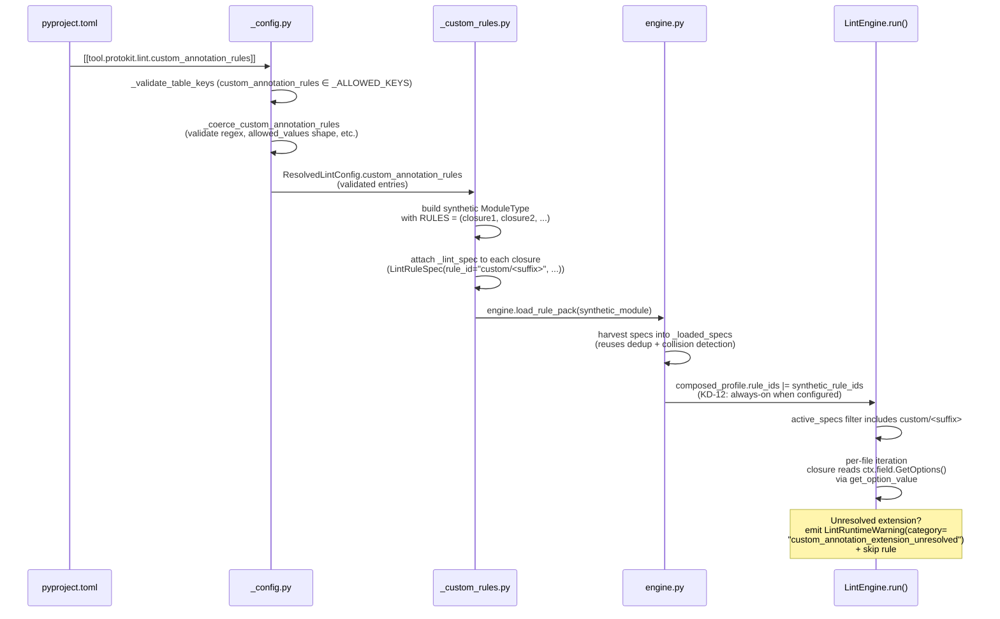

# feat: D6d Option-Aware Pack Expansion (0.5.0)

## Strategic Deferral (added 2026-05-20)

**`field/not-required` (Unit 3 in the original plan) is DEFERRED from
D6d to D6e+** per the umbrella brainstorm's Strategic Deferral section
+ the D6d U3 escalation analysis. D6d now ships in **4 units** instead
of 5:

| Original | Revised | Status |
|---|---|---|
| U1 — synthetic-rule infrastructure | U1 (unchanged) | ✅ shipped (`c137dea`) |
| U2 — `options/field-behavior-consistent` | U2 (unchanged) | ✅ shipped (`c192d5b`) |
| **U3 — `field/not-required` rule** | **DEFERRED to D6e+** | replaced by renumbering |
| U4 — integration-test fixture | **becomes new U3** | pending |
| U5 — delivery boundary 0.5.0 | **becomes new U4** | pending |

**Why deferred**: see the umbrella brainstorm Strategic Deferral
section at
`docs/brainstorms/2026-05-19-d6d-option-aware-pack-expansion-requirements.md`
and the U3 per-unit brainstorm + escalation analysis at
`docs/brainstorms/2026-05-20-d6d-u3-field-not-required-requirements.md`.

**Affected items below** — marked inline with `[SUPERSEDED]` /
`[DEFERRED]`:
- Requirements Trace table: R4, R7 (rule + severity) deferred; S5
  deferred; S6 wording adjusted.
- KD-5 (umbrella brainstorm) reversed.
- KD-17 (plan numerator framing) reverted to D6c's "25 of 26 + 1
  scheduled" language.
- Implementation Units U3 marked DEFERRED in full; U4 + U5 renumbered.
- KD-18 migration recipe simplified (no `field/not-required` demote-
  both content; Path 1b proto3-migration text moves to D6e+).

## Overview

D6d ships protokit lint's strategic-differentiator headline as the
**0.5.0 release**: option-aware pack expansion via user-declarable
custom-annotation rules. Three new rules land:

1. **`custom/<user-suffix>`** — synthetic per-requirement rule_ids
   materialized from pyproject `[[tool.protokit.lint.custom_annotation_rules]]`
   array-of-tables entries. Presence + closed-value-set semantics on
   scalar option values.
2. **`options/field-behavior-consistent`** — well-formedness validator
   for `(google.api.field_behavior)` annotation lists (duplicates,
   INVALID values, contradictory pairs). AIP-203 anchored.
3. ~~**`field/not-required`** — proto2-only buf-parity rule equivalent
   to `buf:FIELD_NOT_REQUIRED`. Closes the proto2 gap from D6c.~~
   **[DEFERRED to D6e+ — 2026-05-20; see Strategic Deferral at top
   of plan]**

Plus pyproject `0.4.0` → `0.5.0`, `_LINT_JSON_SCHEMA_VERSION` bump
`"0.3"` → `"0.4"` (new closed-Literal value), CHANGELOG fold +
delivery-presence-ratchet, README refresh, stale-text sweep, and an
integration-test fixture (`tests/schema/lint/cli/test_d6d_custom_annotation_example.py`)
that proves the differentiator end-to-end in CI.

## Problem Frame

D6d satisfies the **OQ-8 forcing function** inherited from D6c (binding
pre-commit: "D6d MUST ship option-aware pack expansion as headline OR
document a concrete external escalation milestone"). After three
consecutive deferrals of the option-aware path (D6b → D6c → D6d), the
delivery lands the differentiator claim in code: protokit reads custom
protobuf options, and users can declare custom annotation requirements
in pyproject without writing Python.

The brainstorm's 5-reviewer document-review pass (43 surfaced findings;
4 cross-persona P1 convergences) was refined inline before this plan.
Outstanding architectural decisions resolved at plan time per Phase 0.5
+ Phase 1 research:

- The brainstorm's `[severities] = "off"` framing referenced a
  mechanism that doesn't exist today (`LintSeverity` Literal contains
  only `"error" | "warning" | "info"`). Corrected here: disabling a
  synthetic rule = remove the array-of-tables entry; soft-disable =
  demote to `"info"` via `[severities]` (works today).
- The brainstorm's "no `_LINT_JSON_SCHEMA_VERSION` bump required"
  suspicion was wrong. Adding a 6th `LintRuntimeWarning.category`
  Literal value is a closed-discriminator addition per the contract
  at `_builtin_lint.py:227-291`; D6d bumps `"0.3"` → `"0.4"`.
- The brainstorm assumed an existing `field` rule pack; verified
  absent. D6d creates `src/protokit/schema/lint/rules/field.py` as a
  1-rule pack mirroring `file.py`.

D6d ~~also bundles `FIELD_NOT_REQUIRED` as a trivial proto2-only
close-out (one of the seven D6c-deferred items).~~ **[Bundling
reversed 2026-05-20 — see Strategic Deferral.]** The deferred items
list grows: D6b R6 promotion, R9b, strict profile, `LintLocation`
exhaustiveness contract, `PACKAGE_NO_IMPORT_CYCLE`, AND
`FIELD_NOT_REQUIRED` (newly added 2026-05-20) all stay deferred to
D6e+ with explicit CHANGELOG acknowledgment.

## Requirements Trace

Origin: `docs/brainstorms/2026-05-19-d6d-option-aware-pack-expansion-requirements.md`

| ID | Requirement | Implementing Unit |
|---|---|---|
| R1 | New rule template `custom/<user-suffix>` — synthetic-rule-id per pyproject entry under `custom/` namespace; first-class in finding output | U1 |
| R2 | Presence + closed-value-set semantics on scalar option values; per-scalar-type encoding table; unresolved-extension `LintRuntimeWarning` | U1 + U2 (worked example) |
| R3 | New rule `options/field-behavior-consistent` — well-formedness of `(google.api.field_behavior)` lists | U2 |
| R4 | ~~New rule `field/not-required` (proto2-only `buf:FIELD_NOT_REQUIRED` equivalent) in NEW `field` rule pack~~ **[DEFERRED to D6e+ — 2026-05-20]** | ~~U3~~ deferred |
| R5 | `custom/<suffix>` defaults `severity = "warning"`; rule_ids added to composed profile's `rule_ids` at config-resolution; fires on all profiles when configured | U1 |
| R6 | `options/field-behavior-consistent` severity = `warning` in `default` profile only | U2 |
| R7 | ~~`field/not-required` severity = `error` in `recommended` + `default` (buf-parity forced)~~ **[DEFERRED to D6e+ — 2026-05-20]** | ~~U3~~ deferred |
| R8 | Pyproject schema `[[tool.protokit.lint.custom_annotation_rules]]` array-of-tables; per-entry: `rule_suffix`, `option`, `element_kinds`, `allowed_values` (optional), `severity` (optional) | U1 |
| R9 | `rule_suffix` regex `^[a-z][a-z0-9]*(-[a-z0-9]+)*$`; collision detection via `error[lint-pyproject-config-invalid]:`; `test_no_builtin_rule_uses_custom_prefix` regression | U1 |
| R10 | Synthetic rule_ids surface in existing `--format=json` finding output + `[severities]` + `_loaded_specs` registry; `source_spec = "protokit:custom-annotation"`; NOT dependent on `--list-rules` | U1 |
| R11 | CHANGELOG `### D6d` section with headline framing, three rules, migration recipe (3-path: 1a/1b/2 per KD-18), deferral acknowledgment | U5 |
| R12 | README updates: rule table + profile table + worked example referencing integration-test fixture | U5 |
| R13 | pyproject `0.4.0` → `0.5.0` minor bump | U5 |

| Success Criterion | Verification Unit |
|---|---|
| S1: OQ-8 satisfied — `### D6d` headline reads "option-aware pack expansion" | U5 (CHANGELOG fold) |
| S2: Differentiator provable via integration test (`tests/schema/lint/cli/test_d6d_custom_annotation_example.py`) | U4 (test fixture) + U5 (README link) |
| S3: Synthetic rule_ids first-class in `--format=json` finding output + `[severities]` controllable | U1 + U4 |
| S4: `options/field-behavior-consistent` catches ≥3 violation classes (duplicate, INVALID, ≥1 contradictory pair) | U2 |
| S5: ~~`field/not-required` fires on every proto2 `required` field; zero proto3 fires; buf v1.69.0 byte-equivalent~~ **[DEFERRED to D6e+ — 2026-05-20]** | ~~U3~~ deferred |
| S6: `--profile recommended` zero-config users see ZERO new findings (proto3 AND proto2; FIELD_NOT_REQUIRED carve-out removed 2026-05-20 since R4/R7 deferred) | new U4 verification |
| S7: D6c deferral-chain acknowledgment pattern continues in D6d CHANGELOG | U5 |

## Scope Boundaries

Out of scope for D6d (deferred to D6e+ per brainstorm Scope Boundaries):

- `PACKAGE_NO_IMPORT_CYCLE` — own architectural delivery (cross-file
  cycle detection over package-import DAG).
- `custom/<suffix>` value-regex (`value_pattern`) — additive to
  `allowed_values` in D6e+ if demand surfaces.
- `custom/<suffix>` on message-typed or repeated-typed options —
  scalar-only contract; non-scalar element-kind/option combinations
  raise config-load error.
- `options/json-name-respects-snake-case` — D6b-enumerated candidate
  cut from D6d for narrative coherence; carry-forward to D6e.
- D6b R6 promotion `warning` → `error` — pending precision audit.
- R9b per-rule disable/enable CLI flag — `[severities]` demotion is
  the de-facto disable mechanism (now corrected: demote to `info` +
  `--min-severity` filter, since `"off"` value doesn't exist in
  `LintSeverity` Literal).
- `strict` profile rule enumeration.
- `LintLocation` exhaustiveness contract decision (D6c OQ-7).
- TOML-distributable rule packs (`(C) restricted to template-based
  rules` from brainstorm dialogue).

### Deferred to Separate Tasks

- **Build-vs-use audit** (buf custom plugins / protovalidate /
  api-linter comparison) — referenced in brainstorm Outstanding
  Questions as "1-page comparison in /ce:plan." **Reconciled per
  ADV-15 + product-lens F5 + scope-guardian F-05**: the audit is a
  PRE-U5 CHANGELOG-prerequisite (not U1-U4-blocking) — its outcome
  could materially affect U5's CHANGELOG positioning ("differentiator
  vs buf custom plugins" framing). Add to U5 file list as: Create
  `docs/research/2026-05-XX-option-aware-build-vs-use.md` (~30-60
  min hand-written comparison artifact). U5 cannot commit the
  CHANGELOG fold without this artifact existing.
- **AIP-203 contradictory-pair curation** — researched during U2,
  documented inline + referenced from rule docstring.

## Context & Research

### Relevant Code and Patterns

**Pyproject config validation (`src/protokit/schema/lint/_config.py`):**
- `_ALLOWED_KEYS` frozenset at lines 446-456 (7 keys today; D6d adds
  `custom_annotation_rules` for 8).
- `_validate_table_keys` at lines 476-499 (hard-errors on unknown
  top-level keys).
- `_coerce_*` validator pattern at lines 502-808 (one per key; uses
  `error_exit_with_code("pyproject-config-invalid", ...)`).
- Single-pass validation dispatch at lines 1093-1114.
- Array-of-tables is a NEW shape — every existing key is scalar or
  flat-table; `tomllib` parses array-of-tables as `list[dict]`.

**Engine rule-loading (`src/protokit/schema/lint/engine.py`):**
- `LintEngine.load_rule_pack(module)` at lines 255-346 reads
  `module.RULES` tuple, harvests `_lint_spec` attributes.
- Idempotent via `module.__name__` short-circuit at line 303
  (load-bearing per [[cli-loaded-packs-dedup-zip-strict-builtin-packs-flip-2026-05-18]]).
- Active filter at run() lines 467-471: `active_specs = [spec for
  rid, spec in self._loaded_specs.items() if rid in profile.rule_ids]`.
- No runtime-registered rule path exists today — D6d's synthetic-rule
  loader synthesizes a `ModuleType` instance with closures attached
  via `_lint_spec`, then calls the existing `load_rule_pack`.

**`@lint_rule` decorator + `LintRuleSpec` (`decorator.py` + `model.py`):**
- `@lint_rule` at `decorator.py:52-141` attaches `LintRuleSpec` via
  `fn._lint_spec = spec` (line 138).
- `LintRuleSpec` at `model.py:804-903` is directly constructible
  outside the decorator path (verified at `decorator.py:125-133`).
- `get_lint_spec(fn)` at `decorator.py:144-174` is the typed accessor.

**Existing option-aware rule pattern (R6 family):**
- `src/protokit/schema/lint/rules/options/deprecated_replacement.py` —
  5 rules sharing `_check_replacement_comment` + 3-stage param
  sanitization pipeline (truncate → `_safe_for_stderr` → brace-escape)
  at lines 151-187.
- `_comments.py:202-267` `leading_comment` helper signature (NOT
  reused by D6d — R1 doesn't need comments).
- `src/protokit/options.py:43-124` `get_option_value(desc, option_path,
  pool)` — two-tier resolution (Extensions[] → uninterpreted_option).
  **This is the hinge for R1's option-presence check + R2's
  value-comparison logic.**

**ElementKind + LintContext shapes (`model.py:98-113`):**
- 8 ElementKind values: FILE, SERVICE, METHOD, ENUM, ENUM_VALUE,
  MESSAGE, FIELD, ONEOF.
- 5 contexts carry `source_info_descriptors` (FIELD, ENUM, ENUM_VALUE,
  METHOD, MESSAGE — same 5 R6 needed). FILE, SERVICE, ONEOF do not.
  Custom rules don't need `source_info_descriptors`.

**`LintRuntimeWarning.category` Literal (`model.py:518-524`):**
- 5 values today: `"rule_exception"`, `"unloaded_rule"`,
  `"severities_unloaded_rule"`, `"min_severity_relaxed"`,
  `"all_files_excluded"`.
- D6d adds 6th: `"custom_annotation_extension_unresolved"`.
- Bump-trigger per `_builtin_lint.py:227-291` — `_LINT_JSON_SCHEMA_VERSION`
  goes `"0.3"` → `"0.4"`.

**CLI surfaces (`cli.py`):**
- `composed_profile.rule_severity_overrides` overlay at lines 894-901.
- `severities_unloaded_rule_ids` computation at lines 908-912.
- `LintSeverity` has NO `"off"` value (model.py:93-95). `_coerce_severities`
  at `_config.py:759-770` exit-2's on any value outside `{error, warning,
  info}`.
- Multi-pack provenance line at lines 982-1001 uses
  `zip(strict=True)` — load-bearing CLI dedup at lines 841-842 per
  [[cli-loaded-packs-dedup-zip-strict-builtin-packs-flip-2026-05-18]].

**No `field` rule pack exists today** — `field/declared`,
`field/lower-snake-case` referenced in some docs are not real today.
`naming/snake-case-fields` is in `naming.py`. D6d creates
`src/protokit/schema/lint/rules/field.py` as a 1-rule pack template
mirroring `file.py:1-108`.

**Parity test infrastructure (`tests/parity/conftest.py`):**
- `BufFinding` NamedTuple at lines 87-108.
- `parse_buf_recorded_snapshot` at line 686.
- `assert_parity_multi_file` extended at D6c U3 with R8/R8b family
  partition (lines 952-1007).
- `tests/_buf_helpers.py` `SMOKE_FIXTURES` (R7, 22 entries) +
  `PACKAGE_DIRECTORY_SMOKE_FIXTURES` (R8/R8b, 10 entries). D6d adds
  a third family `FIELD_NOT_REQUIRED_SMOKE_FIXTURES`.

**Presence-ratchet test pattern:**
- `tests/test_changelog_delivery_presence_ratchet.py:71-75` uses
  `DeliveryRatchetSpec(delivery=, version=)`. D6d adds a row.
- `tests/test_builtin_lint_formatter.py:705-758`
  `TestBumpContractDocstring` pins substrings via `inspect.getsource`.
  Per [[presence-ratchet-test-pattern-for-prose-substrings-2026-05-14]]
  rule 5: substrings MUST fit on a single source line.

**Integration tests live at `tests/schema/lint/cli/`** (no
`tests/integration/` directory). D6d's worked-example fixture lives
at `tests/schema/lint/cli/test_d6d_custom_annotation_example.py` +
sibling `cli_fixtures/d6d_custom_annotation/` directory.

### Institutional Learnings

- [[presence-ratchet-test-pattern-for-prose-substrings-2026-05-14]] —
  CHANGELOG D6d-section presence ratchet + bump-contract docstring
  substring pins. Apply rule 5: substrings must fit single source
  line.
- [[builtin-packs-expansion-changelog-migration-recipe-structure-2026-05-18]] —
  4-path template; D6d scopes back to 2-3 paths because D6d's
  worst-case blast radius (proto3 `recommended` zero-config user
  sees ZERO new findings) is smaller than R7 PACKAGE_SAME_*'s
  multi-language migration.
- [[wire-format-schema-version-bump-contract-and-absence-semantic-2026-05-13]]
  + [[closed-literal-discriminator-bump-trigger-2026-05-17]] — closed
  Literal additions (new `LintRuntimeWarning.category` value) DO bump
  `_LINT_JSON_SCHEMA_VERSION`. Apply consumer-correctness exhaustive-
  switch test.
- [[stale-forward-looking-text-cli-help-agent-discoverability-2026-05-12]] —
  stale-text sweep at U5 across CLI `--help`, docstrings,
  CHANGELOG-DRAFT.md, README, TODOS.md, plan docs. Search for
  forward-pointing phrases (`"arrives in"`, `"D6d"`, `"deferred to
  D6d"`, etc.).
- [[cli-loaded-packs-dedup-zip-strict-builtin-packs-flip-2026-05-18]] —
  every new BUILTIN_PACKS entry needs
  `TestRulePackExplicitLoadIsIdempotent::test_*_options_pack` (and
  `test_*_field_pack`) to prevent `zip(strict=True)` regression.
- [[multi-mechanism-fix-docstring-enumerate-each-layer-failure-mode-2026-05-18]] —
  synthetic-rule loading has multiple guards (config-load regex,
  collision detection, KD-8 invariant test). Enumerate each layer +
  its failure mode in the test class docstring.
- [[plan-review-verify-prior-art-citations-2026-05-15]] — empirically
  verify (a) `protoxy`'s handling of unregistered extensions, (b)
  buf v1.69.0's FIELD_NOT_REQUIRED behavior on proto2 vs proto3, (c)
  AIP-203 contradictory-pair set (not from secondary citation).
- [[empirical-parity-gate-surfaces-latent-helper-bug-at-implementation-time-2026-05-18]] —
  expect the FIELD_NOT_REQUIRED parity gate to surface ≥1 latent bug
  on first run (track record: U6 + D6c U1 + D6c U2 each surfaced
  one). Budget inline fix time.
- [[dormant-code-changelog-draft-staging-delivery-boundary-2026-05-17]] —
  rules implemented at U2-U3 + new pack registered ONLY at U5
  delivery-boundary commit. CHANGELOG-DRAFT.md staging through U1-U4.
- [[post-ship-adoption-monitoring-pre-1.0-breaking-default-change-2026-05-19]] —
  0.5.0 multi-signal monitoring (PyPI download rate + proactive
  outreach) over 4-6 week window post-ship.
- [[dict-shaped-message-template-multi-arm-rule-violation-kind-2026-05-19]] —
  `options/field-behavior-consistent` has multiple violation kinds
  (duplicate, INVALID, contradictory-pair). Use dict-shaped
  `message_template={violation_kind: template, ...}` not
  single-string identity template.
- [[lint-rule-message-templates-must-not-recommend-actions-that-trigger-siblings-2026-05-13]] —
  R3 message wording mustn't recommend "add `(field_behavior) =
  REQUIRED`" if that would trigger `field/not-required`. Verify at
  U2 against R4's rule semantics.
- [[proto3-optional-synthetic-oneof-false-positive-lint-rule-2026-05-12]] —
  R4 must gate on `file_descriptor.syntax == "proto2"` to avoid
  proto3-optional synthetic-oneof false positives.
- [[rules-tuple-insertion-order-load-bearing-engine-dispatch-2026-05-19]] —
  RULES-tuple insertion order matters for co-fire ordering. D6d
  rules don't co-fire (different element kinds + different rule
  paths), but document the ordering anyway.
- [[expose-finding-params-lint-json-sarif-agent-native-2026-05-19]] —
  R3 multi-arm violations expose `violation_kind` via `params` dict
  (no schema bump for params additions; closed-Literal bumps come
  from category-value additions).
- [[audit-trail-correction-as-changelog-subsection-2026-05-19]] —
  D6c shipped a `#### Corrected` subsection for the buf BASIC
  numerator. D6d uses the same pattern if any U-time corrections
  surface.
- [[click-parameter-source-detection-cli-config-precedence-2026-05-11]] —
  D6d adds NO new CLI flag (synthetic rules are pyproject-only); the
  learning is informational, not applicable.
- [[cli-overrides-deferred-key-notimplemented-trip-wire-2026-05-12]] —
  no CLI flag for `custom_annotation_rules` is intentional. Document
  in U1 that the absence is intentional, not deferred.

### External References

- AIP-203 (`https://google.aip.dev/203`) — field_behavior enum +
  semantic guidance. Researched during U2 implementation against
  primary source.
- `google/api/field_behavior.proto` (googleapis) — enum definition
  for `REQUIRED`, `OPTIONAL`, `IMMUTABLE`, `OUTPUT_ONLY`, `INPUT_ONLY`,
  `UNORDERED_LIST`, `IDENTIFIER`, `NON_EMPTY_DEFAULT`.
- buf v1.69.0 BASIC rule enumeration (`buf config ls-lint-rules
  --configured-only --format=json`) — per D6c Phase 0 verification.

## Key Technical Decisions

- **KD-1 (carry: brainstorm KD-1).** D6d ships option-aware as
  headline (OQ-8 forcing function resolved).
- **KD-2 (carry: brainstorm KD-2).** Custom-annotation rule uses
  synthetic per-requirement rule_ids under `custom/<suffix>`
  namespace.
- **KD-3 (carry: brainstorm KD-3).** Custom-annotation rule
  semantics = presence + closed-value-set on scalar option values.
- **KD-4 (carry: brainstorm KD-4).** Field-behavior rule semantics =
  well-formedness only; renamed `options/required-field-behavior` →
  `options/field-behavior-consistent`.
- **KD-5 (carry: brainstorm KD-5).** `FIELD_NOT_REQUIRED` bundled as
  trivial close-out under NEW `field` rule pack.
- **KD-6 (carry: brainstorm KD-6).** Five-item deferral chain
  (D6b R6 promotion, R9b, strict profile, LintLocation contract,
  PACKAGE_NO_IMPORT_CYCLE) stays deferred to D6e+.
- **KD-7 (carry: brainstorm KD-7).** No default custom-annotation
  rules shipped; worked example via R12 README + integration test.
- **KD-8 (carry: brainstorm KD-8 + plan-time refinement).** `custom/`
  namespace reserved for user synthetic rules; `BUILTIN_PACKS` MUST
  NEVER ship a `custom/*` rule_id. Enforced structurally by
  `test_no_builtin_rule_uses_custom_prefix`. Regression test uses
  REGEX `^custom/` (not `startswith("custom/")`) to prevent accidental
  acceptance of `customer/`, `customs/`, or `custom-*/` rule_ids in
  future BUILTIN_PACKS additions (per ADV-6).
- **KD-9 (carry: brainstorm KD-9).** Pyproject `_ALLOWED_KEYS`
  extension + snake_case key naming (`custom_annotation_rules`).
- **KD-10 (carry: brainstorm KD-10).** Synthetic-rule loading via
  synthetic `ModuleType` with closures attached via `_lint_spec`,
  then `engine.load_rule_pack(synthetic_module)`. Preserves "one
  loading mechanism" invariant; reuses existing collision detection.

**Plan-time new KDs (from research findings):**

- **KD-11. `_LINT_JSON_SCHEMA_VERSION` bumps `"0.3"` → `"0.4"`.**
  Adding `"custom_annotation_extension_unresolved"` to
  `LintRuntimeWarning.category` Literal is a closed-discriminator
  addition per `_builtin_lint.py:227-291`. `TestBumpContractDocstring`
  substrings updated at U5 to reference the new version. Consumer-
  correctness exhaustive-switch test follows
  [[closed-literal-discriminator-bump-trigger-2026-05-17]].

- **KD-12. The `[severities] = "off"` framing in the brainstorm is
  corrected to demote-to-info.** `LintSeverity` Literal has no
  `"off"` value today, and adding one expands scope beyond D6d.
  Disable semantics for synthetic rules:
  - **Remove**: delete the `[[tool.protokit.lint.custom_annotation_rules]]`
    entry from pyproject. Rule_id no longer materialized; no findings
    emitted.
  - **Silence (soft-disable)**: `[tool.protokit.lint.severities]
    "custom/<suffix>" = "info"` + `--min-severity warning` (or
    `error`). Findings emit at `info` but filtered before exit-code
    computation.
  R10's text + brainstorm Visual table corrected at U5 documentation
  fold. Add `[disabled_rules]` table is R9b territory; deferred.

- **KD-13. New `field` rule pack is created in U3** (not extended
  from existing). `src/protokit/schema/lint/rules/field.py` mirrors
  the 1-rule pack structure of `src/protokit/schema/lint/rules/file.py`.
  Registered in `BUILTIN_PACKS` at U5 delivery boundary. Per
  [[dormant-code-changelog-draft-staging-delivery-boundary-2026-05-17]]
  dormancy discipline: module imported + RULES tuple populated at
  U3, BUT NOT added to `BUILTIN_PACKS` until U5.

- **KD-14. KD-4 rename backwards-compat = `LintRuntimeWarning(category=
  "unloaded_rule")`.** A user who pre-emptively configured
  `[severities] "options/required-field-behavior" = "off"` (or any
  severity) hits the existing `severities_unloaded_rule` warning
  path — works today without changes. The rule_id never matched a
  loaded rule, so `severities_unloaded_rule_ids` at `cli.py:908-912`
  surfaces it. No new alias or hard-error needed.

- **KD-15. R3 message_template is dict-shaped per
  [[dict-shaped-message-template-multi-arm-rule-violation-kind-2026-05-19]].**
  `options/field-behavior-consistent` has 3 discriminator values:
  `"duplicate-value"`, `"invalid-value"`, `"contradictory-pair"`.
  Each gets a distinct message template; finding `params` dict
  exposes the discriminator for agent-native consumers per
  [[expose-finding-params-lint-json-sarif-agent-native-2026-05-19]].

- **KD-16. R4 proto2 syntax guard via `CopyToProto`-then-`fdp.syntax`
  pattern.** **Correction from initial brainstorm framing** (which
  asserted `ctx.file.syntax == "proto2"`): `FileDescriptor.syntax`
  is not exposed on the upb backend; protobuf emits `fdp.syntax == ""`
  for proto2 files (both explicit `syntax = "proto2";` and
  no-syntax-statement cases). The guard MUST use the existing
  `file.py:96-98` `CopyToProto` pattern:

  ```python
  fdp = descriptor_pb2.FileDescriptorProto()
  ctx.file.CopyToProto(fdp)
  if fdp.syntax != "":            # proto3 ("proto3") or editions ("editions")
      return                       # skip non-proto2 files
  if ctx.field.label == descriptor_pb2.FieldDescriptorProto.LABEL_REQUIRED:
      ctx.emit(...)
  ```

  Per [[proto3-optional-synthetic-oneof-false-positive-lint-rule-2026-05-12]]
  + the `file/syntax-specified` documented buf-parity divergence.
  Edition-2024+ files with `features.field_presence = LEGACY_REQUIRED`
  are out of scope (verified empirically at U3 against buf v1.69.0;
  if buf fires on edition LEGACY_REQUIRED, U3 escalates via
  documented plan-revision at `docs/plans/2026-05-XX-d6d-u3-legacy-required-scope.md`
  rather than silent scope-widening).

- **KD-17. [SUPERSEDED — REVERTED 2026-05-20]** *Original: "26 of 27
  buf BASIC rules" post-D6d numerator framing.* **Revised**:
  `field/not-required` deferred to D6e+ per Strategic Deferral;
  numerator stays at D6c's "25 of 26 buf BASIC rules"
  (`PACKAGE_NO_IMPORT_CYCLE` + `FIELD_NOT_REQUIRED` both deferred).
  D6c CHANGELOG's existing wording at
  `src/protokit/schema/lint/rules/__init__.py:120-137` does not need
  to change for D6d — D6d's CHANGELOG section explicitly states the
  numerator is unchanged from D6c. The presence-ratchet substring U4
  pins is `"25 of 26 buf BASIC rules"` (matching D6c's already-shipped
  language). D6e+ delivers "27 of 27" cleanly when both deferred rules
  ship bundled with their respective architectural work
  (PACKAGE_NO_IMPORT_CYCLE = cycle detection; FIELD_NOT_REQUIRED =
  engine `ElementKind.EXTENSION_FIELD` walker).

- **KD-19. Multi-`element_kinds` entry produces N closures with same
  `rule_id`, distinct `LintRuleSpec.element`** (resolves scope-guardian
  F-01 HIGH). Per pyproject entry with `element_kinds = ["field",
  "method"]`, the synthetic loader produces TWO closures (one
  `ElementKind.FIELD`, one `ElementKind.METHOD`) both attached with
  `LintRuleSpec(rule_id="custom/<suffix>", element=<kind>, ...)`. Both
  are inserted into the synthetic module's `RULES` tuple. `LintEngine.
  load_rule_pack` registers both into `_loaded_specs` under the SAME
  `rule_id` key — verify whether `_loaded_specs` is keyed by `rule_id`
  alone or `(rule_id, element)` at U1 Phase 0; if `rule_id`-keyed, the
  second closure overwrites the first (BUG); if `(rule_id, element)`-
  keyed, both coexist (CORRECT). Empirical verification in U1 gates
  the answer. If `rule_id`-keyed, the synthetic loader must synthesize
  rule_ids per-kind (e.g., `custom/<suffix>` becomes `custom/<suffix>/field`
  + `custom/<suffix>/method`); document the convention.

- **KD-20. Closure binding discipline: factory function** (resolves
  ADV-3 HIGH). Synthetic-rule closures MUST bind per-entry state via
  factory functions to avoid Python's classic loop-variable
  capture-by-reference footgun. Pattern:

  ```python
  def _make_rule_fn(entry: CustomAnnotationRuleSpec, element_kind: ElementKind) -> Callable[..., None]:
      def rule_fn(ctx):
          # closure captures entry + element_kind via factory scope
          value = get_option_value(getattr(ctx, _element_to_attr(element_kind)),
                                    entry.option, ctx.pool)
          # ... presence/value check logic ...
      rule_fn._lint_spec = LintRuleSpec(rule_id=f"custom/{entry.rule_suffix}",
                                         severity=entry.severity, element=element_kind, ...)
      return rule_fn

  rules = tuple(_make_rule_fn(entry, kind)
                for entry in custom_annotation_rules
                for kind in entry.element_kinds)
  ```

  DO NOT use bare loop-variable closure capture (e.g., `for entry in
  ...: def rule_fn(ctx): use(entry)`). U1 test scenario "2 distinct
  entries with distinct `option` + distinct `rule_suffix` each fire
  only on its own configured option" is the falsification test for
  capture-by-reference.

- **KD-21. Synthetic module `__name__` is content-addressed** (resolves
  ADV-2 HIGH). Synthetic module's `__name__` = `f"protokit_synthetic_custom_annotations_{hash_of_resolved_config}"`
  where `hash_of_resolved_config` is a stable digest of the resolved
  `custom_annotation_rules` tuple (e.g., SHA-256 of a canonically-
  serialized representation). Rationale: `LintEngine.load_rule_pack`'s
  `__name__`-based dedup at `engine.py:303` would otherwise silently
  no-op when long-lived processes (test suites, IDE servers,
  hypothetical MCP integration) re-invoke lint after config changes.
  Content-addressing makes config changes naturally produce new module
  names, triggering a fresh load. Static-name approach (e.g.,
  `"protokit_synthetic_custom_annotations"`) creates a stale-rule
  failure mode that the CLI flow doesn't hit (single invocation) but
  library users do. U1 test scenario "synthetic-rule config change
  between invocations on the same engine instance produces refreshed
  rules" gates this.

- **KD-18. Migration recipe 3-path structure** (revised per ADV-10 +
  product-lens F7; scoped back from 4-path):
  - **Path 1a — Proto3 zero-config (true no-op)**: upgrade is no-op
    for proto3 `recommended`-profile users with no
    `custom_annotation_rules`. Configure synthetic rules if desired.
  - **Path 1b — Proto2 schema-evolution path**: proto2 teams hitting
    `field/not-required` errors at scale should plan a migration to
    proto3 + presence detection OR protovalidate annotations for the
    fields previously declared `required`. Document references the
    canonical proto2→proto3 migration guide + protovalidate as the
    primary remediation, NOT just severity demotion. This is harm
    reduction's escape path.
  - **Path 2 — Soft-disable (demote-to-info)**: for proto2 users
    facing `field/not-required` or `default`-profile users facing
    `field-behavior-consistent` warnings: `[severities]
    "field/not-required" = "info"` + `--min-severity warning`. Filters
    findings before exit-code computation. Use as a short-term harm
    reduction while planning Path 1b.
  Per [[builtin-packs-expansion-changelog-migration-recipe-structure-2026-05-18]]
  the 4-path template is right-sized for default-on rule expansions
  with real worst-case blast radius (D6b R7 PACKAGE_SAME_*'s
  140-finding worst case). D6d's worst case is ~M proto2 fields with
  `required`, which is fully addressed by Path 2 demotion. The "pin
  to 0.4.x" escape hatch is documentation theater for D6d's blast
  radius.

## Open Questions

### Resolved During Planning

- **Custom-extension parsing path through protoxy** — Resolved as
  U1 Phase 0 task (30-minute empirical verification using a minimal
  custom-extension proto). Brainstorm Outstanding Question moved to
  in-unit prerequisite work, not pre-plan blocker.
- **`"off"` severity mechanism** (research-surfaced divergence) —
  Resolved per KD-12: dropped from D6d scope; soft-disable via
  `info`-demotion works today.
- **`_LINT_JSON_SCHEMA_VERSION` bump** (research-surfaced
  divergence) — Resolved per KD-11: bump `"0.3"` → `"0.4"` required.
- **KD-4 rename backwards-compat** — Resolved per KD-14: existing
  `severities_unloaded_rule` warning handles pre-emptive users; no
  new mechanism.
- **`field` rule pack location** — Resolved per KD-13: new file
  `src/protokit/schema/lint/rules/field.py` (1-rule pack template).
- **R3 dict-shaped message_template** — Resolved per KD-15.
- **R4 proto3 guard** — Resolved per KD-16.
- **Numerator framing** — Resolved per KD-17: option (a) "26 of 27".
- **Migration recipe scope** — Resolved per KD-18: 2-path (not
  4-path).

### Deferred to Implementation

- **AIP-203 contradictory-pair curated set** — Research at U2 against
  AIP-203 + `google/api/field_behavior.proto` primary source.
  Candidate pairs from brainstorm: REQUIRED+OPTIONAL,
  REQUIRED+OUTPUT_ONLY, OUTPUT_ONLY+INPUT_ONLY, IDENTIFIER+OUTPUT_ONLY,
  IMMUTABLE+OUTPUT_ONLY. U2 finalizes + documents inclusion criteria
  in rule docstring per
  [[plan-review-verify-prior-art-citations-2026-05-15]].
- **Specific buf v1.69.0 parity gaps for FIELD_NOT_REQUIRED** —
  Anticipated per
  [[empirical-parity-gate-surfaces-latent-helper-bug-at-implementation-time-2026-05-18]].
  U3 generates buf NDJSON snapshots BEFORE rule implementation;
  expect ≥1 byte-divergence; budget inline fix.
- **Edition-2024+ `LEGACY_REQUIRED` boundary** for FIELD_NOT_REQUIRED
  — U3 empirically verifies buf v1.69.0's behavior on edition files
  + documents protokit's stance (skip or fire). Out of scope unless
  divergent.
- **Per-ElementKind synthetic-rule closure shape uniformity** — KD-10
  assumes one closure shape works across all 8 ElementKinds. U1
  verifies during implementation (closure body is rule_id-uniform;
  only `ctx.<element>` varies — uniform is plausible).
- **`options` rule pack file structure** — `options/field-behavior-consistent`
  lives in `src/protokit/schema/lint/rules/options/field_behavior.py`
  as a sibling to `deprecated_replacement.py`. The existing `options`
  BUILTIN_PACKS entry covers both modules' RULES.
- **Worked-example option name** for integration test — U4 picks an
  illustrative custom-extension name (e.g., `(example.audit_level)`)
  with a curated minimal `.proto` extension definition. Avoids
  conflict with real-world `(mycorp.*)` patterns.
- **CLI dedup regression test sibling files** — U5 creates
  `tests/schema/lint/test_cli_rule_pack_dedup_post_d6d.py` mirroring
  the D6c version, covering the new `field` pack (and any new
  `options` member if applicable).

## Output Structure

```
src/protokit/schema/lint/
├── _config.py                                    # MODIFY: + _coerce_custom_annotation_rules, _ALLOWED_KEYS, ResolvedLintConfig field
├── _custom_rules.py                              # NEW: synthetic-rule loader (KD-10)
├── engine.py                                     # MODIFY: composed-profile augmentation (R5)
├── model.py                                      # MODIFY: + LintRuntimeWarning category value, _LINT_JSON_SCHEMA_VERSION bump
├── cli.py                                        # MODIFY: thread synthetic rules through load_rule_pack pipeline
└── rules/
    ├── __init__.py                               # MODIFY (U5): + options pack registration update if needed; + field pack
    ├── field.py                                  # NEW (U3): field/not-required rule pack (1-rule, template = file.py)
    └── options/
        └── field_behavior.py                     # NEW (U2): options/field-behavior-consistent rule

tests/
├── schema/lint/
│   ├── rules/
│   │   ├── test_field_not_required.py            # NEW (U3): unit tests + dormancy
│   │   ├── test_field_behavior_consistent.py     # NEW (U2): unit tests + AIP-203 contradictory-pair coverage
│   │   ├── test_custom_annotation_rules.py       # NEW (U1): synthetic-rule infrastructure tests
│   │   └── fixtures/
│   │       ├── field_not_required/_buf_smoke/    # NEW (U3): buf v1.69.0 NDJSON snapshots
│   │       │   ├── recorded/*.json
│   │       │   └── <fixture-name>/buf.yaml + *.proto
│   │       └── custom_annotation/                # NEW (U1): pyproject schema validation fixtures
│   ├── cli/
│   │   ├── test_d6d_custom_annotation_example.py # NEW (U4): integration-test fixture (S2 worked example)
│   │   └── cli_fixtures/d6d_custom_annotation/   # NEW (U4): pyproject.toml + sample protos + extension defn
│   ├── test_custom_rules_loader.py               # NEW (U1): synthetic ModuleType + load_rule_pack integration
│   ├── test_pyproject_custom_annotation.py       # NEW (U1): _coerce_custom_annotation_rules validation
│   ├── test_lint_runtime_warning_categories.py   # MODIFY (U1): + custom_annotation_extension_unresolved
│   ├── test_cli_rule_pack_dedup_post_d6d.py      # NEW (U5): per [[cli-loaded-packs-dedup-zip-strict-builtin-packs-flip-2026-05-18]]
│   └── test_dormancy_contract_d6d.py             # NEW (U1-U4): dormant-code staging gate per [[dormant-code-changelog-draft-staging-delivery-boundary-2026-05-17]]
├── parity/
│   ├── conftest.py                               # MODIFY (U3): + FIELD_NOT_REQUIRED family partition
│   └── test_parity_field_not_required.py         # NEW (U3): buf v1.69.0 parity gate
├── _buf_helpers.py                               # MODIFY (U3): + FIELD_NOT_REQUIRED_SMOKE_FIXTURES tuple + helper
├── test_changelog_delivery_presence_ratchet.py   # MODIFY (U5): + DeliveryRatchetSpec(delivery="D6d", version="0.5.0")
├── test_builtin_lint_formatter.py                # MODIFY (U5): TestBumpContractDocstring substring updates (schema_version "0.4")
└── test_builtin_packs.py                         # MODIFY (U5): + field pack membership
```

## High-Level Technical Design

> *This illustrates the intended approach and is directional guidance
> for review, not implementation specification. The implementing agent
> should treat it as context, not code to reproduce.*

**Synthetic-rule lifecycle (per KD-10):**



**Pyproject schema (per R8 + R9):**

```
[[tool.protokit.lint.custom_annotation_rules]]
rule_suffix    = "audit-level"            # required; ^[a-z][a-z0-9]*(-[a-z0-9]+)*$
option         = "(mycorp.audit_level)"   # required; full extension ref
element_kinds  = ["field", "method"]      # required; ≥1 lowercase ElementKind
allowed_values = ["HIGH", "CRITICAL"]     # optional; homogeneous scalars per R2 table
severity       = "warning"                # optional; default "warning"; cannot be "off"
```

**`options/field-behavior-consistent` violation discriminator (per KD-15):**

| `violation_kind` | Message template |
|---|---|
| `duplicate-value` | `Field {field_name} has duplicate (google.api.field_behavior) = {value} entries.` |
| `invalid-value` | `Field {field_name} has invalid (google.api.field_behavior) = {value} (not a recognized FieldBehavior enum value).` |
| `contradictory-pair` | `Field {field_name} has contradictory (google.api.field_behavior) entries: {value_a} and {value_b}.` |

`finding.params` dict exposes `violation_kind` + ancillary keys per
[[expose-finding-params-lint-json-sarif-agent-native-2026-05-19]].

## Implementation Units

- [ ] **Unit 1: Synthetic-rule infrastructure (`custom/<user-suffix>`)**

**Goal:** Ship pyproject schema extension + synthetic ModuleType
loader + composed-profile augmentation + `LintRuntimeWarning` category
addition. Establishes the option-aware capability headline. Largest
unit; ~600-900 LOC.

**Requirements:** R1, R2, R5, R8, R9, R10 + KD-9, KD-10, KD-11, KD-12

**Dependencies:** None (Phase 0 prerequisite empirical verification
performed in-unit before main implementation).

**Files:**
- Phase 0 verification: off-tree `/tmp/d6d_phase0_extension_parsing/` (never committed; D6c precedent). Findings recorded in R2 contract table + this plan's Open Questions; no in-tree fixture.
- Create: `src/protokit/schema/lint/_custom_rules.py` — synthetic ModuleType + closure factory + `LintRuleSpec` construction
- Modify: `src/protokit/schema/lint/_config.py` — add `custom_annotation_rules` to `_ALLOWED_KEYS`; add `_coerce_custom_annotation_rules` validator; add `custom_annotation_rules` field to `ResolvedLintConfig`
- Modify: `src/protokit/schema/lint/cli.py` — composed-profile augmentation logic AFTER `LintProfile.compose(*per_pack_profiles)` and BEFORE the `[severities]` overlay (synthetic `rule_ids` union via new `_augment_profile_with_synthetic_rules(profile, synthetic_specs) -> LintProfile` helper). Note: brainstorm + earlier plan revision said "engine.py" — this was wrong per Phase 1 research: profile composition happens in `cli.py:851-876`, not in `engine.run()`.
- Modify: `src/protokit/schema/lint/model.py` — add `"custom_annotation_extension_unresolved"` to `LintRuntimeWarning.category` Literal (line 518-524)
- Modify: `src/protokit/formatters/_builtin_lint.py` — bump `_LINT_JSON_SCHEMA_VERSION` `"0.3"` → `"0.4"` (line 291); update bump-contract docstring (lines 227-291) to enumerate the new category value
- Modify: `src/protokit/schema/lint/cli.py` — thread `ResolvedLintConfig.custom_annotation_rules` into the rule-loading pipeline (after `BUILTIN_PACKS`, before `--rule-pack` modules)
- Test: `tests/schema/lint/rules/test_custom_annotation_rules.py` — synthetic-rule unit tests (presence, closed-value-set, unresolved-extension warning)
- Test: `tests/schema/lint/test_pyproject_custom_annotation.py` — `_coerce_custom_annotation_rules` validation (regex, type-rejection, collision, mixed-type lists)
- Test: `tests/schema/lint/test_custom_rules_loader.py` — synthetic ModuleType + `engine.load_rule_pack` integration; composed-profile augmentation
- Test: `tests/schema/lint/test_lint_runtime_warning_categories.py` — closed-Literal exhaustive switch; consumer-correctness check
- Test: `tests/schema/lint/test_no_builtin_rule_uses_custom_prefix.py` — KD-8 invariant regression
<!-- test_dormancy_contract_d6d.py dropped per scope-guardian F-02: existing tests/schema/lint/test_builtin_packs.py BUILTIN_PACKS membership pin test already enforces "new packs not registered until U5" structurally; redundant new test file removed. -->

**Approach:**
- **Phase 0 verification** (30 min, in-unit, off-tree at `/tmp/d6d_phase0_extension_parsing/` — never committed, D6c precedent): write a minimal `.proto` with a custom extension `(example.x)` applied to a field; invoke `protokit.options.get_option_value` via tier-1 (extension in pool) AND tier-2 (`uninterpreted_option`). Record which wire field each scalar TOML type maps to + verify the proto3 scalar-default ambiguity (per `protokit/options.py:80-85` docstring: proto3 scalar extensions return type default `""`/`0`/`False` when unset; presence-only rule needs explicit tier-2 fallback for proto3 string-typed extensions). Update R2 contract table in the brainstorm + this plan's Phase 0 Findings sub-section if reality diverges. The empirical results become a permanent regression test at `tests/schema/lint/test_protoxy_option_value_encoding_contract.py` (per ADV-7 — captures the contract so future protoxy/upb upgrades surface divergence at CI time).
- **`_custom_rules.py` design** (per KD-10): factory function `build_synthetic_module(custom_annotation_rules: tuple[CustomAnnotationRuleSpec, ...]) -> ModuleType`. Each entry produces a closure attached to `_lint_spec: LintRuleSpec`. The synthetic module's `__name__` is a stable identifier (e.g., `"protokit_synthetic_custom_annotations"`) to satisfy `LintEngine.load_rule_pack`'s `__name__`-based dedup at line 303.
- **Closure body uniform across ElementKinds** (verified Phase 0): each closure calls `protokit.options.get_option_value(ctx.<element>, option_path, ctx.pool)`. Returns `None` → fire presence violation. Returns value → if `allowed_values` set, compare per KD-15-style discriminator (presence-pass + value-mismatch arm). Wire-format-additive params include `option_name`, `actual_value` (truncated + safed).
- **Unresolved-extension path** (CORRECTION per Phase 1 research: `get_option_value` does NOT raise on absent extensions — it returns `None` via tier-1 KeyError-catching loop + tier-2 linear-scan exhaustion). The closure must explicitly precheck via `pool.FindExtensionByName(option_name)` to distinguish "extension absent because not registered in pool" from "extension absent because user didn't apply it." On `KeyError` from the precheck, emit `LintRuntimeWarning(category="custom_annotation_extension_unresolved", message=...)` naming the synthetic `rule_id` + skip firing. Uses existing warning emission path.
- **Composed-profile augmentation in `cli.py`** (CORRECTION from brainstorm/earlier plan framing that said `engine.py`): after `LintProfile.compose(*per_pack_profiles)` at `cli.py:851-876` returns the composed profile + BEFORE the `[severities]` overlay at lines 894-901, add `_augment_profile_with_synthetic_rules(profile, synthetic_specs) -> LintProfile`. Returns a new immutable `LintProfile` (don't mutate; `frozenset(profile.rule_ids | synthetic_rule_ids)`). Ordering rationale: augment BEFORE severity overlay so user `[severities] "custom/<suffix>" = "info"` applies; augment AFTER profile composition so the augmentation reflects the user's `--profile` choice. The engine's profile-filter invariant (`active_specs = [spec for rid in profile.rule_ids ...]`) is UNCHANGED.
- **`_coerce_custom_annotation_rules`** in `_config.py` (follow pattern at lines 502-808):
  - `isinstance(value, list)` → else error `pyproject-config-invalid: 'custom_annotation_rules' must be array-of-tables`
  - Per entry: `isinstance(dict)`, required keys present, `rule_suffix` regex match, `option` non-empty string, `element_kinds` non-empty subset of ElementKind values, optional `allowed_values` homogeneous scalar list (per R2 contract — reject floats + mixed-type), optional `severity` ∈ `{error, warning, info}`.
  - Cross-entry: collision detection on `rule_suffix` (case-sensitive; suffixes are ASCII-only by R9 regex).

**Execution note:** Start with the Phase 0 verification — write the
minimal proto + run `get_option_value` through both tiers before
writing any rule logic. The verified value-encoding contract gates
all downstream decisions in this unit.

**Technical design:** Synthetic ModuleType pattern with closure
factory: see High-Level Technical Design above. Closures share
`get_option_value`-based body; per-rule state bound via closure
capture.

**Patterns to follow:**
- `src/protokit/schema/lint/rules/options/deprecated_replacement.py` — option-aware rule pattern (param sanitization 3-stage pipeline at lines 151-187)
- `src/protokit/schema/lint/_config.py:502-808` — `_coerce_*` validator pattern
- `src/protokit/schema/lint/engine.py:255-346` — `load_rule_pack` mechanism
- `src/protokit/options.py:43-124` — `get_option_value` two-tier resolution

**Test scenarios:**
- **Happy path: presence-only rule fires on absence.** Configure
  `[[custom_annotation_rules]]` with `rule_suffix = "audit-needed"`,
  `option = "(example.audit_level)"`, `element_kinds = ["method"]`,
  no `allowed_values`. Sample proto: 2 methods, one with annotation,
  one without. Assert: `custom/audit-needed` fires on the method
  without annotation; does NOT fire on the annotated method.
- **Happy path: closed-value-set fires on absence + value mismatch.**
  Configure `allowed_values = ["HIGH", "CRITICAL"]`. Sample proto: 3
  fields — one absent, one with `(audit_level) = HIGH`, one with
  `(audit_level) = NONE`. Assert: 2 findings (the absent + the
  `NONE`); 0 findings on the `HIGH` field.
- **Happy path: enum identifier value matches string `allowed_values`.**
  Enum-typed extension; verify TOML string `"HIGH"` matches protobuf
  `identifier_value = "HIGH"` per KD-11 contract.
- **Edge case: empty `allowed_values` list.** Reject at config-load
  with `error[lint-pyproject-config-invalid]: 'allowed_values' must
  be non-empty if specified`.
- **Edge case: signed integer comparison.** `allowed_values = [5, -3]`
  on integer-typed extension; verify protobuf `positive_int_value: 5`
  matches TOML `5`; `negative_int_value: 3` matches TOML `-3`.
- **Edge case: float in `allowed_values` rejected at config-load.**
  `allowed_values = [1.0]` → exit-2 with clear error per KD-11.
- **Edge case: mixed-type list rejected at config-load.**
  `allowed_values = ["HIGH", 5, true]` → exit-2.
- **Edge case: invalid `rule_suffix` regex.** Suffixes `"../etc"`,
  `""`, `"Audit-Level"`, `"audit--level"`, `"audit-"`, `"-audit"`,
  `"audit_level"` (underscores forbidden), `"audit/level"` all
  rejected per R9 regex.
- **Edge case: duplicate `rule_suffix` across entries.** Two entries
  with same suffix → exit-2 with both pyproject positions named.
- **Error path: unresolved extension.** Configure
  `option = "(notinpool.foo)"` where `(notinpool.foo)` is not in any
  proto file's compile set. Run lint. Assert: 1
  `LintRuntimeWarning` emitted with `category=
  "custom_annotation_extension_unresolved"`; the rule does NOT fire
  any findings (skips silently per KD-12-spec).
- **Error path: invalid `element_kinds` value.**
  `element_kinds = ["unknown_kind"]` → exit-2 at config-load.
- **Error path: `rule_suffix` collision with future built-in rule.**
  KD-8 regression test: walk `BUILTIN_PACKS`, assert no rule_id
  starts with `"custom/"`.
- **Integration: synthetic rule fires across all profiles.** Configure
  one entry. Run with `--profile recommended`, `--profile default`,
  `--profile essentials`. Verify rule fires on all three (R5 KD-12).
- **Integration: synthetic rule respects `[severities]` demotion.**
  Configure entry with default `severity = "warning"`; in
  `[severities]` table demote to `info`. Verify finding emits at
  `info` severity.
- **Integration: synthetic rule + `--rule-pack` co-load.** Configure
  a custom rule AND `--rule-pack=<user-pack>`. Verify no
  `zip(strict=True)` regression (per [[cli-loaded-packs-dedup-zip-strict-builtin-packs-flip-2026-05-18]]).
- **Integration: closed-Literal exhaustive switch on
  `LintRuntimeWarning.category`.** Consumer-correctness test per
  [[closed-literal-discriminator-bump-trigger-2026-05-17]] asserts
  every `category` value has a corresponding consumer branch +
  the version bumped correctly.
- **Dormancy gate:** `test_dormancy_contract_d6d.py` asserts that
  through U1-U4, `custom_annotation_rules` are unregistered in
  BUILTIN_PACKS (synthetic rules don't ship via BUILTIN_PACKS but
  the test asserts the file/options/field packs aren't yet
  registered as new D6d packs).

**Verification:**
- Phase 0 verification produces a working extension-parsing demo +
  confirms the R2 contract table.
- All test scenarios pass.
- `protokit lint --format=json` on a configured project shows
  synthetic findings with matching `rule_id` strings.
- `composed_profile.rule_ids` contains synthetic rule_ids
  post-config-resolution.
- `_LINT_JSON_SCHEMA_VERSION = "0.4"` in output.
- ruff + mypy clean; full suite passes.

---

- [ ] **Unit 2: `options/field-behavior-consistent` rule**

**Goal:** Ship the well-formedness validator for
`(google.api.field_behavior)` annotation lists. Single specimen of
the "value-validation" template family. AIP-203 anchored.

**Requirements:** R3, R6, S4 + KD-4, KD-15

**Dependencies:** U1 (uses `LintRuntimeWarning.category` Literal at
its post-bump shape; uses generic option-aware patterns from
`get_option_value`).

**Files:**
- Create: `src/protokit/schema/lint/rules/options/field_behavior.py` — rule callable + dict-shaped message_template
- Modify: `src/protokit/schema/lint/rules/options/__init__.py` (if exists) or `rules/__init__.py` — add module reference for dormancy staging (NOT in BUILTIN_PACKS yet — per [[dormant-code-changelog-draft-staging-delivery-boundary-2026-05-17]])
- Test: `tests/schema/lint/rules/test_field_behavior_consistent.py` — unit tests (duplicate, INVALID, contradictory-pair, well-formed-pass)
- Test fixture: `tests/schema/lint/rules/fixtures/field_behavior/` — protos exercising each violation kind

**Approach:**
- **AIP-203 research at unit start:** Read AIP-203 + `google/api/field_behavior.proto` primary source. Document the curated contradictory-pair set in the rule's module docstring with inclusion criteria. Candidate pairs (verify in research):
  - REQUIRED + OPTIONAL (semantically opposite)
  - REQUIRED + OUTPUT_ONLY (server-only can't be client-required)
  - OUTPUT_ONLY + INPUT_ONLY (mutually exclusive directionality)
  - IDENTIFIER + OUTPUT_ONLY (identifiers are inputs)
  - IMMUTABLE + OUTPUT_ONLY (overlap or contradiction; verify against grpc/googleapis usage)
- **Rule structure** (per `deprecated_replacement.py` precedent):
  ```python
  @lint_rule(
      rule_id="options/field-behavior-consistent",
      severity=LintSeverity.WARNING,
      profiles=("default",),
      element_kinds=(ElementKind.FIELD,),
      source_spec="https://google.aip.dev/203",
      message_template={  # dict-shaped per KD-15
          "duplicate-value": "Field {field_name} has duplicate (google.api.field_behavior) = {value} entries.",
          "invalid-value": "Field {field_name} has invalid (google.api.field_behavior) = {value}.",
          "contradictory-pair": "Field {field_name} has contradictory (google.api.field_behavior) entries: {value_a} and {value_b}.",
      },
  )
  def check_field_behavior_consistent(ctx): ...
  ```
- **Rule body**: read all `(google.api.field_behavior)` values from
  `ctx.field` via `get_option_value` (repeated extension); iterate;
  detect duplicates → fire `duplicate-value`; detect non-enum-name
  values → fire `invalid-value`; detect contradictory pairs → fire
  `contradictory-pair`. Each finding's `params` includes
  `violation_kind` discriminator + `value`/`value_a`/`value_b`.
- **Message wording** must NOT recommend "add `(field_behavior) =
  REQUIRED`" per [[lint-rule-message-templates-must-not-recommend-actions-that-trigger-siblings-2026-05-13]]
  — that advice would trigger `field/not-required` on the same
  field if the field is proto2 `required`. Message is descriptive,
  not prescriptive.

**Execution note:** AIP-203 research first; then write tests against
the curated contradictory-pair set; then implement the rule. The
contradictory-pair curation is the load-bearing decision; tests
codify it.

**Technical design:** Dict-shaped message_template enables agent-
native consumers (per
[[dict-shaped-message-template-multi-arm-rule-violation-kind-2026-05-19]]
+ [[expose-finding-params-lint-json-sarif-agent-native-2026-05-19]])
to discriminate violation kinds via `finding.params['violation_kind']`
without text parsing.

**Patterns to follow:**
- `src/protokit/schema/lint/rules/options/deprecated_replacement.py` — option-aware rule + dormancy pattern
- `src/protokit/schema/lint/rules/package_same.py` — multi-arm rule with `violation_kind` discriminator (post-D6c U-something)
- `src/protokit/options.py:43-124` — repeated-extension access via tier-1/tier-2

**Test scenarios:**
- **Happy path: well-formed annotation passes.** Field with
  `[(google.api.field_behavior) = REQUIRED, (google.api.field_behavior) = IMMUTABLE]`
  produces zero findings.
- **Happy path: no annotation present passes.** Field with no
  `field_behavior` annotation produces zero findings (the rule does
  not require presence).
- **Edge case: duplicate value.** Field with
  `[(field_behavior) = REQUIRED, (field_behavior) = REQUIRED]`
  fires `duplicate-value` once.
- **Edge case: INVALID value (typo).** Field with
  `[(field_behavior) = REQURIED]` — if the protoxy compile rejects
  the typo, no finding fires (out of scope). If it surfaces as
  `identifier_value = "REQURIED"`, the rule fires `invalid-value`.
  Empirical Phase 0 (in U1) clarifies which path.
- **Edge case: 3+ values with one duplicate pair.** Field with
  `[REQUIRED, OPTIONAL, REQUIRED]` fires `duplicate-value` for the
  REQUIRED pair AND `contradictory-pair` for REQUIRED+OPTIONAL —
  two distinct findings.
- **Error path: contradictory pair (REQUIRED + OPTIONAL).** Fires
  `contradictory-pair` with `value_a=REQUIRED, value_b=OPTIONAL`.
- **Error path: contradictory pair (REQUIRED + OUTPUT_ONLY).** Same.
- **Error path: contradictory pair (OUTPUT_ONLY + INPUT_ONLY).** Same.
- **Edge case: `--profile recommended` zero findings.** Sample proto
  with malformed `field_behavior` annotation. Run with `--profile
  recommended`. Assert: zero findings (the rule is `default`-only
  per R6).
- **Integration: rule fires in `default` profile.** Same sample, run
  with `--profile default`. Assert: warnings fire as expected.
- **Integration: message does not trigger sibling rules.** Field with
  malformed `field_behavior` in a proto2 file (also has `required`
  fields). Assert: `options/field-behavior-consistent` fires its
  findings; `field/not-required` fires on `required` fields; the
  two rules' messages are independent and protokit's findings file
  shows them as separate.

**Verification:**
- ≥3 distinct violation classes covered in unit tests (S4).
- AIP-203 contradictory-pair set documented in rule docstring + cited
  in CHANGELOG-DRAFT.md entry.
- `field-behavior-consistent` warnings emit ONLY on `--profile default`.
- Pre-emptive `[severities] "options/required-field-behavior" = ...`
  raises `severities_unloaded_rule` warning per KD-14.

---

- [~~] **Unit 3: `field/not-required` rule + new `field` rule pack
  — DEFERRED to D6e+ per Strategic Deferral (2026-05-20)**

**Status (2026-05-20)**: Unit deferred entirely. The remaining text
below describes the *original* scope; preserved for the D6e+ unit
that picks it back up. The U3 per-unit brainstorm at
`docs/brainstorms/2026-05-20-d6d-u3-field-not-required-requirements.md`
+ its 2 doc-review passes are the analytical context for the D6e+
implementer. D6d Unit 3 in the revised lineup becomes the original
Unit 4 (integration-test fixture); see renumbering note at top of
plan.

---

**Original Goal:** Ship the proto2-only buf-parity rule equivalent to
`buf:FIELD_NOT_REQUIRED` in a new `field` rule pack. Validate against
buf v1.69.0 NDJSON snapshots.

**Requirements:** R4, R7, S5 + KD-5, KD-13, KD-16, KD-17

**Dependencies:** U1 (uses bumped `_LINT_JSON_SCHEMA_VERSION`); U2
(pattern reuse for dormancy staging, though FIELD_NOT_REQUIRED is
single-template not dict-shaped).

**Files:**
- Create: `src/protokit/schema/lint/rules/field.py` — new 1-rule pack (template = `file.py`)
- Modify: `src/protokit/schema/lint/rules/__init__.py` — module import + RULES tuple entry (NOT in BUILTIN_PACKS yet — dormancy)
- Test: `tests/schema/lint/rules/test_field_not_required.py` — unit tests (proto2 fires, proto3 zero-fires, multiple required fields)
- Test fixture: `tests/schema/lint/rules/fixtures/field_not_required/_buf_smoke/` — buf v1.69.0 NDJSON snapshots + per-fixture `buf.yaml` + `.proto`
- Test: `tests/parity/test_parity_field_not_required.py` — empirical buf-parity gate (mirrors `test_parity_package_directory.py`)
- Modify: `tests/parity/conftest.py` — add FIELD_NOT_REQUIRED family partition to `assert_parity_multi_file` (extends existing 2-family partition)
- Modify: `tests/_buf_helpers.py` — add `FIELD_NOT_REQUIRED_SMOKE_FIXTURES` tuple + `field_not_required_smoke_root()` helper

**Approach:**
- **Pre-implementation parity-gate snapshots:** Per
  [[empirical-parity-gate-surfaces-latent-helper-bug-at-implementation-time-2026-05-18]],
  generate buf v1.69.0 NDJSON snapshots BEFORE writing the rule.
  Fixture corpus: (a) proto2 with one `required` field, (b) proto2
  with multiple `required` fields, (c) proto2 with no `required`
  fields, (d) proto3 file (must NOT fire), (e) edition-2024+ file
  with `features.field_presence = LEGACY_REQUIRED` (verify buf's
  behavior empirically per KD-16).
- **Rule structure** (template = `file.py:1-108`):
  ```python
  @lint_rule(
      rule_id="field/not-required",
      severity=LintSeverity.ERROR,
      profiles=("recommended", "default"),
      element_kinds=(ElementKind.FIELD,),
      source_spec="buf:FIELD_NOT_REQUIRED",
      message_template="Field {field_name} declared 'required'; proto2 'required' is forbidden.",
  )
  def check_field_not_required(ctx):
      # KD-16 proto2 guard via CopyToProto (FileDescriptor.syntax is
      # not exposed on upb backend; fdp.syntax == "" identifies proto2).
      fdp = descriptor_pb2.FileDescriptorProto()
      ctx.file.CopyToProto(fdp)
      if fdp.syntax != "":  # proto3 or editions
          return
      if ctx.field.label == descriptor_pb2.FieldDescriptorProto.LABEL_REQUIRED:
          ctx.emit(field_name=ctx.field.name)
  ```
- **Edition-2024+ handling**: empirical check at unit start. If buf
  v1.69.0 fires on edition `LEGACY_REQUIRED`, U3 escalates to
  scope-expansion review (need feature-flag check). If buf v1.69.0
  doesn't fire on edition, U3 ships proto2-only as planned + adds
  documentation note.
- **`field` rule pack registration**: `field.py` exports `RULES =
  (check_field_not_required,)` per `file.py` precedent. Module
  imported at `rules/__init__.py` for dormancy staging (importable
  but NOT in `BUILTIN_PACKS` — flip at U5).

**Execution note:** Generate buf v1.69.0 NDJSON snapshots first +
record them. Anticipate latent-bug surface per the [[empirical-parity-gate-...]]
learning. Implement the rule. Run the parity gate; if byte-divergence
appears, fix inline before proceeding.

**Patterns to follow:**
- `src/protokit/schema/lint/rules/file.py` — 1-rule pack template
- `tests/parity/test_parity_package_directory.py` — empirical parity gate structure
- `tests/_buf_helpers.py` `SMOKE_FIXTURES` + `PACKAGE_DIRECTORY_SMOKE_FIXTURES` pattern
- `tests/parity/conftest.py:894+` `assert_parity_multi_file` family partition extension

**Test scenarios:**
- **Happy path: proto3 file produces zero findings.** Sample proto3
  file with `optional` fields. Assert: zero `field/not-required`
  findings. Verifies KD-16 guard.
- **Happy path: proto2 file with no `required` fields produces zero
  findings.** Proto2 file with only `optional` + `repeated` fields.
  Assert: zero findings.
- **Happy path: proto2 file with one `required` field fires once.**
  Assert: 1 finding naming the field.
- **Happy path: proto2 file with multiple `required` fields fires
  per-field.** Proto2 message with 3 `required` fields. Assert: 3
  findings.
- **Edge case: nested message with `required` field.** Proto2 message
  containing nested message with `required` field. Assert: finding
  fires on the nested field (the rule walks all fields per
  ElementKind.FIELD).
- **Edge case: `extend` block adding `required` field.** Proto2 file
  with `extend MessageDefinedElsewhere { required string foo = 100;
  }`. Empirical: verify which file the rule fires in (extending,
  extended, or both). Match buf v1.69.0's behavior in the parity gate.
- **Edge case: edition-2024+ `features.field_presence = LEGACY_REQUIRED`.**
  Empirical verification per KD-16. If buf fires, U3 escalates. If
  buf doesn't fire, document as out-of-scope.
- **Integration: buf v1.69.0 byte-equivalent parity.** 5+ fixture
  pairs in `tests/schema/lint/rules/fixtures/field_not_required/_buf_smoke/`
  + matching NDJSON snapshots. `test_parity_field_not_required.py`
  asserts byte-equivalent output.
- **Integration: rule fires on both `recommended` and `default`
  profiles.** Same proto2 input under both profiles → same findings.

**Verification:**
- Buf v1.69.0 NDJSON snapshots committed under
  `tests/schema/lint/rules/fixtures/field_not_required/_buf_smoke/recorded/`.
- Parity gate passes byte-equivalent.
- New `field` rule pack module imports cleanly; `RULES` tuple
  populated; NOT yet in `BUILTIN_PACKS` (dormancy verified by U1's
  dormancy contract test).
- Proto3 zero-fire verified (KD-16).

---

- [ ] **Unit 3 (revised 2026-05-20; was Unit 4): Integration-test
  fixture for worked example (S2)**

**Goal:** Ship a self-contained CI-runnable fixture that demonstrates
the full custom-annotation flow end-to-end. Makes OQ-8 satisfaction
provable, not rhetorical (S2 hardening).

**Requirements:** R12 (worked example), S2 (provable in CI)

**Dependencies:** U1 (synthetic-rule infrastructure must work);
U2 + U3 not required (this unit demonstrates `custom/<suffix>` only,
not the other rules).

**Files:**
- Create: `tests/schema/lint/cli/test_d6d_custom_annotation_example.py` — pytest invoking `protokit lint` end-to-end
- Create: `tests/schema/lint/cli/cli_fixtures/d6d_custom_annotation/` — self-contained directory:
  - `pyproject.toml` — sample `[[tool.protokit.lint.custom_annotation_rules]]` entry
  - `proto/example/audit.proto` — extension definition `extend MethodOptions { optional AuditLevel audit_level = 50000; enum AuditLevel { NONE = 0; LOW = 1; HIGH = 2; CRITICAL = 3; } }`
  - `proto/example/service.proto` — sample service with one annotated method + one unannotated method
- Modify: `tests/schema/lint/cli/conftest.py` (if exists) — add fixture-runner helper if not already supported

**Approach:**
- **Self-contained directory**: the fixture must work in isolation
  — no dependency on the parent project's `pyproject.toml` or other
  fixtures. README references it as the canonical worked example
  with a one-line `pytest` invocation a user can copy-paste to
  verify their own setup.
- **Extension definition** in `audit.proto` registers
  `(example.audit_level)` extension on `MethodOptions`. The
  extension is intentionally protokit-curated (avoids conflict
  with real-world `(mycorp.*)` patterns).
- **Pyproject** declares:
  ```toml
  [[tool.protokit.lint.custom_annotation_rules]]
  rule_suffix    = "audit-required"
  option         = "(example.audit_level)"
  element_kinds  = ["method"]
  allowed_values = ["LOW", "HIGH", "CRITICAL"]
  severity       = "error"
  ```
- **Test body** invokes the protokit CLI on the fixture directory
  with `--format=json`; parses the JSON output; asserts:
  - 1 finding for the unannotated method (presence violation)
  - 0 findings for the method annotated with `audit_level = HIGH`
  - 0 findings for the method annotated with `audit_level = LOW`
  - 1 finding if a method is annotated with `audit_level = NONE`
    (value not in `allowed_values`)
  - `rule_id` matches `custom/audit-required`
  - `source_spec` matches `protokit:custom-annotation`

**Execution note:** The README reference must be present in U5.
U4's job is the test fixture + the test. U5 links to it.

**Patterns to follow:**
- `tests/schema/lint/cli/test_cli_integration.py` — integration test pattern
- `tests/schema/lint/cli/cli_fixtures/` — fixture directory pattern
- `tests/schema/lint/cli/_helpers.py` — helper functions for CLI invocation

**Test scenarios:**
- **Happy path: end-to-end run produces expected findings.** Run
  `protokit lint --proto proto/example/service.proto
  --proto-path proto/ --format=json`. Parse JSON. Assert exact
  finding count + rule_ids + severities.
- **Integration: presence-only variant (no `allowed_values`).** Add
  a second pyproject entry without `allowed_values`. Verify it
  fires on absence-only.
- **Integration: severity override via `[severities]`.** Override
  the rule's severity in `[severities]` to `info`; verify the
  finding emits at `info`.
- **Edge case: copy-paste verification.** A separate `pytest`
  invocation runs the README's literal copy-paste example +
  asserts it works without modification. Catches drift between
  README prose and actual fixture.

**Verification:**
- `pytest tests/schema/lint/cli/test_d6d_custom_annotation_example.py`
  passes cleanly.
- README reference is set up (actually written in U5).
- The fixture demonstrates the full lifecycle: pyproject config →
  synthetic rule materialization → finding emission → JSON output.

---

- [ ] **Unit 4 (revised 2026-05-20; was Unit 5): Delivery boundary
  (0.4.0 → 0.5.0)**

**Goal:** Fold staged CHANGELOG-DRAFT.md content into CHANGELOG.md
under `### D6d`, bump pyproject + `_LINT_JSON_SCHEMA_VERSION`, flip
new rule packs into `BUILTIN_PACKS`, refresh README, sweep stale
forward-looking text, add presence-ratchet test, CLI dedup
regression test.

**Requirements:** R11, R12, R13, S1, S3, S5, S6, S7 + KD-6 (deferral
acknowledgment), KD-11 (schema_version bump), KD-13 (field pack
registration), KD-17 (numerator framing), KD-18 (migration recipe)

**Dependencies:** U1-U4 all complete.

**Files:**
- Modify: `pyproject.toml` — version `0.4.0` → `0.5.0` (line 7)
- Modify: `CHANGELOG.md` — fold CHANGELOG-DRAFT.md content into `### D6d — option-aware pack expansion + buf BASIC field/not-required close-out (0.5.0)` section
- Delete: `CHANGELOG-DRAFT.md` (or reset to staging-empty per project precedent)
- Modify: `README.md` — Schema Linting section refresh (rule table + profile table; 26-of-27 numerator per KD-17; worked example reference)
- Modify: `src/protokit/schema/lint/rules/__init__.py` — register the new `field` module + new `options/field_behavior` module in `BUILTIN_PACKS` (today's BUILTIN_PACKS has `deprecated_replacement` as the registered options-namespace module — D6d adds `field_behavior` alongside it, NOT as a sub-entry of a non-existent "options pack"; each module is registered independently per existing convention); update `BUILTIN_PACKS` docstring (lines 70-145 area) to reflect 26-of-27 numerator
- Modify: `src/protokit/schema/lint/cli.py` — `--help` epilog refresh (remove "deferred to D6d" prose; add active framing)
- Modify: `src/protokit/formatters/_builtin_lint.py` — bump-contract docstring substring updates for `_LINT_JSON_SCHEMA_VERSION = "0.4"` reference + new category enumeration
- Modify: `tests/test_changelog_delivery_presence_ratchet.py` — add `DeliveryRatchetSpec(delivery="D6d", version="0.5.0")` at lines 71-75
- Modify: `tests/test_builtin_lint_formatter.py` — `TestBumpContractDocstring` substring updates (schema_version "0.4" + new category Literal value)
- Modify: `tests/test_builtin_packs.py` — `field` pack membership + `options` pack updates
- Create: `tests/schema/lint/test_cli_rule_pack_dedup_post_d6d.py` — `TestRulePackExplicitLoadIsIdempotent::test_field_pack` + `::test_field_behavior_module` (both new BUILTIN_PACKS entries per the multi-mechanism load-bearing CLI dedup discipline at `cli.py:841-846`)
- Create: `docs/research/2026-05-19-option-aware-build-vs-use.md` — 1-page comparison of protokit synthetic rules vs buf custom plugins / protovalidate / api-linter (pre-CHANGELOG-fold prerequisite per ADV-15)
- Create: `docs/operational/d6d-post-ship-monitoring-2026-05-XX.md` — multi-signal checklist with calendar dates (ship + 1w, +2w, +4w, +6w), PyPI download-rate baseline, named outreach contacts ≥5, closure criterion (per ADV-20 + product-lens F4 + scope-guardian F-06: the post-ship monitoring discipline named in Operational Notes needs a concrete artifact, not a TODOS.md TODO)
- Modify: `TODOS.md` — add a single-line reference to the post-ship monitoring document above + 4-week and 8-week post-ship calendar reminders
- Modify: stale-text sweep across `docs/`, `src/`, `tests/`, `README.md` (grep for `"D6d"`, `"deferred to D6d"`, `"arrives in D6d"`, etc.)

**Approach:**
- **CHANGELOG `### D6d` section structure:**
  - Headline: "option-aware pack expansion + buf BASIC field/not-required close-out (0.5.0)" (KD-17 framing)
  - Lead paragraph: OQ-8 forcing-function satisfaction acknowledgment + the three new rules' summary
  - "Added" subsection: R1/R2/R3/R4 details with `rule_id`, severity, profile membership, source_spec
  - "Changed" subsection: `_LINT_JSON_SCHEMA_VERSION "0.3"` → `"0.4"` + new `LintRuntimeWarning.category` value
  - "Behavior changes (defaults; demotable)" subsection: per-rule migration impact (zero for proto3 `recommended` zero-config; FIELD_NOT_REQUIRED for proto2 users; field-behavior-consistent for `default`-profile googleapis users)
  - "Pre-upgrade migration recipe" subsection: 2-path per KD-18 (adopt OR demote-via-info)
  - "Deferred to D6e+" subsection: 5-item enumeration per KD-6 (D6b R6 promotion, R9b, strict profile, LintLocation contract, PACKAGE_NO_IMPORT_CYCLE) with explicit project-owner-visible acknowledgment per S7
  - Audit-trail correction subsection (if applicable): numerator framing transition per [[audit-trail-correction-as-changelog-subsection-2026-05-19]]
- **README Schema Linting section refresh** (per R12):
  - Top: "As of `protokit 0.5.0`, `protokit lint` covers **26 of 27 buf BASIC rules** (the 27th, `PACKAGE_NO_IMPORT_CYCLE`, defers to D6e — its cross-file cycle-detection algorithm is not amenable to the D6c Arch-D pre-walk accumulator)."
  - Rule table: add rows for `custom/<user-suffix>` (note: synthetic), `options/field-behavior-consistent`, `field/not-required`
  - Profile table: counts updated
  - Worked example: link to `tests/schema/lint/cli/test_d6d_custom_annotation_example.py` + show the pyproject snippet from the fixture
- **Stale-text sweep** (per [[stale-forward-looking-text-cli-help-agent-discoverability-2026-05-12]]):
  - `git grep -n 'deferred to D6d\|arrives in D6d\|D6d-bound\|forthcoming' src/ tests/ docs/ README.md` — audit + replace with active framing
  - CLI `--help` epilog: remove any D6d future-state prose
  - `__init__.py` BUILTIN_PACKS docstring: refresh 26/27 numerator
- **Presence-ratchet test** (per [[presence-ratchet-test-pattern-for-prose-substrings-2026-05-14]]):
  - Add `DeliveryRatchetSpec(delivery="D6d", version="0.5.0")` to `DELIVERY_RATCHETS`
  - Pattern A (line-anchored regex on `### D6d`) — sufficient for the section's existence check
- **Bump-contract docstring update** at `_builtin_lint.py:227-291`:
  - Per [[presence-ratchet-test-pattern-for-prose-substrings-2026-05-14]] rule 5: every pinned substring fits on ONE source line. Verify before committing.
  - Update `TestBumpContractDocstring` in `tests/test_builtin_lint_formatter.py:705-758` with new pin substrings reflecting the post-D6d `_LINT_JSON_SCHEMA_VERSION = "0.4"` reference + new category value enumeration.

**Execution note:** Stale-text sweep is the highest-risk-of-miss step
— enumerate every file that mentioned "D6d" as forward-state and
convert to active or past-tense framing.

**Patterns to follow:**
- `### D6c` section in `CHANGELOG.md:435-740` — section structure +
  "Deferred to X" subsection pattern
- D6b U7 / D6c U5 delivery-boundary commits (`git log --grep="delivery boundary"`)
- `tests/test_changelog_delivery_presence_ratchet.py:1-100` — pattern
- `tests/schema/lint/test_cli_rule_pack_dedup_post_d6c.py` — CLI dedup regression pattern

**Test scenarios:**
- **Happy path: presence-ratchet asserts `### D6d` section.** New
  `DeliveryRatchetSpec` row exercises Pattern A regex match.
- **Happy path: CLI dedup regression.** `--rule-pack=field` (or
  `--rule-pack=options` if newly named) + no other rules; verify
  zero `zip(strict=True)` errors (per
  [[cli-loaded-packs-dedup-zip-strict-builtin-packs-flip-2026-05-18]]).
- **Happy path: BUILTIN_PACKS membership test.** `test_builtin_packs.py`
  asserts `field` pack is registered + has 1 rule (`field/not-required`).
- **Happy path: bump-contract docstring substrings.**
  `TestBumpContractDocstring` substrings updated to `_LINT_JSON_SCHEMA_VERSION
  = "0.4"`. Test passes.
- **Edge case: stale-text sweep.** `git grep` shows zero matches
  for `"deferred to D6d"` post-sweep. (Manual sweep verification;
  no automated test here.)
- **Integration: 26-of-27 numerator surfaces consistently.** README +
  CHANGELOG + `__init__.py` docstring + CLI `--help` all show
  "26 of 27" (not "25 of 26 + close-out" or "26 of 26 minus
  PACKAGE_NO_IMPORT_CYCLE").
- **Integration: full suite + ruff + mypy pass.** All prior tests
  continue passing; new tests added by U1-U4 also pass; no
  regressions.

**Verification:**
- `pyproject.toml` shows `version = "0.5.0"`.
- `_LINT_JSON_SCHEMA_VERSION = "0.4"`.
- `CHANGELOG.md` has `### D6d` section with all required subsections.
- README Schema Linting section reads "26 of 27 buf BASIC rules".
- `BUILTIN_PACKS` includes new `field` pack (and `options` pack
  members if newly named).
- Presence-ratchet test passes.
- CLI dedup regression test passes.
- Stale-text sweep: `git grep 'deferred to D6d'` returns zero matches.
- Full suite passes; ruff + mypy clean.

## System-Wide Impact

- **Interaction graph:** pyproject parsing → `_config.py` → synthetic
  ModuleType construction in `_custom_rules.py` → `engine.load_rule_pack`
  → composed profile augmentation → engine run loop → finding emission
  → formatter (`_builtin_lint.py`) → CLI output (`--format=json` /
  `--format=text` / SARIF). The synthetic-rule path is an additive
  branch on the existing pipeline; existing rules unaffected.

- **Error propagation:** Config-load errors exit-2 via
  `error_exit_with_code("pyproject-config-invalid", ...)` (existing
  surface). Unresolved-extension runtime errors emit
  `LintRuntimeWarning(category="custom_annotation_extension_unresolved")`
  via existing warning emission path. No new error code surfaces.

- **State lifecycle risks:** Synthetic ModuleType holds closures with
  bound state per pyproject entry. Lifecycle = one per `LintEngine`
  instance; created at config-load, garbage-collected at engine
  teardown. No persistent state across runs. The `_loaded_specs` dict
  +  composed profile's `rule_ids` set are both built per-invocation
  per existing engine semantics.

- **API surface parity:** `LintRuntimeWarning.category` Literal gains
  a 6th value → `_LINT_JSON_SCHEMA_VERSION` bumps `"0.3"` → `"0.4"`.
  `params` dict additions for `options/field-behavior-consistent`'s
  `violation_kind` discriminator are forward-compatible per
  [[expose-finding-params-lint-json-sarif-agent-native-2026-05-19]]
  (params additions don't bump). `LintRuleSpec.source_spec` field is
  unchanged (the new value `"protokit:custom-annotation"` is a new
  string value, but the field's Literal type is `str` not closed
  Literal — confirmed at `model.py`).

- **Integration coverage:** U4's integration-test fixture exercises
  the full pipeline (pyproject → engine → CLI → JSON output) end-to-
  end. CLI dedup regression test (U5) covers the new pack co-load
  case. Buf v1.69.0 parity gate (U3) covers FIELD_NOT_REQUIRED.

- **Unchanged invariants:**
  - **Engine profile-filter invariant**: `active_specs = [spec for
    rid in profile.rule_ids if rid in _loaded_specs]` is UNCHANGED.
    Synthetic rules fire because they're in the composed profile, not
    because the engine bypasses the filter.
  - **`LintEngine.load_rule_pack` semantics**: UNCHANGED. Synthetic
    ModuleType passes through the existing path with no special-case
    branches.
  - **`@lint_rule` decorator usage**: UNCHANGED. The decorator is not
    used by synthetic rules (closures attach `_lint_spec` directly),
    but the decorator's contract continues to hold for built-in rules.
  - **All existing rule_ids**: UNCHANGED.
  - **Wire format for findings**: UNCHANGED (other than the new
    `LintRuntimeWarning.category` value and bumped
    `_LINT_JSON_SCHEMA_VERSION`).
  - **`--profile recommended`/`default`/`essentials` semantics**:
    UNCHANGED for built-in rules. Synthetic rules added via composed
    profile augmentation, not by changing the base profile membership
    of any built-in rule.
  - **`BUILTIN_PACKS` registration discipline**: still requires
    explicit module entry. Synthetic rules don't appear in
    `BUILTIN_PACKS` — they live in `_loaded_specs` + composed profile
    only.

## Risks & Dependencies

| Risk | Mitigation |
|---|---|
| Synthetic ModuleType + `LintEngine.load_rule_pack` interaction surfaces unexpected issues (no precedent in codebase) | U1 Phase 0 prototype + verification before main implementation. Heavy ce:review focus on `_custom_rules.py`. |
| `protoxy` returns custom-extension values in unexpected wire-format representation | U1 Phase 0 empirical verification gates the value-encoding contract. If reality diverges from R2 table, plan updates contract before locking. |
| Buf v1.69.0 parity gate for FIELD_NOT_REQUIRED surfaces latent helper bug | Anticipated per [[empirical-parity-gate-surfaces-latent-helper-bug-at-implementation-time-2026-05-18]]. Generate snapshots BEFORE implementation. Budget inline fix time in U3. |
| Edition-2024+ files with `LEGACY_REQUIRED` cause buf v1.69.0 vs protokit divergence | U3 empirical verification. If divergent, escalate to scope-expansion review or document as known divergence. |
| Pre-emptive users configured `options/required-field-behavior` silently no-op | KD-14: existing `severities_unloaded_rule` warning surfaces it. No additional infrastructure. |
| AIP-203 contradictory-pair curation contentious — disagreement on which pairs are "truly" contradictory | U2 documents inclusion criteria in rule docstring; cite primary source. If reviewer disagrees, treat as policy decision + document. Pre-1.0 we can iterate. |
| New `BUILTIN_PACKS` entry triggers `zip(strict=True)` regression | KD-13 mitigation: `TestRulePackExplicitLoadIsIdempotent::test_field_pack` regression test at U5. CLI dedup at `cli.py:841-842` is load-bearing. |
| `_LINT_JSON_SCHEMA_VERSION` bump breaks downstream JSON consumers | Bump is closed-Literal discriminator addition (additive); consumers using exhaustive-switch on `category` must update. Documented in CHANGELOG-DRAFT.md "Behavior changes" subsection + migration recipe Path 1 (adopt) covers it. |
| Stale-text sweep misses references | `git grep -n` audit at U5 with specific phrase enumeration ([[stale-forward-looking-text-cli-help-agent-discoverability-2026-05-12]]). Manual review during ce:review. |
| Document-review (Phase 5.3.8) surfaces new findings post-plan | Expected per D6c precedent (D6c brainstorm + plan combined surfaced 87 findings). Plan ce:review pass is mandatory; refine before /ce:work. |
| Post-ship adoption fails to materialize (silent-pin failure mode) | Per [[post-ship-adoption-monitoring-pre-1.0-breaking-default-change-2026-05-19]]: multi-signal monitoring (PyPI download rate inversion + proactive outreach) over 4-6 week window post-0.5.0 ship. Track in TODOS.md or similar. |

## Documentation / Operational Notes

- **README Schema Linting section** refresh per R12 — rule + profile
  table updates + worked example link.
- **CHANGELOG.md `### D6d`** section per R11 — option-aware headline
  + deferral acknowledgment + 2-path migration recipe per KD-18.
- **CLI `--help` epilog** sweep per [[stale-forward-looking-text-cli-help-agent-discoverability-2026-05-12]].
- **Stale-text sweep**: `git grep` audit across `docs/`, `src/`,
  `tests/`, `README.md` at U5.
- **Post-ship monitoring** per [[post-ship-adoption-monitoring-pre-1.0-breaking-default-change-2026-05-19]]:
  set up PyPI download tracking + proactive outreach list BEFORE
  ship date. Multi-signal monitoring 4-6 weeks post-0.5.0.
- **Build-vs-use audit** artifact (deferred but on the critical
  path to U5 commit): `docs/research/2026-05-XX-option-aware-build-vs-use.md`
  comparing buf custom plugins / protovalidate / api-linter against
  protokit's synthetic-rule approach.

## Sources & References

- **Origin document:** `docs/brainstorms/2026-05-19-d6d-option-aware-pack-expansion-requirements.md`
- **Parent brainstorms:** `docs/brainstorms/2026-05-18-d6c-r8-cross-file-package-same-directory-requirements.md` (OQ-8 forcing function origin); `docs/brainstorms/2026-05-14-protokit-lint-delivery-6b-option-aware-and-multi-language-requirements.md` (R6-family-successors enumeration)
- **Related code:**
  - `src/protokit/schema/lint/_config.py:446-808` (config-load + coercer pattern)
  - `src/protokit/schema/lint/engine.py:255-471` (load_rule_pack + profile-filter)
  - `src/protokit/schema/lint/model.py:518-524, 804-903` (LintRuntimeWarning category + LintRuleSpec)
  - `src/protokit/schema/lint/rules/options/deprecated_replacement.py` (R6 family — option-aware precedent)
  - `src/protokit/schema/lint/rules/file.py` (1-rule pack template for new `field` pack)
  - `src/protokit/options.py:43-124` (`get_option_value` two-tier resolution)
  - `src/protokit/schema/lint/cli.py:794-1117` (severity overrides + multi-pack provenance)
  - `src/protokit/formatters/_builtin_lint.py:227-291` (bump-contract docstring + schema_version)
- **Related tests:**
  - `tests/parity/conftest.py:686-1100` + `tests/_buf_helpers.py:152-273` (parity gate infrastructure)
  - `tests/test_changelog_delivery_presence_ratchet.py:71-75` (presence ratchet)
  - `tests/test_builtin_lint_formatter.py:705-758` (`TestBumpContractDocstring`)
  - `tests/schema/lint/test_cli_rule_pack_dedup_post_d6c.py` (CLI dedup regression template)
- **External docs:**
  - AIP-203 (`https://google.aip.dev/203`)
  - `google/api/field_behavior.proto` (googleapis)
- **Related learnings:** See "Institutional Learnings" section above.
- **Buf BASIC reference:** v1.69.0 NDJSON snapshots per D6c Phase 0 verification.
